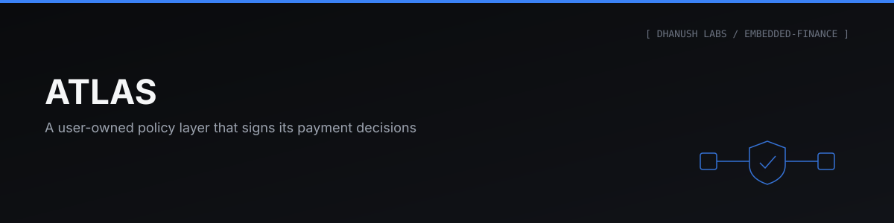
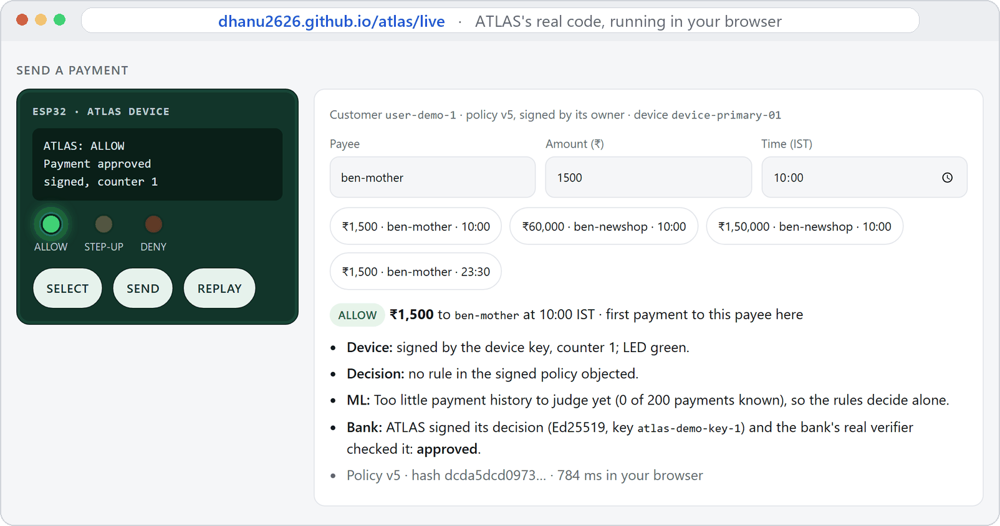
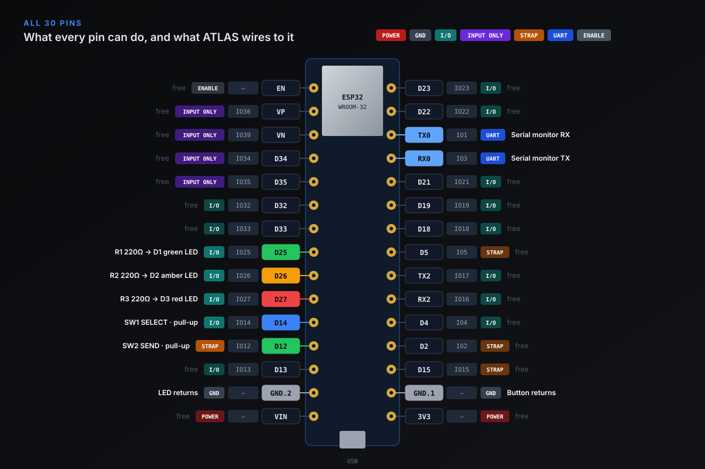
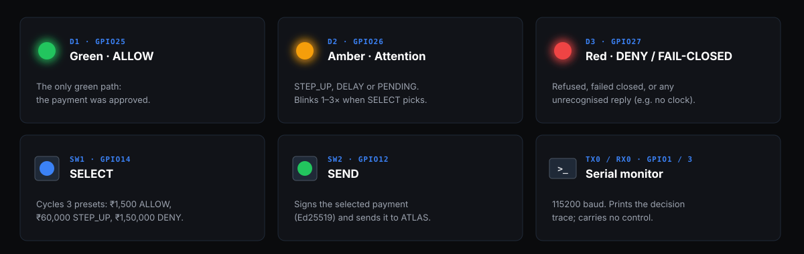

<p align="center"></p>


### A Signed Second Opinion Before Your Payment Leaves

A user-owned policy layer that evaluates a payment with deterministic rules and local ML evidence, signs its decision, and hands the bank something it can verify — without ever replacing the bank or the payment rail. Built by **Dhanush Jangadi**. All data synthetic; no real bank or payment rail is connected.

**[📐 Read the full Engineering Blueprint →](docs/ATLAS-Blueprint.md)** — every component, trust boundary, failure mode and known limitation, each tagged with how it is known. · **[🔌 Main circuit diagram →](docs/hardware/atlas-schematic.svg)** · **[▶️ Live dashboard →](https://dhanu2626.github.io/atlas/)** · **[🧪 Run ATLAS in your browser →](https://dhanu2626.github.io/atlas/live/)**

---

## Try It Yourself

<p align="center"><a href="https://dhanu2626.github.io/atlas/live/"></a></p>

<p align="center"><sub>Real screenshots of the <b>Run it live</b> page: ATLAS's own code, running inside the browser — click to try it.</sub></p>

| | What you get | How |
|---|---|---|
| 🧪 **Run it live** | ATLAS's real code runs **in your browser** — any amount, payee and time, and, if you allow it, **your real location**; the device signs, ATLAS decides, the bank verifies. Nothing leaves your device. First start downloads about 39 MB (Python for the browser) and takes 20 seconds to about a minute | **[Run ATLAS in your browser →](https://dhanu2626.github.io/atlas/live/)** |
| 👀 **Watch it** | The dashboard: press SELECT and SEND and see the LED ATLAS lit in real recorded runs, with every layer of each payment — instant, nothing to download | **[Open the live dashboard →](https://dhanu2626.github.io/atlas/)** |
| ▶️ **Run it** | The real ATLAS and bank code decide three payments on your own computer in about 30 seconds — no hardware, no Wokwi, nothing saved | `pip install -r requirements.txt`, then `python scripts/demo.py` |
| ☁️ **Run it in the browser** | The same demo in your own GitHub Codespace — nothing to install | [](https://codespaces.new/Dhanu2626/atlas?quickstart=1), then `python scripts/demo.py` |
| ✅ **See the latest run** | GitHub runs the demo on every push and fails unless it gets ALLOW, STEP_UP and DENY | [](https://github.com/Dhanu2626/atlas/actions/workflows/demo.yml) |

What `python scripts/demo.py` prints, abridged:

```text
Press 1: SELECT preset 1, then SEND -- Rs 1,500.00 to ben-mother at 10:00 IST
   ATLAS says ALLOW   ->  device LED [GREEN]
   - bank: verified ATLAS's signed decision and approved the payment
Press 2: SELECT preset 2, then SEND -- Rs 60,000.00 to ben-newshop at 10:00 IST
   ATLAS says STEP_UP   ->  device LED [AMBER]
   - policy rule 'large_amount': the amount is over Rs 50,000 -> STEP_UP
Press 3: SELECT preset 3, then SEND -- Rs 1,50,000.00 to ben-newshop at 10:00 IST
   ATLAS says DENY   ->  device LED [RED]
   - policy rule 'hard_cap': the amount is over Rs 1,00,000 -> DENY
Replay: an attacker captures a validly signed request and sends it again
   first time: ALLOW   second time: FAIL_CLOSED (COUNTER_REGRESSION: that device counter was already used)
Result: ALLOW, STEP_UP, DENY  -- as the policy requires (green, amber, red).
```

What is simulated, plainly: the live page and the demo press the buttons through the firmware's tested Python twin ([`firmware/virtual_device.py`](firmware/virtual_device.py)) rather than the C firmware in Wokwi, and run both services in-process — the live page through three small browser adapters (no threads in a browser, so FastAPI's thread pool becomes a direct call; the bank's real `verify_endpoint()` is called in-process; key protection's scrypt comes from `cryptography`, byte-identical), which a parity test proves change no decision; everything that decides — the device-signature and replay checks, ML evidence, the owner-signed policy, ATLAS's signed decision and the bank's verification — is the real code. Location has two paths, kept apart on purpose: on the live page it is **your real position**, from your own browser, used only in that tab; on the ESP32 in Wokwi it comes from a **simulated** GNSS receiver with scripted positions. The full simulation of the real firmware in Wokwi is in [`firmware/README.md`](firmware/README.md); it needs VS Code, the ESP32 toolchain and Wokwi's local gateway.

---

## Problem Statement

> [!IMPORTANT]
> Spending controls, fraud scores and authorization rules already exist — but they belong to the bank, the card network or the wallet, not the account holder, and they don't travel between payment rails. ATLAS tests one narrow question: can a **user-owned** policy decide on a payment, protect that decision cryptographically, and hand existing payment infrastructure a **verifiable assertion** it can consume, while the behavioural evidence behind it stays **local**?

ATLAS does not claim the architecture is new — an existing patent (US20210065194A1) combines most of it. What it tests is the narrower question above: user ownership, portability across rails, and evidence that stays local.

## Architecture

<p align="center"></p>

<sub>Drawn from the published code paths and real serial output.</sub>

```
LAW / REGULATION  ─►  BANK  ─►  USER POLICY  ─►  ML EVIDENCE     (a layer can only add restriction)

ESP32 ──signed envelope──► ATLAS_SERVICE ──signed assertion, ALLOW only──► BANK_SERVICE
 sign · display             verify ─► ML ─► policy ─► sign                   verify ─► ledger
   ◄──────────────────────── final_status: ALLOW · STEP_UP · DENY ◄──────────────────┘
```

| Step | Subsystem | Result |
|---|---|---|
| 0–2 | Contracts, ML evidence, policy engine | Per-subject Isolation Forest; deterministic most-restrictive-wins; SHA-256 policy hash |
| 3–4 | Two-service authority split, state machine | AST-enforced boundary; a restart reconciles, never guesses |
| 5–6 | Ed25519 assertions, bank verification | Signature → revocation → expiry → replay, live over HTTP |
| 7 | UPI + Pix adapters | One signed decision, two rail shapes, FX divergence made visible |
| 8 | ESP32 firmware + virtual device | Fail-closed whitelist: exactly one status lights green |
| 3.1–3.3 | Device trust | Registry, per-device Ed25519 keys, counter + nonce replay layers, `/v2/transact` |
| 3.3b | Step-up, off by default | A STEP_UP can pause for out-of-band confirmation; re-resolution recomputes nothing and can never rescue a DENY |
| 9 | Dashboard | A dated snapshot page: read-only database figures, the Results scenarios re-run through both services over the signed path, per-transaction replay status, and measured ML precision, recall and latency. Not deployed anywhere |

## The Device: ESP32 Circuit

The payment device ATLAS talks to, as wired in the Wokwi simulation. It signs requests and shows the answer; it never decides.

<p align="center"></p>

<p align="center"></p>

<p align="center"></p>

**[🔌 Main circuit diagram →](docs/hardware/atlas-schematic.svg)** · drawn from [`diagram.json`](firmware/atlas_device/diagram.json) · simulated in Wokwi.

## How It Works

```bash
python -m venv .venv
.venv\Scripts\python -m pip install -r requirements.txt
.venv\Scripts\python scripts\demo.py        # ALLOW, STEP_UP, DENY in about 30 s; nothing saved
.venv\Scripts\python -m pytest -q
.venv\Scripts\python scripts\run_dev.py
```

`run_dev.py` starts `atlas_service` on `127.0.0.1:8000` and `bank_service` on `127.0.0.1:8100`. The ESP32 firmware, its Wokwi circuit and device provisioning are documented in [`firmware/README.md`](firmware/README.md), and day-to-day operation — starting the simulator stack, provisioning a device, redeeming a step-up — is in [`RUNBOOK.md`](RUNBOOK.md).

## Features

- **User-owned, deterministic policy** — versioned YAML in a rail-neutral vocabulary (`MAX_AMOUNT`, `NEW_BENEFICIARY`, `INTERNATIONAL`, `TIME_WINDOW`, `VELOCITY`, `RISK_THRESHOLD`, `BEYOND_OBSERVED_RANGE`, `GEOFENCE`), most-restrictive-wins, SHA-256 hashed, rollback-checked and signed by its owner, so a forged or edited policy is refused before anything is decided.
- **ML as evidence, never the judge** — a per-subject Isolation Forest produces a risk band with plain-language reasons; a policy rule decides whether it matters. Client claims about new beneficiaries are recomputed from history, never trusted. Below 200 known payments the answer is `INSUFFICIENT_HISTORY` with no score — unknown is not treated as risky — and the deterministic rules decide alone. The forest does not catch bursts (held-out recall 0.0), so a separate `beyond_observed_range` signal, its 6× threshold chosen on the validation split only, flagged 40 of 40 synthetic test bursts and 0 of 320 ordinary cases — and the customer's policy acts on it: `burst_beyond_own_history` (policy v5) asks for confirmation when a customer pays more than 6× their own busiest day, while `velocity_burst` still refuses more than 20 in 24 hours. On real bank customers, ATLAS rated 0.59% of ordinary payments HIGH, and the burst signal fired on none of 11,450.
- **Signed decisions the bank can verify** — an ALLOW becomes an Ed25519-signed assertion carrying the decision, not the ML score. The bank checks signature, revocation, 90-second expiry and replay before its own ledger decides.
- **Location as evidence, never proof** — every signed request can carry where the device says it is, from one of two paths: the visitor's **real** position on the live page (their own browser, after they allow it, never leaving the tab), or the ESP32 reading a **GNSS receiver over UART** — in Wokwi a simulated multi-GNSS receiver (a custom chip writing NMEA sentences from scripted positions), parsed on the device with checksum checks and signed into the request. ATLAS grades the claim only after the signature verifies, against the frozen table: a browser position is LOW confidence, a GNSS fix is LOW until device-integrity evidence exists, HIGH is unreachable without a secure element; inside, outside, stale or too vague for the device's home area; impossible travel noted as evidence. Policy v6's one location rule, `outside_home_area`, asks for confirmation outside the home area. Location can only add friction: being "at home" relaxes no rule, so faking home gains nothing. Coordinates are never logged, returned or sent to the bank.
- **Fail closed vs. reconcile** — a bad signature is refused immediately; an unreachable bank becomes `PENDING` and is reconciled against the bank's own record, never blindly retried.
- **Device trust** — registered devices sign every request with their own key, verified through ordered checks with three independent replay defences: counter, nonce and `transaction_id`.
- **Firmware that only displays** — the ESP32 signs and submits with libsodium, then maps the reply through a whitelist; anything unrecognised lights red.
- **Step-up that cannot rescue a DENY** — with `ATLAS_ENABLE_STEP_UP=1` (off by default), a STEP_UP pauses for an out-of-band Ed25519 confirmation. The re-resolution is a pure function of the frozen decision: no ML, no policy re-run, no clock. Anything unexpected resolves to DENY, and a payment left unanswered is settled to DENIED at the next start.
- **A request without a valid proof changes nothing** — a wrong transaction id, a bad or malformed signature, or no enrolled authenticator is refused and audited, and the reply carries no risk evidence at all. The challenge and transaction ids are not treated as secrets: only the authenticator's signature can complete a payment, and only the 120-second clock can end a challenge without one.
- **Nothing unsigned by default** — the legacy unsigned `POST /transact` is closed unless it is deliberately reopened, and a service will not serve a non-loopback address, or call a non-loopback bank, without TLS.

## Interactive Demo

**[Run it live](https://dhanu2626.github.io/atlas/live/)** ([`docs/live/`](docs/live/)) runs ATLAS's real source in the visitor's browser with [Pyodide](https://pyodide.org) (Python compiled to WebAssembly, pinned to 314.0.7 and loaded from jsDelivr with an integrity hash, only after the visitor clicks Start). The page downloads the bundle of ATLAS's tracked source ([`scripts/build_live_bundle.py`](scripts/build_live_bundle.py), checked against its published SHA-256), makes fresh throwaway keys, trains the visitor's model, and every press of SEND goes through the real `/v2/transact` endpoint and the bank's real verifier. [`tests/test_live_parity.py`](tests/test_live_parity.py) sends the same payments through the real desktop services, through the browser runner, and through the real page in a real browser, and requires identical answers; GitHub runs it on every push, fails (never skips) if the browser cannot run, and posts the result as a public note on each run. Checked in Chromium and WebKit (Safari's engine), both with the real-location feature (9 of 9 decisions matched, 2026-10-09; the WebKit run found and fixed a timestamp-unit difference), and earlier in iPhone and Pixel emulation; Firefox untested.

**[The live dashboard](https://dhanu2626.github.io/atlas/)** is the Step 9 dashboard, served by GitHub Pages straight from [`docs/index.html`](docs/index.html): one self-contained page that needs no server and loads nothing from the network, so it also works opened from the file. It starts with the device: **SELECT**, **SEND** and a day/night switch light the LED the firmware would, replaying the results this export recorded through both real services — labelled a replay, never a live call, and a result it does not have fails closed, red. Then choose any of its seven scenarios to follow one payment through every layer: ML evidence, the policy decision and the rule that decided it, the signed assertion, the bank's verdict, the replay defence that refused the same envelope a second time, and the rail payload — next to aggregate figures from the local databases.

The page and its data are separate pieces: [`scripts/export_dashboard_data.py`](scripts/export_dashboard_data.py) writes the numbers into the page and into `docs/dashboard-data.json`, and the page only displays them:

```bash
.venv\Scripts\python scripts\export_dashboard_data.py --run-tests
```

- **Live databases, read-only.** Transaction states, step-up challenges and events, the device registry and the bank's replay cache are opened in SQLite's read-only mode and never written. Only aggregate figures reach the page; the database files themselves are never committed or published.
- **Scenarios on the signed path, on temporary stores.** The Results table below is re-run through both real services in-process, as signed `DeviceEnvelope`s posted to `/v2/transact` — the path the firmware itself uses — with the transaction, device and step-up stores, the replay cache and the signing key in a throwaway directory that is removed afterwards. The services' startup hook, which writes to the live databases, is never run. Each envelope is then sent a second time, and the page records which defence refused it.
- **Measured or recorded.** `--run-tests` runs the suite and the ML evaluation and records what it observed: the test count, and ML precision, recall and latency from [`scripts/evaluate_ml.py`](scripts/evaluate_ml.py). The firmware build size, the Wokwi step-up checks and the mutation results are not re-measured by the export; the page labels each one as recorded and names the document or test it came from.
- **Failures stay visible.** A dropped scenario, a failing test run or a page that could not be updated makes the export exit with status 1, and warnings are displayed on the page rather than dropped — including one for each database that could not be read, or a single one saying the snapshot was left out when the transaction database itself is missing.

The export in this release ran on 2026-10-02: all 760 tests passed (three skipped, each naming its reason — the opt-in firmware build, Playwright's Firefox, which will not start on this machine, and the opt-in real-browser check of the live page), all 7 scenarios produced rows with no warnings, every replayed envelope was refused with `COUNTER_REGRESSION`, and all six live database files were byte-identical by SHA-256 before and after. That count now includes the bank's ledger: exports from 2026-09-22 to 2026-09-24 wrote their approved scenarios into the live `bank_ledger.db`, because the sweep never redirected the bank's ledger path. That was found and fixed on 2026-09-25, and a test now fails if it returns.

> [!NOTE]
> **What the dashboard is not.** A dated snapshot of a software-only prototype — not a live feed, a monitoring service or a production deployment. The services run locally on loopback and are never exposed publicly, all data is synthetic, and no real bank or payment rail is involved. Its ML detection figures come from generated customers with planted anomalies; its false-alarm figures come from 229 real bank customers.
>
> **How the page was checked, last on 2026-09-25.** A committed browser matrix ([`tests/test_dashboard_browsers.py`](tests/test_dashboard_browsers.py)) loads the page from the file, over a local static HTTP server and as a failure page, at the default window, 400 px and 1280 px, in light and dark, and clicks every scenario, checking each against the exported JSON: no console errors, no horizontal overflow, no request besides the page itself. It passes in Playwright's Chromium and WebKit, the installed **Google Chrome 153** and **Microsoft Edge 153**, and two **emulations** — WebKit with the iPhone 13 profile and Chromium with the Pixel 7 profile, tapping rather than clicking — which are labelled as emulation and are not phones. The page's own JavaScript has 34 automated checks ([`tests/js/`](tests/js/)). Firefox (Playwright's build will not start on this machine), Safari on Apple hardware, real phones and an actual GitHub Pages deployment were **not** tested.

The test suite also drives both real services end to end, and the Wokwi circuit is in [`firmware/atlas_device/`](firmware/atlas_device/).

## Engineering Decisions

| Question | Answer |
|---|---|
| Can ML approve a payment? | No. ML produces evidence and a policy rule decides. A poisoned or evaded model degrades to deterministic policy, never to "fail open". |
| Can ATLAS overrule the bank? | Only toward restriction. ATLAS ALLOW plus bank DENY is always DENY — proven end to end with frozen and insufficient-balance accounts. |
| What does the bank learn? | The decision, policy version and policy hash — never the ML score, features or history. |
| Why verify the signature first? | Every other field, including the key id revocation relies on, is attacker-controlled until the signature proves it. |
| What if the bank is unreachable? | `PENDING`, then reconciliation against the bank's record using the same `transaction_id`. |
| What does the device decide? | Nothing. It signs, submits and displays; only an exact `ALLOW` lights green. |

> [!WARNING]
> Several problems remain **unsolved by design**, not by oversight: trust enrollment (proving a key or policy belongs to the real account holder), authority when ATLAS says DENY but the bank never agreed to honour it, and cross-rail semantics.

## Project Structure

```
atlas/
├── contracts.py       shared models + canonical signed bytes, imported by both services
├── atlas_service/     ML evidence, policy engine, state machine, crypto, rail adapters, device trust, step-up
├── bank_service/      independent verifier, replay cache, revocation, toy ledger
├── firmware/          ESP32 sketch + Wokwi circuit, virtual_device.py, device identity
├── assets/            hero, architecture animation, device board, pinout and parts images
├── keystore.py        protected-at-rest storage for every private key on disk
├── scripts/           run_dev.py, run_sim.py, serve.py, provision_device.py, enroll_authenticator.py,
│                   export_dashboard_data.py, evaluate_ml.py, audit_file_access.py, make_dev_ca.py,
│                   train_models.py, protect_keys.py, policy_key.py, benchmark_public_dataset.py,
│                   demo.py (the one-command run), wokwi_gateway.py (the Wokwi gateway preflight),
│                   build_live_bundle.py (the source the live page runs)
├── tests/             763 tests in 43 files, plus 45 JavaScript checks in tests/js/ and the browser matrix
├── docs/              Engineering Blueprint, security gap report, Phase 3 spec, dashboard (index.html),
│                   hardware/atlas-schematic.svg (the main circuit diagram), live/ (ATLAS in your browser)
├── ledger/            frozen research record: architecture, synthesis, notebook
├── .github/, .devcontainer/   the demo on every push; Open in GitHub Codespaces
├── RUNBOOK.md         start, run, stop, provision, test, step-up
├── HANDOFF.md         build status and known limitations as of this release
└── BUILD-PLAN.md      step-by-step build record
```

Two private research notes — the raw research transcript and an interview positioning note — are not published; a few documents still refer to them by name.

## Tech Stack

Python 3.12 · FastAPI/Uvicorn · Pydantic v2 · scikit-learn · cryptography (Ed25519) · SQLite · httpx · pytest · ESP32 (Arduino core 3.3.11) · libsodium · ArduinoJson 7 · Wokwi

## Results

Measured against this exact code, with real signing and real bank verification:

| Payment | At 10:00 IST | At 23:30 IST |
|---|---|---|
| ₹1,500 to an existing beneficiary | **ALLOW** · bank approved | **STEP_UP** · `odd_hours` |
| ₹60,000 to a new beneficiary | **STEP_UP** · `large_amount` | **STEP_UP** |
| ₹1,50,000 to a new beneficiary | **DENY** · `hard_cap` | **DENY** |

| Attack or failure | Outcome |
|---|---|
| Tampered amount, beneficiary, subject, device or counter | `INVALID_DEVICE_SIGNATURE` |
| Verbatim replay of a signed envelope | `COUNTER_REGRESSION` |
| Bank unreachable | `PENDING` → reconciliation, never approval |
| 10 concurrent requests | 0 internal errors, down from 4–6 before the F2 atomicity fixes |

| Location claim (policy v6) | Outcome |
|---|---|
| ₹1,500 from inside the home area | **ALLOW** — location relaxes nothing and adds nothing |
| ₹1,500 from 50 km away | **STEP_UP** · `outside_home_area` |
| ₹1,50,000 while claiming to be at home | **DENY** · `hard_cap` — faking home gains nothing |
| Location rewritten after the device signed it | `INVALID_DEVICE_SIGNATURE`, before any grading |
| A fix more than five minutes old, or too vague to place | shown as `LOCATION_STALE` / `LOCATION_UNKNOWN`; no rule acts on it |

| ATLAS's own ML on real bank customers | Result |
|---|---|
| 229 accounts of a Czech bank (PKDD'99), 11,450 ordinary payments, model fitted on 200 payments of history | **0.59%** rated HIGH, the level a policy rule acts on (67 payments) |
| The same payments, 50 / 100 / 150 payments of history | 0.03% / 0.19% / 0.24% rated HIGH |
| Burst signal on the same payments | fired **0** times |

Real people's payments, so these are **false alarms** — the data carries no fraud labels. Measured by [`scripts/evaluate_real_data.py`](scripts/evaluate_real_data.py); the dataset stays outside the repository.

841 tests pass across 45 files, plus 45 JavaScript checks for the dashboard page and 15 for the firmware (wiring, the LED whitelist, the debounce, the step-up display, the GNSS receiver on UART2, and an opt-in `arduino-cli` build). Four tests are skipped and each says why: the C comparison of the ESP32's GNSS reader with its Python twin (`ATLAS_C_PARITY=1`; this Windows PC has no C compiler, so GitHub's Linux machines run it); the opt-in firmware build — last run 2026-09-29 with the HTTPS client, producing 1,175,976 bytes, 89% of program storage — Playwright's Firefox, which will not start on the build machine, and the real-browser check of the live page (`ATLAS_LIVE_BROWSER=1`, because it downloads Pyodide; it passes in Chromium and WebKit, and GitHub Actions runs it on every push). They run on temporary stores and keys: an autouse fixture points every default database and key path into a per-test sandbox and fails any test that lands there, and `scripts/audit_file_access.py` re-runs the suite under a Python audit hook to confirm from the outside that nothing protected was opened. Guards are mutation-tested — a check is deliberately broken and the run must fail before it is restored: 10 of 10 on the step-up restart cleanup, 24 of 24 on the 2026-09-17 changes, 16 of 17 on the 2026-09-18 security pass, and 15 of 15 on the 2026-09-22 controls (key protection, the model registry, TLS and mutual TLS, bank reply validation, the durable ledger, the legacy lockdown, the size cap and the malformed-request handler). Two of that last set survived their first run, which is the point of running them: the bank ledger's idempotency and an echoed error body were real holes in the suite, and each was closed with a test before the break was caught. The one older survivor is honest and documented: removing the sandbox redirect alone changes nothing today, because every test already overrides its own stores. The 2026-09-25 closure work was broken deliberately 13 times — the rollback gate, the production TLS pin, CRL and TLS 1.3 settings, the export's ledger redirect, the isolation guard and the evaluation's no-look-ahead placement among them — and all 13 were caught; the two approved ML specification changes that followed were broken 15 more times, and all 15 were caught; the 2026-09-27 signed policy updates were broken 5 times, and all 5 were caught; the 2026-10-01 device HTTPS checks were broken 5 times and the Wokwi gateway preflight 9 times, and all 14 were caught; the 2026-10-02 live page's safeguards were broken 6 times, and all 6 were caught; the 2026-10-09 location work was broken 8 times — "home" relaxing a rule, any location matching the rule, a browser position trusted as MEDIUM, a stale fix still placing the device, coordinates in the audit log, the GNSS reader skipping checksums, the firmware leaving location out of its signed bytes, the page asking for location on load — and all 8 were caught.

## Future Improvements

- **Run the HTTPS and GNSS firmware in the Wokwi simulator** — the device's HTTPS connection to ATLAS (certificate and name checked) and its GNSS receiver on UART2 are implemented; the NMEA reader is tested byte for byte against its Python twin and the signed bytes against the backend. Running that firmware in the simulator is pending: the local build was blocked by Windows Application Control on 2026-10-01, and a build on GitHub's machines can only carry the placeholder identity, because the device's key is compiled into the binary and must never leave this PC. Every Wokwi observation on record was made on the earlier plain-HTTP build
- **Test the dashboard on more browsers** — it is published on GitHub Pages, and a committed browser matrix covers Chromium, WebKit, installed Chrome and Edge, and iPhone and Pixel emulation; Firefox, Safari proper and real phones are untested
- **Finish Step 9's measurements** — the page does not yet show policy-evaluation, signing or verification latency separately (only each scenario's round trip), reconciliation success rate, or what leaves the trust boundary
- **Phase 3.5 and the rest of Phase 3.6** — device-integrity grading and rollback checks (until they exist, the frozen table grades a GNSS fix no higher than LOW), and the remaining device-evidence keys (`DEVICE_TRUST`, `LOCATION_CONFIDENCE`, `FIRMWARE_INTEGRITY`, `AUTH_STRENGTH`). Phase 3.4 (location grading), the `GEOFENCE` key with policy v6's one approved rule, and Phase 3.7's GNSS receiver are built; Phase 3.8 is complete
- **The ML-unavailable fallback** — the frozen design says that when the model cannot run, ATLAS should decide on deterministic policy alone; today it refuses the payment instead (`FAIL_CLOSED`, `ml_unavailable`) — safe, but stricter than specified
- **A lower history threshold** — the ML layer judges no customer below 200 payments. On real customers, less history means fewer false alarms (0.03% HIGH at 50 payments, 0.59% at 200); what is still to measure is how well a model fitted on fewer payments catches anomalies

## Lessons Learned

Tests prove the model that was written, not necessarily the device that ships. The firmware's signing template was pinned byte-for-byte against the backend, yet the first real simulator run still found a start-up clock race no test could see — compiling is not running. The backend showed the same pattern: a counter claim made deliberately non-atomic passed the suite until a 2 ms interleaving window was forced, so that guarantee rests on a single locked compare-and-swap rather than on the tests; and seven tests with hard-coded dates silently expired overnight. Each was caught by running something real or breaking something on purpose, which is why the mutation checks became part of the build. The step-up work repeated the lesson: a cleanup routine documented as the restart's safety net was never called by anything, and the test guarding it asserted only half of what its name promised — so a payment could sit waiting forever without a single test noticing.

## License

MIT © 2026 Dhanush Jangadi

## Contact

Dhanush Jangadi — [GitHub](https://github.com/Dhanu2626) · [LinkedIn](https://www.linkedin.com/in/jangadidhanush)

---
<p align="center"><sub>Part of the <b>Dhanush Labs</b> portfolio · engineered by <a href="https://github.com/Dhanu2626">Dhanush Jangadi</a></sub></p>
