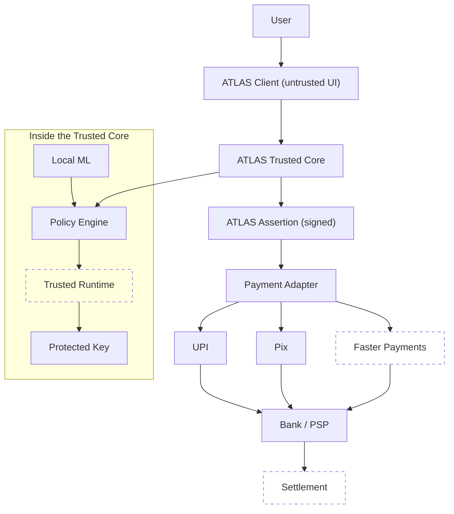
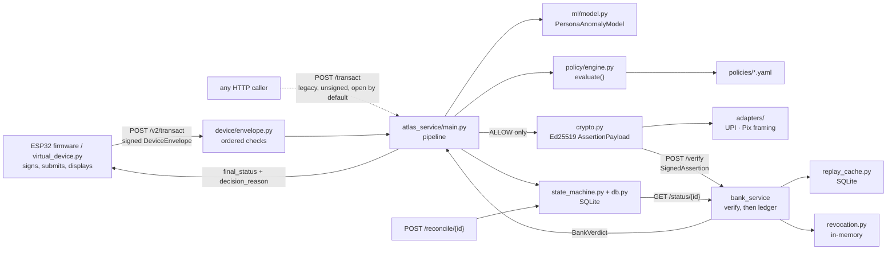
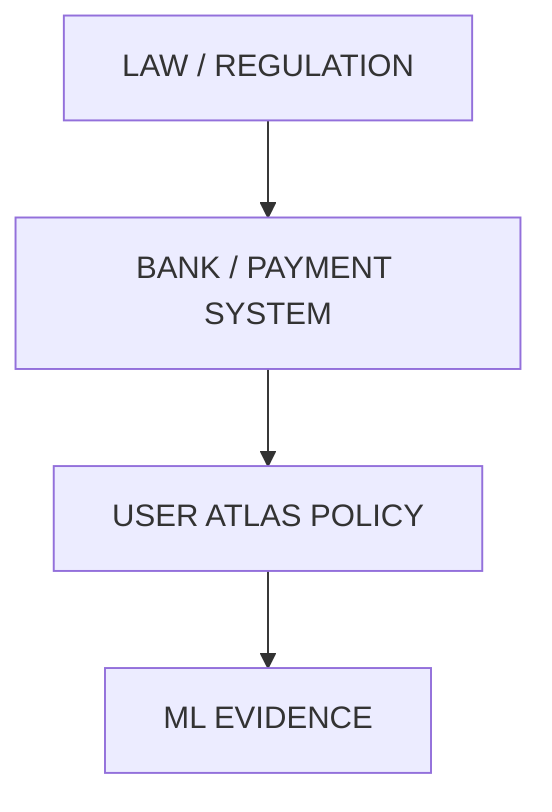
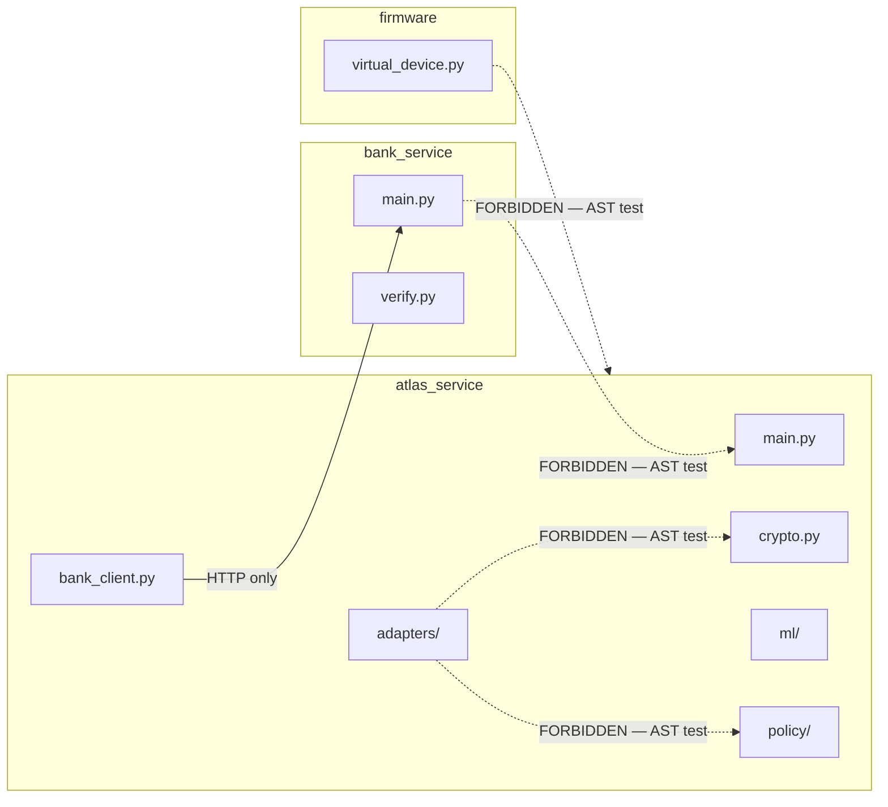
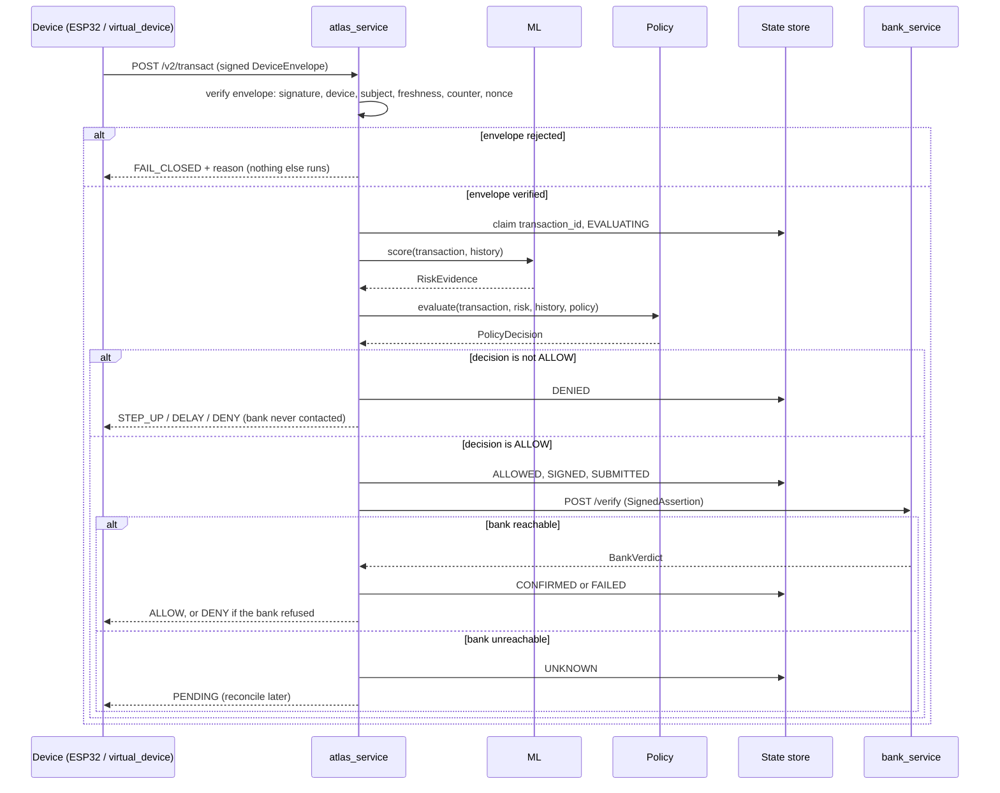
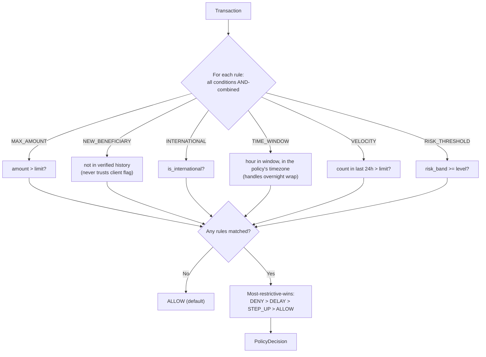
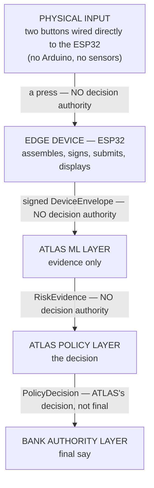
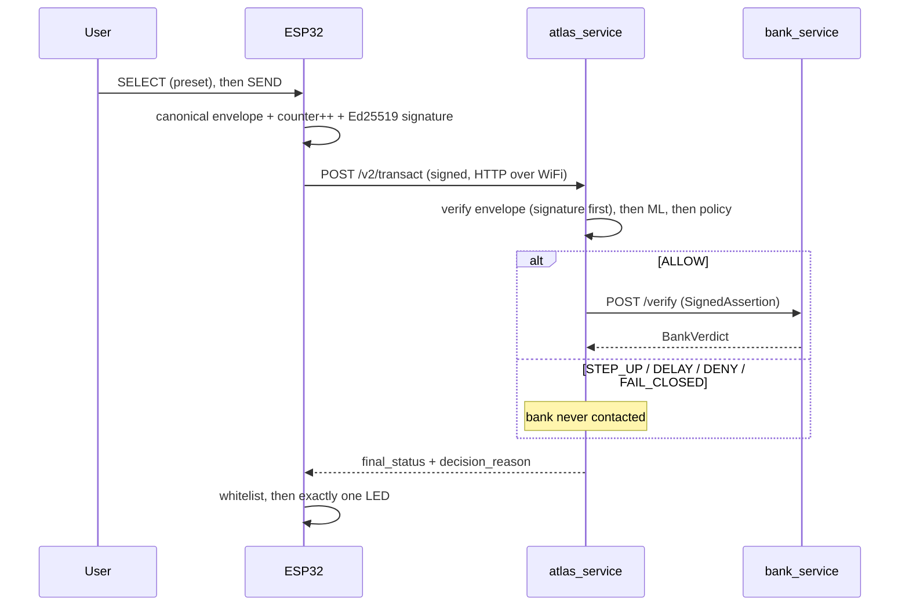

<!-- title: ATLAS Blueprint -->

# ATLAS Engineering Blueprint

**Document status:** living reference. First generated 2026-08-26 against Steps 0–3; **refreshed 2026-09-16 to match this published release** (the commit *"feat: complete ATLAS Phase 3 device integration"*, 28 Aug 2026). It must be regenerated as later work lands, and it must never be used to silently redefine the frozen architecture or research conclusions it describes.

**Scope statement.** This document describes ATLAS exactly as it exists in this repository: a research prototype whose novelty is explicitly unproven; whose build covers Steps 0–8 of a nine-step plan plus a hardening track (Phase 1 audit, Phase 2, Phase 3.1–3.3, checkpoints F1–F3); and whose embedded dimension is an ESP32 firmware verified by tests and by a simulator — never by physical hardware. Nothing below should be read as a claim that ATLAS is complete, secure in the production sense, hardware-backed, or novel. Where this document proposes something the research never decided, that is labelled — not blended in as if the research had settled it.

---

## How to read this document — the provenance legend

Every non-trivial claim below carries one or more of these tags. This is the same discipline `ledger/ARCHITECTURE.md` established for the codebase.

| Tag | Meaning | Where it comes from |
|---|---|---|
| **[A]** | Research-established — something the Day 1–13 research conversation actually said, explored, or concluded | Distilled in `ledger/ARCHITECTURE.md` and `ledger/SYNTHESIS.md` (the raw transcript is kept private) |
| **[B]** | Frozen architecture — locked by the final "architecture freeze"; changing it requires the evidence-first protocol | `ledger/ARCHITECTURE.md` |
| **[C]** | Engineering judgment — a design or implementation decision made during the build, not dictated by the research | This document, `BUILD-PLAN.md`, `HANDOFF.md` |
| **[D]** | Implemented — code exists in this release | Verified by direct inspection of this release, 2026-09-16 |
| **[E]** | Tested — covered by a passing automated test | Verified by a live `pytest` run on this release, 2026-09-16: **304 passed** |
| **[F]** | Proposed / future work — no code exists | — |
| **[G]** | Unresolved research question — the research left this open; this document does not answer it | `ledger/ARCHITECTURE.md`'s RQ backlog |

A claim tagged **[D][E]** is both built and verified. A claim tagged **[C][F]** is a proposed design that has not been built. A claim tagged only **[A]** or **[B]** describes what the research said, not what the code does.

---

## 0. Source-of-Truth / Reconciliation

Before this refresh, the document was checked against the release itself — a fresh file listing, a fresh test run, and a fresh run of the three demo payments — not against memory.

### 0.1 A genuine tension in the research record, already reconciled (2026-08-22)

Day 7's Q5 **[A]** poses a scenario where the policy engine sees `Bank: Fraud risk=LOW` as an input. The frozen architecture **[B]** sequences the bank's check *after* ATLAS's own decision, with no bank input into it. `ledger/SYNTHESIS.md` §1 resolved this as research narrowing over time. The implemented engine **[D][E]** still takes no bank data: `evaluate(transaction, risk, history, policy)`.

### 0.2 Specificity the research never provided — flagged, not invented

The research **[A]** discusses embedded security abstractly — "MCU", "Arduino/MCU", the Embedded Interface Emulator surface, secure boot / TEE / Secure Element *concepts*. It never names ESP32, Wokwi, or WiFi/HTTP. Choosing an ESP32 in Wokwi, speaking HTTP, was a build decision **[C]** — and it is now implemented **[D][E]** (Step 8, Phase 3.3, F3). The Arduino sensor bridge Section 24 once proposed was **not** built **[F]**: the ESP32 reads its own two buttons.

### 0.3 What the fresh audit of this release confirmed

| Check | Result |
|---|---|
| Tracked files | 75 — the build's 71 plus `README.md`, `LICENSE` and two SVG assets |
| Test suite | **304 passed** across 16 test files |
| `atlas_service` routes | `POST /evaluate`, `POST /transact`, `POST /v2/transact`, `POST /reconcile/{transaction_id}` |
| `bank_service` routes | `POST /verify`, `GET /status/{transaction_id}` |
| Present | `firmware/`, `atlas_service/{adapters,device}/`, `state_machine.py`, `crypto.py`, `db.py`, `bank_service/{verify,replay_cache,revocation}.py`, `scripts/` |
| Absent | `dashboard/` (Step 9), an FPS adapter, any Arduino code, `docs/THREAT-MODEL.md` and `docs/DEMO-SCRIPT.md` (named in `BUILD-PLAN.md`'s aspirational tree, never written) |

Demo payments, run against this release with real signing and real bank verification:

| Payment | At 10:00 IST | At 23:30 IST |
|---|---|---|
| ₹1,500 → `ben-mother` | ALLOW (bank approved) | STEP_UP (`odd_hours`) |
| ₹60,000 → `ben-newshop` | STEP_UP (`large_amount`, `new_beneficiary_meaningful_amount`, `high_ml_risk`) | STEP_UP (the same plus `odd_hours`) |
| ₹1,50,000 → `ben-newshop` | DENY (`hard_cap` wins) | DENY |

### 0.4 Found after this release was cut — disclosed, not fixed here

Running this firmware in the Wokwi simulator (2026-08-30 to 09-02) closed Limitation 1 — the compiled firmware does execute — and exposed a start-up clock race: the sketch calls `configTime()` but never waits for NTP before signing. A SEND pressed in the first seconds after boot can carry a 1970 timestamp (rejected as `STALE_REQUEST`) or abort and reboot the ESP32 during SNTP start-up. `HANDOFF.md` in this release predates both findings and still describes the firmware as never executed. The fix exists in later work and is **not** part of this release.

---

## 1. Executive Overview

ATLAS is a research prototype investigating one narrow, sharpened question **[B]**:

> Can a trusted, user-controlled financial policy layer evaluate transaction intent using deterministic policies and local behavioral evidence, protect the resulting decision through a trusted security boundary and cryptographic identity, and produce a verifiable policy assertion that can be consumed by existing payment infrastructure — without replacing the payment rail?

It is **not** a payment app, a bank, a new payment rail, or a fraud-detection product **[B]**. It is a policy and security layer that can only ever make a transaction *more* restrictive, never grant what a higher authority didn't already allow **[B]**.

**What exists in this release, precisely:**

- A per-subject ML anomaly layer producing evidence, never decisions **[D][E]**
- A deterministic, versioned, hashed policy engine **[D][E]**
- Two independent HTTP services proving a bank can override ATLAS **[D][E]**
- A persistent transaction state machine with restart reconciliation **[D][E]**
- Ed25519-signed assertions verified by the bank for signature, revocation, expiry and replay **[D][E]**
- UPI- and Pix-shaped rail adapters that frame one signed decision **[D][E]**
- Device trust: a registry, per-device Ed25519 keys, signed envelopes, and counter + nonce replay layers on `/v2/transact` **[D][E]**
- ESP32 firmware that signs with libsodium and fails closed — pinned byte-for-byte against the backend **[D][E]**, executed in Wokwi after release (§0.4)

**Not built:** the Step 9 dashboard; Phase 3.4–3.8; any hardware-backed key, attestation or trusted execution; any real bank or rail connectivity **[F]**.

**Not proven:** that any of this is novel. A real prior-art search **[A]** found a patent combining most of ATLAS's original architecture. What survives is a narrower, explicitly unproven hypothesis **[B]** — see Section 21.

---

## 2. Problem Definition and Research Question

### 2.1 Origin **[A]**

ATLAS began as a request to combine an embedded-systems (ECE) background with a PGDM finance specialization, deliberately scoped to *global* finance, with eleven explicit constraints: no physical hardware; software tools replicating hardware behaviour faithfully; genuine idea generation and selection; real-world usefulness; a rigorous experimental structure; a prior-art check; genuine novelty; a real, unprecedented problem; a working, usable piece of software rather than a viewable-only demo; and Arduino-based embedded C with chip integration (wires, LEDs, sensors).

### 2.2 Methodology **[A]**

An explicit "researcher, not student" discipline: never stop at *what* — continue through *why → why not → what if → can it fail → can it be improved → can ATLAS do better*; model, don't memorize; find the bottleneck; every claim needs external evidence. That discipline produced the Day 11–13 novelty findings (Section 3) instead of an unexamined novelty claim.

### 2.3 The research question's evolution **[A][B]**

| Framing | Status | When killed |
|---|---|---|
| "Can ML detect fraud?" | Rejected — not novel | Day 7 |
| "Build an embedded fraud detector" | Rejected — too generic | Day 8 |
| "ATLAS decides ALLOW/DENY and tells the bank what to do" | Rejected — wrong authority model | Day 9 |
| "TEE + policy + ML + attestation for transaction authorization" | Rejected — an existing patent claims this combination | Day 11 |
| *(final, frozen)* "Can a trusted, user-controlled financial policy layer… produce a verifiable policy assertion… without replacing the payment rail?" | **Current, frozen** | Freeze conversation |

---

## 3. Research Findings and Prior-Art Positioning

Days 11–13 **[A]** found that most of ATLAS's individual pieces already exist in production or in filed patents:

- A patent (**US20210065194A1**) combines policy ruleset + ML-based authentication + TEE + attestation + a transaction-authorization message — most of ATLAS's original architecture in one claim.
- A second patent describes policy-compliance checking inside a TEE with proof of execution attached to a transaction.
- **Visa's Commercial Payment Controls** provide near-real-time spend/merchant/location/time/velocity controls tied into authorization.
- **Coinbase's Policy Engine** applies rules to wallet operations with accept/reject outcomes.
- **Apple Pay** demonstrates Secure Element + Secure Enclave + dynamic transaction cryptograms at scale.
- **EMV tokenization** constrains payment credentials to device, merchant or scenario.
- **NIST and Android Key Attestation** establish hardware-backed attestation as a working mechanism.

**[B] None of these, individually or combined, is ATLAS's novelty claim.** See Section 21 for what survives.

---

## 4. ATLAS Architecture

### 4.1 The frozen conceptual architecture **[B]**



*Solid nodes exist in this release in software form; dashed nodes do not.* The assertion, the policy engine, local ML and the UPI/Pix adapters are implemented **[D][E]**. The "Protected Key" is a **plaintext file**, and the "Trusted Runtime" is ordinary process and import isolation — there is no TEE or secure element **[D]**, **[F]**. The FPS adapter was deliberately not built, and real settlement is excluded from scope **[B]**.

### 4.2 The implemented architecture **[D][E]** — what actually runs in this release



The animated walkthrough in `assets/atlas-flow.svg` (shown in the README) traces the same path for the three demo payments and a replay attack, using the firmware's real serial output.

### 4.3 The three-domain split **[B]**

| Domain | Job | Provides |
|---|---|---|
| Embedded / Trusted Security | protects the *authority* | trusted execution, protected identity, key protection, attestation |
| Machine Learning | provides *evidence* | local behavioural anomaly detection only — never the final decision |
| FinTech / Finance | provides *meaning* | policy semantics, authorization logic, payment-rail integration |

---

## 5. Component and Service Responsibilities

For each component: what it does, what it may and may not do, how it fails, how it is tested, and where the idea came from.

### 5.1 `atlas_service/ml` — the anomaly-evidence layer

| | |
|---|---|
| **What it does** | Produces `RiskEvidence` — an anomaly score, a `LOW`/`MEDIUM`/`HIGH` band, and plain-language reasons — for one transaction against one subject's own history |
| **Model** | scikit-learn `IsolationForest`, `contamination=0.02`, `n_estimators=200`, `random_state=0`, scaler fitted on training data only **[C][D]** |
| **Features** | Ten: `amount_zscore`, `hour_of_day`, `is_new_beneficiary`, `is_new_device`, `is_new_location`, `is_new_merchant_category`, `transactions_last_24h`, `is_international`, `declared_travel_mode`, `is_emergency_request` **[D]** |
| **Allowed to** | Read the transaction and history; produce evidence |
| **Not allowed to** | Decide ALLOW/DENY/STEP_UP/DELAY — that authority is the policy engine's **[B] principle 1** |
| **On failure** | Frozen behaviour **[B]** is "ML unavailable → fall back to deterministic policy". **Not implemented [F]** — if the model raises, the request fails closed as `INTERNAL_ERROR` rather than degrading to policy alone |
| **Tested** | `tests/test_ml_model.py`, 8 tests **[D][E]** — normal activity scores LOW; the research's planted anomalies (₹70,000 at 3:12 AM, a 45-transaction burst, an unknown crypto exchange, an unknown device abroad) score MEDIUM/HIGH; a legitimate ₹85,000 purchase reads as anomalous *without* being called fraud; declared travel measurably lowers anomaly; explanations are never a bare number |
| **Known gaps** | Refit from scratch on every request; amount baseline is per-subject-global, not per-beneficiary; `is_emergency_request` is a feature, but no synthetic training row sets it and the firmware always sends `false` **[D]** |
| **Provenance** | Principle (ML advises, per-subject baseline) **[A][B]**; Isolation Forest, the feature set and the travel-mode neutralization **[C]** |

### 5.2 `atlas_service/policy` — the deciding authority

| | |
|---|---|
| **What it does** | Deterministically evaluates a transaction against a versioned YAML policy in the frozen vocabulary and returns `PolicyDecision` (decision, matched rules, policy version, policy hash) |
| **Vocabulary** | `MAX_AMOUNT`, `NEW_BENEFICIARY`, `INTERNATIONAL`, `TIME_WINDOW`, `VELOCITY`, `RISK_THRESHOLD` **[B]** |
| **Conflicts** | Most-restrictive-wins: `DENY > DELAY > STEP_UP > ALLOW` **[C]** |
| **Allowed to** | Read the transaction, risk evidence, history and policy; independently recompute beneficiary novelty from history instead of trusting the client's flag |
| **Not allowed to** | See bank-side data (§0.1); silently ignore an unrecognised condition — it raises instead |
| **On failure** | Frozen: "policy corrupted → deny". **One case implemented [D][E]**: an unknown condition key raises `ValueError` (`test_unknown_condition_key_fails_closed`). Malformed YAML and a missing policy file are **not handled explicitly [F]** |
| **Tested** | `tests/test_policy_engine.py`, 24 tests **[D][E]** — amount boundaries to the paisa, time-window edges and midnight wrap, multi-rule conflicts, a client lying about `is_new_beneficiary`, hash determinism and sensitivity, rollback accept/reject cases |
| **Rollback — stated precisely** | `check_rollback()` exists and is unit-tested **[D][E]**, but **no request path calls it** and no "last version seen" is persisted — so rollback rejection is not live in the running service **[F]** |
| **Provenance** | Vocabulary, versioning and hashing **[B]**; conflict ordering and comparing against the categorical risk band rather than a raw score **[C]** |

### 5.3 `atlas_service/bank_client.py` — the one-directional door to the bank

| | |
|---|---|
| **What it does** | Calls `bank_service`'s `POST /verify` with a `SignedAssertion`; converts connection, timeout and HTTP failures into a typed `BankUnreachableError` |
| **Why it exists** | **[B]**: ATLAS may ask the bank; the reverse must never be possible |
| **On failure** | "Bank unavailable → pending", never silent approval — tested against a genuinely closed TCP port, not a mock **[D][E]** |
| **Known gap** | `BANK_SERVICE_URL` is a hardcoded constant (`http://127.0.0.1:8100`), not configuration **[D]** |

### 5.4 `bank_service` — the independent authority

| | |
|---|---|
| **What it does** | `POST /verify` checks the assertion (`verify.py`: signature → revocation → expiry → replay), then lets its own ledger decide. `GET /status/{transaction_id}` reports what actually happened, for reconciliation |
| **Why it exists** | **[B]**: "the bank still owns the account" — a genuinely separate authority, not a rubber stamp |
| **State** | Replay cache: SQLite, keyed on `(transaction_id, nonce)`, survives restart. Revocation: **in-memory** — a revoked key un-revokes itself on restart. Ledger: **three hardcoded in-memory accounts** (normal, frozen, insufficient balance). Outcomes are recorded idempotently by `transaction_id` **[D][E]** |
| **Key distribution** | Learns ATLAS's public key from a shared, gitignored file that `atlas_service` writes on start — a toy stand-in, explicitly not a solution to RQ-24 **[D][G]** |
| **Not allowed to** | Import `atlas_service` internals — enforced by an AST-level source test **[D][E]** |
| **Authority** | Final. It can override an ATLAS ALLOW; ATLAS can never override a bank DENY **[B]** |
| **Tested** | `test_bank_boundary.py` (17), `test_crypto.py` (9), `test_replay.py` (5), `test_revocation.py` (5), `test_expiry.py` (5) **[D][E]** |

### 5.5 `state_machine.py` + `db.py` — persistence and reconciliation

| | |
|---|---|
| **Lifecycle** | `CREATED → EVALUATING → [DENIED / ALLOWED → SIGNED → SUBMITTED → [CONFIRMED / FAILED / UNKNOWN → RECONCILING → CONFIRMED or FAILED]]` **[B] states, [C] transition graph** |
| **Guarantees** | Terminal states (`DENIED`, `CONFIRMED`, `FAILED`) can never be left; a restarted process finds transactions stuck in `SUBMITTED`/`UNKNOWN` and asks the bank, by the same `transaction_id`, what happened — never guessing, never resubmitting **[D][E]** |
| **Concurrency** | SQLite with `check_same_thread=False`, a busy timeout and an `RLock`, plus an atomic `claim_new()` so two requests with the same id cannot both proceed (F2) **[D][E]** |
| **Known limitation** | `STEP_UP` and `DELAY` land in `DENIED`, the same state as `DENY`; only the response's `final_status` and `decision_reason` distinguish them. There is no confirmation loop **[D]** |
| **Tested** | `test_state_machine.py` (15), `test_end_to_end.py` (13), part of `test_f2_concurrency.py` **[D][E]** |

### 5.6 `crypto.py` — ATLAS's own identity and assertions

| | |
|---|---|
| **Implements** | Five of the seven frozen Embedded Interface Emulator functions: `init_device`, `generate_identity`, `get_public_key`, `secure_sign`, `revoke` **[B] surface, [D][E]**. `verify_policy` is covered by policy hashing; `attest()` is **not implemented [F]** |
| **Signs** | An Ed25519 `AssertionPayload` — `issuer`, `subject`, `transaction_id`, `amount`, `currency`, `beneficiary`, `policy_version`, `policy_hash`, `decision`, `nonce`, `issued_at`, `expires_at` (90 s), `audience`, `atlas_key_id` — over sorted-key canonical bytes both services reproduce from `contracts.py` **[D][E]** |
| **Only for** | ALLOW. STEP_UP, DELAY and DENY produce no assertion and never reach the bank **[C][D][E]** |
| **Deliberately excluded** | The ML score, features, history and full policy text **[B] principle 5** |
| **Key storage** | A **plaintext file** at `atlas_service/keys/atlas_ed25519.key` (gitignored). No HSM, no secure element **[D]** |

### 5.7 `adapters/` — payment-rail framing

| | |
|---|---|
| **What it does** | Frames one signed decision as a UPI-shaped or Pix-shaped payload via a registry that raises `UnknownRailError` rather than defaulting **[C][D][E]** |
| **Load-bearing rule** | An adapter frames the `SignedAssertion` and never edits through it. Proven by extracting the assertion back out of each rail shape and re-running the bank's real verifier; confirmed by mutation (making the Pix adapter rewrite the amount fails the test) **[D][E]** |
| **FX** | One hardcoded, illustrative INR→BRL rate. Converting back deliberately does not round-trip — RQ-16/25/26 made visible, not solved **[D][E][G]** |
| **Trust side** | Untrusted. An AST test fails the build if an adapter imports `crypto`, `policy` or `ml` **[D][E]** |
| **Not built** | FPS **[F]** |
| **Tested** | `test_adapters.py`, 21 tests **[D][E]** |

### 5.8 `device/` + `firmware/device_identity.py` — device trust (Phase 3.1–3.3)

| | |
|---|---|
| **Registry** | SQLite `devices`, `device_counters`, `device_nonces`, `device_events`. Status `ACTIVE` / `SUSPENDED` / `REVOKED`; `REVOKED` is terminal; re-enrolling an existing device id is refused, because silently replacing an enrolled key is an account-takeover primitive **[D][E]** |
| **Identity** | Each device holds its own Ed25519 key, separate from ATLAS's key **[D][E]** |
| **Envelope** | `DeviceEnvelope`: `device_id`, `device_key_id`, `boot_id`, `counter`, `nonce`, `issued_at`, `transaction`, `location`, `health`, `signature` — the signature covers every field but itself **[D][E]** |
| **Verification order** | 1 look up key (a hint only) · 2 well-formed · **3 signature — the trust boundary** · 4 `device_id` matches · 5 status `ACTIVE` · 6 subject binding · 7 freshness (±5 min) · 8 counter strictly rises · 9 nonce unused · 10 `transaction_id` unused **[C][D][E]** |
| **Replay** | Three independent layers: counter, nonce, `transaction_id`. `ATLAS_SIMULATION_ALLOW_COUNTER_RESET` (default **off**, audited) relaxes only the counter, for simulators that cannot persist NVS **[D][E]** |
| **Legacy path** | `POST /transact` performs **no device authentication** and stays open unless `ATLAS_REQUIRE_DEVICE_AUTH=1` — closing it is Phase 3.8 **[D]** |
| **Provisioning** | `scripts/provision_device.py`: `enroll`, `firmware-config`, `list`, `show`, `revoke`, `suspend`. Demo-grade — it proves key possession, not ownership. The `/admin/devices` endpoints `PHASE3-SPEC.md` proposed were not built **[D][F]** |
| **Carried but not graded** | `location` and `health` are inside the signed bytes, but nothing grades them yet — that is Phase 3.4/3.5 **[D][F]** |
| **Tested** | `test_phase3_device_trust.py`, 53 tests **[D][E]** |

### 5.9 `firmware/` — the edge device (Step 8, F3)

The ESP32 sketch, `virtual_device.py` and the Wokwi circuit are described in full in Section 24. `virtual_device.py` carries the executable correctness claims (30 tests); `test_f3_firmware_parity.py` (19 tests) pins the sketch's signing template byte-for-byte against the backend **[D][E]**.

### 5.10 Components that do not exist in this release **[F]**

| Component | Planned in |
|---|---|
| Dashboard | Step 9 |
| Location evidence + geofence grading | Phase 3.4 |
| Integrity grading + firmware rollback check | Phase 3.5 |
| Optional policy keys + ML features for device evidence | Phase 3.6 — the only step that can change financial decisions |
| GNSS stub in firmware | Phase 3.7 |
| Legacy `/transact` closed by default + full red-team suite | Phase 3.8 |
| FPS adapter, attestation, Arduino sensor bridge, STEP_UP confirmation loop | Not scheduled |

---

## 6. Trust and Authority Boundaries

### 6.1 The authority hierarchy **[B]**



A layer can only make a transaction **more restrictive**, never grant what the layer above didn't already allow **[B]**.

- `ATLAS=ALLOW`, `Bank=DENY` → **DENY, always**. Proven end to end for a frozen account and an insufficient balance **[D][E]**.
- `ATLAS=DENY`, `Bank=would-have-approved` → genuinely unresolved **[G]** (RQ-13/28/29 — governance, not code).

### 6.2 A conservative engineering resolution of an open question **[C]**

Because RQ-13/28/29 are unresolved **[G]**, `atlas_service` never contacts the bank at all when its own decision is not ALLOW — there is nothing to assert. Verified by pointing the bank client at a closed port and confirming the result is ATLAS's own `DENY`, not `PENDING` **[D][E]**.

### 6.3 How the boundaries are actually enforced

Not by network topology alone — by **static source isolation**, checked in the test suite **[C][D][E]**:



| Rule | Test |
|---|---|
| `bank_service` never imports `atlas_service` | `test_bank_boundary.py` |
| Adapters never import `crypto`, `policy` or `ml` | `test_adapters.py` |
| The device imports no `atlas_service`, `bank_service` or `contracts` internals | `test_virtual_device.py` |

---

## 7. Transaction / Data Flow

### 7.1 What is implemented and tested **[D][E]** — the authenticated path



The legacy `POST /transact` runs the same pipeline without the envelope step.

### 7.2 What the full frozen flow still lacks **[B][F]**

Attestation of the device or of ATLAS itself, a trusted execution boundary, hardware-protected keys, real UPI/Pix/FPS connectivity (excluded by design), and an interactive STEP_UP confirmation.

---

## 8. ML / Anomaly-Detection Layer

Section 5.1 covers the layer. Two real defects found and fixed during Step 1 shaped the final design **[D][E]**:

1. **Data leakage + O(n²) performance.** The first training-feature computation let a transaction "see" later transactions when deciding whether a beneficiary was new, and was ~10x slower because of it. Fixed with a walk-forward `extract_training_matrix()` that only looks backward in time.
2. **Travel Mode made scores worse.** At ~2.5% of training data — right at the contamination rate — the forest learned to isolate travel itself. Fixed with a deterministic feature-neutralization for declared travel, following Day 7 Q4's instruction that travel mode is a *reinterpretation* of evidence, not something to hope the model infers **[A][C]**.

---

## 9. Policy Semantic Layer and Rule Engine

### 9.1 The frozen vocabulary **[B]**

`MAX_AMOUNT`, `NEW_BENEFICIARY`, `INTERNATIONAL`, `TIME_WINDOW`, `VELOCITY`, `RISK_THRESHOLD` are conditions; `ALLOW`, `STEP_UP`, `DELAY` and `DENY` are the outcomes a rule maps to **[C, interpretation of A]**. The demo policy `user-demo-1.yaml` (version 4) contains seven rules: `hard_cap` (DENY above ₹1,00,000), `large_amount` (STEP_UP above ₹50,000), `new_beneficiary_meaningful_amount`, `international_txn`, `high_ml_risk`, `velocity_burst` (DENY) and `odd_hours` (STEP_UP 22:00–06:00) **[D]**.

### 9.2 Evaluation flow **[D][E]**



### 9.3 The client's claims are recomputed, not trusted **[C], extending A**

`NEW_BENEFICIARY` never trusts `Transaction.is_new_beneficiary` as sent — the engine recomputes it from the subject's own history, extending Day 13's red-team finding ("the trusted layer re-verifies transaction data itself") to the policy layer. Verified adversarially by `test_client_lying_about_new_beneficiary_is_ignored` **[D][E]**.

### 9.4 `TIME_WINDOW` is evaluated in the user's timezone **[C][D][E]**

Found in the Phase 1 audit: `TIME_WINDOW` used the raw hour of whatever offset the client sent, and the ESP32 sends UTC — so `odd_hours: [22, 6]` fired at 09:24 IST and stayed silent at 21:00 IST. Fixed in Phase 2: a policy declares `timezone: Asia/Kolkata`, and the rule reads the transaction's own timestamp in that zone. Re-verified on this release: the same ₹1,500 payment is ALLOW at 10:00 IST and STEP_UP at 23:30 IST (§0.3).

---

## 10. Bank / PSP Interaction Model

**`bank_service` is a toy simulator with three hardcoded in-memory accounts [C]**. It connects to no real bank core, UPI switch or PSP, and the frozen research excludes that from this prototype's scope **[B]**. Its value is proving the authority-separation mechanism — signed assertions, independent verification, an independent ledger decision and reconciliation — not providing banking.

---

## 11. Security Architecture and Threat Model

### 11.1 The frozen Red Team scorecard **[A][B]** (Day 13)

| Attack | Status | Reasoning |
|---|---|---|
| Compromised OS / malicious app | 🟡 mitigable | trusted layer re-verifies data itself |
| Stolen phone | 🟡 layered | key protection helps; user authentication is a separate problem |
| Stolen assertion (replay) | 🟢 strong | transaction ID + nonce + expiry + state + signature |
| Malicious policy update | 🟡 mitigable | needs auth + versioning + secure storage |
| Fake policy enrollment | 🔴 unsolved | trust bootstrap, not a cryptography problem |
| Compromised / poisoned / evaded ML | 🟡 mitigable | ML is non-authoritative by design |
| Policy rollback | 🟡 mitigable | monotonic versioning |
| Compromised TEE | 🔴 serious | attestation is evidence, not proof |
| Compromised Secure Element | 🔴 serious | needs revocation + re-enrollment |
| Fake attestation | 🟡 mitigable | verifier must check the full chain |
| Network failure | 🟢 solved | state machine + reconciliation |
| Bank rejects ATLAS's ALLOW | 🟢 not an attack | the hierarchy working as designed |
| ATLAS/bank conflict on DENY | 🔴 unsolved | governance, not code |
| Emergency override abuse | 🟡 mitigable | needs a separate high-assurance flow |
| Privacy leakage via the assertion | 🟡 open | even a bare decision leaks *something* |
| Cross-rail incompatibility | 🔴 hardest | currency, timing and regulatory differences |

### 11.2 What this release actually does about each **[C], mapped against A/B**

| Red-team item | Status in this release |
|---|---|
| Stolen assertion / replay | **Implemented on both hops [D][E]** — bank replay cache on `(transaction_id, nonce)`; device→ATLAS counter + nonce + `transaction_id` on `/v2` |
| Compromised app lying about data | **Partly [D][E]** — beneficiary novelty recomputed; every field of a `/v2` envelope is signature-protected. The legacy `/transact` accepts whatever it is sent **[D]** |
| Stolen device | **Revocation implemented [D][E]** — but the key is in plaintext flash, so a signature proves possession of a key, not the genuineness of a device |
| Fake enrollment | **Unsolved [G]** — enrollment is a demo CLI with no identity proofing |
| Policy rollback | **Check exists, not live** — `check_rollback()` is unit-tested but not called by any request path **[E][F]** |
| Compromised TEE / Secure Element, fake attestation | **Not applicable** — no TEE, secure element or `attest()` exists **[F]** |
| Network failure | **Implemented [D][E]** — `PENDING`, then `/reconcile` against the bank's record |
| Bank rejects ATLAS's ALLOW | **Implemented [D][E]** |
| ATLAS/bank conflict on DENY | **Sidestepped, not solved** (§6.2) **[G]** |
| Emergency override | **No flow exists [F]**; the firmware always sends `is_emergency_request: false` |
| Privacy leakage | **Partly [D]** — the assertion excludes the ML score, features and history; the decision itself still leaks **[G]** |
| Cross-rail incompatibility | **Demonstrated, not solved [D][E][G]** — one signed decision framed for two rails, with FX divergence made measurable |

**Phase 1 audit gaps (`docs/SECURITY-GAP-REPORT.md`), status in this release:** G1–G3 (no device authentication, signing or registry) and G8 (no device→ATLAS replay protection) are **closed on `/v2/transact`** but remain open on the legacy `/transact`. G4 (duplicate-id HTTP 500), G6 (timezone), G7 (DENY vs FAIL_CLOSED) and G13 (structured logging) are **fixed**. G12 (tested model ≠ shipped firmware) is **converged** by F3's parity tests. **Still open:** G5 (location is unverified), G9 (in-memory revocation), G10 (plaintext device key), G11 (no secure boot or firmware integrity), G14 (`authentication_method` never validated; STEP_UP has no second factor).

---

## 12. Failure Modes and Resilience

### 12.1 The frozen failure-mode table **[B]**

| Failure | ATLAS response |
|---|---|
| ML unavailable | fall back to deterministic policy |
| ML uncertain | step-up |
| Policy corrupted | deny |
| Key unavailable | step-up / deny |
| Attestation fails | step-up / deny |
| Device revoked | deny |
| Network unavailable | pending → reconciliation |
| Bank unavailable | pending |
| Bank rejects | bank's decision wins |
| Assertion expired | reject |
| Assertion replayed | reject |
| Policy rollback detected | reject |
| Model integrity failure | disable ML, use policy alone |
| Emergency request | separate high-assurance flow |
| Unknown payment status | reconcile — never blindly retry |

### 12.2 Implementation status against that table **[C]**

| Failure | This release |
|---|---|
| Bank unavailable | ✅ `PENDING` **[D][E]** |
| Network unavailable / unknown payment status | ✅ `UNKNOWN` → `/reconcile` against `GET /status` **[D][E]** |
| Bank rejects | ✅ bank wins **[D][E]** |
| Assertion expired / replayed | ✅ rejected at the bank **[D][E]** |
| Device revoked | ✅ `DEVICE_REVOKED` **[D][E]** |
| Key unavailable | ✅ on the device: no identity → the firmware halts and never sends an unsigned request **[D][E]**. ATLAS generates its own key on first start |
| Policy corrupted | 🟡 one case (unknown condition key) **[D][E]**; malformed or missing YAML not handled **[F]** |
| ML uncertain | 🟡 a `HIGH` band triggers `high_ml_risk` → STEP_UP **[D][E]**; there is no separate notion of uncertainty |
| Policy rollback detected | 🟡 check unit-tested, not wired into requests **[E][F]** |
| ML unavailable, model integrity failure, attestation fails, emergency request | ❌ not implemented **[F]** |

---

## 13. Policy Integrity, Versioning and Hashing

**[B]**: policy integrity requires versioning + hashing + non-rollback — and **a policy hash proves integrity, not legitimacy**. It proves "this exact text produced this decision", not "the real account holder wrote it" (RQ-7/12/24 **[G]**).

**Implemented [D][E]:** SHA-256 over the canonical, sorted-key JSON of the whole policy including its version. Every `PolicyDecision` carries `policy_version` and `policy_hash`, and both travel inside the signed `AssertionPayload`, so the bank receives cryptographic proof of which policy produced an ALLOW.

**Not implemented [F]:** a persisted "highest version seen" per subject, and a request path that calls `check_rollback()` against it.

---

## 14. Authentication, Authorization and Trust Model

**[A]** Day 10's distinction: *authentication* = who are you; *authorization* = what may you do; *policy* = under what rules.

| Link | What protects it in this release |
|---|---|
| Device → ATLAS, `/v2/transact` | Ed25519 signature over every envelope field, checked against a registered, ACTIVE device key **[D][E]** |
| Device → ATLAS, legacy `/transact` | **Nothing.** Unauthenticated and open unless `ATLAS_REQUIRE_DEVICE_AUTH=1` **[D]** |
| ATLAS → bank | Ed25519-signed assertion, verified by the bank before its ledger runs **[D][E]** |
| Transport | Plain HTTP. No TLS anywhere in the prototype; the documented Wokwi demo reaches ATLAS through a public tunnel that authenticates nothing **[D]** |
| Keys | All software-only, in plaintext files or flash **[D]** |
| The human | Not authenticated. `authentication_method: "device_button"` is never validated, and STEP_UP has no second factor **[D][F]** |
| Enrollment | A demo CLI proving key possession, not ownership **[D][G]** |

The honest summary: ATLAS now has real cryptographic *message* authentication on its authenticated path, and no hardware-rooted *identity* anywhere.

---

## 15. Implementation Architecture

**[D]** Python 3.12. FastAPI + Pydantic v2 for both services, all endpoints synchronous. scikit-learn (`IsolationForest`) + NumPy + pandas for ML. PyYAML for policies. `httpx` for inter-service calls. `cryptography` for Ed25519. SQLite for transaction state, the device registry and the bank's replay cache. pytest with `fastapi.testclient.TestClient`, which runs both real apps in-process.

**Firmware [D][E]:** Arduino core for ESP32 3.3.11 (board `esp32doit-devkit-v1`), libsodium bundled in that core (mbedTLS there has no Ed25519), ArduinoJson 7.2.0, NVS `Preferences` for the counter, simulated in Wokwi.

**Reproducibility note:** `requirements.txt` is unpinned.

---

## 16. Repository / File Structure

**[D]** The actual tree of this release — 75 tracked files:

```
atlas/
├── README.md · LICENSE · HANDOFF.md · BUILD-PLAN.md · PROJECT.md
├── requirements.txt · .gitignore · contracts.py
├── assets/
│   ├── hero-atlas.svg
│   └── atlas-flow.svg              (animated walkthrough)
├── docs/
│   ├── ATLAS-Blueprint.md          (this document)
│   ├── IMPROVEMENT-DIRECTIVE.md
│   ├── PHASE3-SPEC.md
│   └── SECURITY-GAP-REPORT.md
├── ledger/
│   ├── ARCHITECTURE.md · NOTEBOOK.md · SYNTHESIS.md
├── atlas_service/
│   ├── __init__.py · main.py · bank_client.py · crypto.py · db.py · state_machine.py
│   ├── adapters/   __init__ · base · fx · upi_adapter · pix_adapter
│   ├── device/     __init__ · db · envelope · registry
│   ├── ml/         __init__ · features · model · synth
│   └── policy/     __init__ · engine
│       └── policies/  user-demo-1 · user-frozen-1 · user-poor-1 (.yaml)
├── bank_service/   __init__ · ledger · main · replay_cache · revocation · verify
├── firmware/
│   ├── README.md · __init__.py · device_identity.py · virtual_device.py
│   └── atlas_device/  atlas_device.ino · diagram.json · libraries.txt · wokwi.toml
├── scripts/        provision_device.py · run_dev.py
└── tests/          __init__ · conftest · 16 test files
```

Two private research notes — the raw research transcript and an interview positioning note — are not in this repository; some documents still refer to them by name. Gitignored and never published: signing keys (`keys/`, `device_keys*/`, `shared_keys/`), SQLite databases, and firmware build output.

---

## 17. Test Architecture and Verification Evidence

**[D][E]** Live result on this release, 2026-09-16:

```
304 passed
```

| Test file | Tests | What it proves |
|---|---|---|
| `test_phase3_device_trust.py` | 53 | Registry lifecycle, envelope verification order, tampering, replay layers, subject binding, freshness |
| `test_virtual_device.py` | 30 | Raw event → contract-valid transaction; ALLOW/STEP_UP/DENY through both real services; fail-closed on 13 malformed bodies, HTTP 500, non-JSON and an unreachable host; exactly one status lights green |
| `test_f1_canonicalization.py` | 30 | Signed numerics are `Decimal`, never `float`; canonical bytes are deterministic |
| `test_phase2_fixes.py` | 29 | Duplicate `transaction_id` fails closed instead of HTTP 500; timezone-correct `TIME_WINDOW`; DENY vs FAIL_CLOSED; firmware and Python id formats agree |
| `test_policy_engine.py` | 24 | Boundaries, conflicts, a lying client, hashing, rollback check |
| `test_f2_concurrency.py` | 21 | Shared stores across threads; atomic counter, nonce, transaction and replay claims |
| `test_adapters.py` | 21 | Rail framing never edits the signed assertion; FX divergence; adapters stay on the untrusted side |
| `test_f3_firmware_parity.py` | 19 | The sketch's signing template is byte-identical to the backend's; the sketch contains no decision logic |
| `test_bank_boundary.py` | 17 | `bank_service` never imports ATLAS; the bank overrides an ATLAS ALLOW; a genuinely closed port yields PENDING |
| `test_state_machine.py` | 15 | Terminal states are final; restart reconciliation with no duplicate submission |
| `test_end_to_end.py` | 13 | Both real apps together: ALLOW, STEP_UP, bank override, `/reconcile`, tamper/expiry/revocation |
| `test_crypto.py` | 9 | Ed25519 signing, tamper detection, device self-revocation |
| `test_ml_model.py` | 8 | Per-subject anomaly detection against the research's own planted examples |
| `test_replay.py`, `test_revocation.py`, `test_expiry.py` | 5 each | The bank's replay cache survives restart; revocation is key-specific; the exact expiry instant is tested on both sides |

**Growth, every checkpoint preserving all prior tests:** 45 (Steps 0–3) → 58 (Step 4) → 85 (Step 5) → 96 (Step 6) → 122 (Step 7) → 152 (Step 8) → 181 (Phase 2) → 234 (Phase 3.1–3.3) → 264 (F1) → 285 (F2) → 304 (F3).

**Guards proven to have teeth** — each was deliberately broken to confirm a test fails, then restored **[E]**:

- Weakening the expiry comparison to `>` → the boundary test failed
- Reverting the `REJECTED`-during-reconciliation fix → the test caught a transaction stuck in `RECONCILING` forever
- Making the Pix adapter rewrite the signed amount → verification failed, naming PIX
- Matching statuses by substring → `"ALLOWED"` lit green and two tests failed
- Reverting F1's coordinates to `float` → 12 tests failed
- Removing one default field from the firmware template → 4 tests failed
- Making `claim_counter` non-atomic → **not caught** until a 2 ms interleaving window was added; the atomicity guarantee rests on the single locked compare-and-swap, not on the tests

**What the suite does not prove:** that the compiled firmware produces these bytes at runtime (template parity only — see §0.4 for the later Wokwi run); any hardware security property; multi-process safety; ML quality, since precision and recall were never evaluated; the absence of every race.

---

## 18. Red-Team Findings and Security Decisions

The concrete, implemented answers to specific findings **[C], addressing A/B**:

1. **Compromised app lying about data** → beneficiary novelty recomputed from history; every field of a `/v2` envelope is covered by the device signature.
2. **Bank rejects ATLAS's ALLOW** → the headline test of the whole system, proven end to end.
3. **Network failure** → a typed exception, `PENDING`, then reconciliation by the same `transaction_id`; a bank `REJECTED` discovered during reconciliation resolves to `FAILED` instead of hanging.
4. **Replay** → blocked on both hops. The bank marks `(transaction_id, nonce)` only after full success, so a rejected assertion never burns its slot. Device requests face three independent layers.
5. **Tampering in flight** → signatures cover every field; adapters frame the assertion and never edit through it.
6. **Revocation** → enforced by the verifier, because a compromised device cannot be trusted to revoke itself. `REVOKED` is terminal, and re-enrolling a device id is refused.
7. **Probing and enumeration** → the signature is checked before device status, so an unsigned probe cannot map which devices are revoked; lookup is keyed on the high-entropy `device_key_id`, not the readable `device_id`.
8. **Outages hidden as risk decisions** → `DENY` (a decision was reached) and `FAIL_CLOSED` (no trustworthy decision could be reached) are separate statuses with a machine-readable `decision_reason`.
9. **Duplicate `transaction_id`** → an atomic claim; the duplicate fails closed instead of re-running policy, which could return a different answer for an id the bank already settled.
10. **Firmware trusting a reply** → a whitelist: only an exact `ALLOW` lights green, anything unknown lights red, and the device never retries.
11. **Non-deterministic signed bytes** → `Decimal`, never `float`, inside anything signed (F1).
12. **Check-then-act races** → atomic claims and per-store locks (F2).

---

## 19. Known Limitations

### 19.1 The six limitations recorded at release, with what happened next

| # | Limitation | Class | Standing decision |
|---|---|---|---|
| 1 | Wokwi round-trip not proven — the sketch compiles but had never executed | E — verification gap | **Closed after release** (§0.4): the firmware ran in Wokwi, and the run exposed limitations 7 and 8 |
| 2 | Device key seed in plaintext flash, readable with `esptool` | G — hardware | Document it. A secure element is an architecture change requiring approval |
| 3 | `firmware-config` exports the private key seed | I — intentional | Inherent to software-key provisioning; not removed in isolation |
| 4 | Wokwi may not persist NVS, so a restarted simulation can resume its counter from 0 | H — environment | Correctly rejected as `COUNTER_REGRESSION`. `ATLAS_SIMULATION_ALLOW_COUNTER_RESET` exists, defaults off, is audited, and cannot bypass the nonce or `transaction_id` layers |
| 5 | 89% flash use (libsodium ~120 KB) | D — resource | A constraint, not a defect; never reclaim space by removing security components |
| 6 | Legacy `POST /transact` open by default, with no device authentication | J — deferred | Phase 3.8. Close only after verifying clients and migration |

### 19.2 Found after this release was cut

| # | Limitation | Effect |
|---|---|---|
| 7 | No wait for NTP before signing | A SEND in the first seconds after boot can carry a 1970 `issued_at`, rejected as `STALE_REQUEST` |
| 8 | Signing during SNTP start-up | Can abort and reboot the ESP32 |

Both are present in this release's firmware. The fix exists in later work and is not part of this release.

### 19.3 Other known limitations

- **No TLS** anywhere; the documented Wokwi demo reaches ATLAS through a public tunnel that authenticates nothing and exposes the key-holding service while it runs.
- **Policy rollback rejection is not live** — the check exists but no request path calls it (§13).
- **The ML model is refit on every request**, its amount baseline is per-subject-global rather than per-beneficiary, and model quality (precision/recall) has never been measured.
- **No handling for the ML model raising, or for malformed/missing policy YAML**, except the one tested unknown-condition case.
- **The bank's ledger and revocation table are in-memory**; a revoked ATLAS key un-revokes itself when `bank_service` restarts.
- **`BANK_SERVICE_URL` is hardcoded**; the bank learns ATLAS's public key from a shared file (RQ-24).
- **`STEP_UP`/`DELAY` persist as `DENIED`**, and no confirmation loop exists.
- **Out-of-order concurrent requests from one device trip `COUNTER_REGRESSION`** — the monotonic counter working as designed; 8 sequential transactions give 8/8 ALLOW.
- **F2's locks are per store instance**; multi-process deployment is untested and unclaimed.
- **FX uses one hardcoded rate** and deliberately does not round-trip.
- **`requirements.txt` is unpinned.**

---

## 20. Open / Unresolved Research Questions

**[G]** Reproduced from `ledger/ARCHITECTURE.md` — not answered here, not softened. No implementation work in this release answers any of them: implementation tests the *mechanism*, never the *novelty claim* or the governance questions.

- **RQ-7/12/24** — policy and device *provenance*: how does a bank know a policy or device key genuinely belongs to the real account holder? The red team's "fake enrollment" attack, rated 🔴.
- **RQ-11/23** — who operates ATLAS's identity infrastructure? Four candidate models, none chosen.
- **RQ-13/28/29** — the DENY-side authority conflict; where user policy sits relative to mandatory regulatory controls; liability when ATLAS says ALLOW and the payment is fraudulent.
- **RQ-14** — the full revocation lifecycle across parties.
- **RQ-16/18/19/25/26** — cross-rail policy portability and currency-conversion semantics — the hardest open problem.
- **RQ-30** — what would make a bank or PSP economically willing to integrate ATLAS at all?
- **RQ-31** — which guarantees need real hardware and which can stay simulated (see Section 24).

Also open, not blocking: whether the dedicated Security (Module 7) and historical-failures (Module 8) research days ever ran.

---

## 21. Novelty / Contribution Positioning

**[B]**, following `ledger/ARCHITECTURE.md`'s novelty section — this document does not sharpen it into a stronger claim than the research supports.

Individually, none of ATLAS's pieces are new: policy engines, spending controls, Secure Elements, TEEs, attestation, and even the specific combination of policy + ML + TEE + attestation for transaction authorization all have prior art, including a directly overlapping patent. What survives is a hypothesis, not a claim — whether the specific combination of:

- **(a)** a policy that is **user-owned** rather than institution-owned,
- **(b)** **portable across payment rails** rather than tied to one provider, and
- **(c)** **strictly local behavioural evidence**, disclosing only a minimal decision to the bank

can be made to work. Pieces of (a), (b) and (c) also have partial precedent, so the honest status is a narrower, harder question than originally posed — not yet shown to be unsolved either.

**Novelty status: OPEN / UNPROVEN.** Nothing in this release changes that.

---

## 22. Implementation Roadmap / Future Work

**[C][F]**

| Item | Content | Note |
|---|---|---|
| Step 9 | Dashboard: transactions, ML evidence, policy decision, crypto/replay status, active rail, and the measurement dimensions in `ledger/ARCHITECTURE.md` | Last item of the original build plan |
| Phase 3.4 | Location evidence, confidence, geofence — graded, not gating | Low risk |
| Phase 3.5 | Integrity grading + firmware rollback check | Low risk |
| Phase 3.6 | Optional policy keys and ML features for device evidence | **Highest risk** — the only step that can change financial decisions; deliberately last |
| Phase 3.7 | Firmware GNSS stub | Medium — unverifiable in simulation |
| Phase 3.8 | Close the legacy `/transact` by default; full red-team suite | Closes the unauthenticated path |
| — | Wait for NTP before the first signed request | Limitations 7 and 8 |
| — | Wire `check_rollback()` to a persisted per-subject version | Makes rollback rejection live |
| — | A real STEP_UP confirmation flow | Today STEP_UP is reported but cannot be completed |
| — | Hardware-backed keys, TLS, a real enrollment story | RQ-7/12/24, RQ-31 |

---

## 23. Final Architecture Summary

ATLAS in this release is: a per-subject ML anomaly model that only advises **[D][E]**; a deterministic, versioned, hashed policy engine that decides **[D][E]**; a persistent state machine that never guesses an outcome **[D][E]**; Ed25519-signed assertions that a separate bank service verifies for signature, revocation, expiry and replay before its own ledger decides **[D][E]**; rail adapters that frame one signed decision for UPI and Pix **[D][E]**; and a device-trust layer — registry, per-device keys, signed envelopes, three independent replay defences — used by an ESP32 firmware that signs, submits and only displays **[D][E]**. It proves the *mechanism* of a user-owned policy layer handing the bank something verifiable, in running and tested code. It does not provide hardware-rooted identity, attestation, transport security, real rail connectivity or a dashboard **[F]**, and its novelty remains exactly where the research left it: open, unproven, and narrower than the original pitch **[B]**.

---

## 24. Embedded Hardware Architecture

**Read this section's labels carefully.** Much of what the original blueprint proposed here as **[C][F]** is now implemented for the ESP32 — and the parts that are *not* implemented are marked just as clearly. Nothing here is hardware-backed.

### 24.1 What the research actually said **[A][B]**

- The embedded/trusted layer exists because protecting keys and evaluation integrity needs a stronger boundary than ordinary application code — **not** because the project needed an Arduino in the diagram **[B]**.
- The **Embedded Interface Emulator** surface is frozen: `init_device()`, `generate_identity()`, `get_public_key()`, `secure_sign(data)`, `verify_policy(policy)`, `attest()`, `revoke()` **[B]**.
- The software-only prototype must never claim hardware-equivalent security **[B]**.
- RQ-31 **[G]**: policy evaluation, ML, hashing, signatures and the payment API are fine in software; private-key protection, trusted execution, device identity, attestation and secure boot should eventually be hardware-backed.
- The research discussed a future Python ↔ serial/USB ↔ Arduino/MCU bridge generically — not ESP32, not Wokwi, not WiFi **[A]**.

### 24.2 Layer separation — who owns each decision **[C], implemented [D][E]**



**No decision authority exists below the policy layer [C], extending [B] principle 1 down one more layer.** A component closer to the physical world is *more* exposed to tampering, so it deserves less trust, not more. This is enforced by test: `test_firmware_never_contains_decision_logic` fails if the sketch contains `anomaly`, `risk_band`, `policy_hash`, `IsolationForest` or `evaluate(` **[D][E]**.

### 24.3 The ESP32's role — as implemented **[D][E]**

| Question | This release |
|---|---|
| Input | Two buttons: SELECT (GPIO 14) cycles three presets — ₹1,500 → `ben-mother`, ₹60,000 → `ben-newshop`, ₹1,50,000 → `ben-newshop`; SEND (GPIO 12) submits |
| Local processing | Builds the canonical envelope from a hand-written template — sorted keys, all 15 transaction fields, defaults spelled out, no whitespace — and signs it with Ed25519 via libsodium. **No ML, no policy evaluation** |
| Replay state | A random `boot_id` per power-on (`esp_random()`) and an NVS-persisted counter that rises with every SEND |
| Communication | `POST /v2/transact` over WiFi, 8-second timeout, **no retry**, **no TLS** |
| Identity | A per-device Ed25519 key derived from `DEVICE_KEY_SEED_HEX`, compiled into flash in plaintext; identified by `device_key_id` |
| Display | Green (GPIO 25) **only** for `ALLOW`; amber (GPIO 26) for `STEP_UP`, `DELAY` or `PENDING`; red (GPIO 27) for `DENY` or `FAIL_CLOSED` — mapped through a whitelist |
| Refusals | If identity setup fails, the device halts and never sends an unsigned request. Unreachable ATLAS, non-200 replies and malformed bodies all become `FAIL_CLOSED` |
| Serial output | `[DEVICE] preset N selected` · `[DEVICE] txn=… counter=N submitting signed envelope` · `[POLICY] txn=… final_status=… decision_reason=… state=…` |
| Build | Compiles to 1,168,316 B (89% of flash) and 51,248 B (15% of RAM) |
| Parity | The template renders byte-identical to the backend's `canonical_envelope_bytes()` — 605 bytes — pinned by 19 tests |
| Must never | Decide, score, evaluate policy, sign ATLAS assertions, hold ATLAS's key, or hold a copy of the policy |

**This project must never claim ESP32 signing provides hardware-equivalent security.** A consumer ESP32 without a certified secure element is a prototype convenience **[C]**, not the hardware-backed guarantee Section 24.1 requires for anything real.

### 24.4 Arduino's role — **not built [F]**

The original proposal of an Arduino as a sensor/peripheral interface feeding the ESP32 (button, RFID/NFC or keypad input over serial or I²C) was not built; the ESP32 reads its own buttons. The principle stands for any future bridge: a bare Arduino has no trusted execution, protected identity, key protection or attestation, so it can only ever be a sensor interface, never an authority.

### 24.5 Device-to-ATLAS sequence — implemented **[D][E]**



### 24.6 Embedded threat model — status in this release

| Threat | Handling | Status |
|---|---|---|
| Compromised firmware | Undetectable — no attestation or secure boot; its signatures still verify | **[F]** |
| Stolen device | Revoke or suspend in the registry; the key is still extractable with `esptool` | **[D][E]** revocation |
| Replayed transaction | Counter + nonce + `transaction_id`, independently | **[D][E]** |
| Forged device identity | Unknown keys are refused (`DEVICE_UNKNOWN`); proving a registered key belongs to the real owner is unsolved | **[D][E]** / **[G]** |
| Modified firmware | No secure boot or anti-rollback | **[F]** |
| Network interception | No TLS: payloads are readable. Tampering is detected by the signature; confidentiality is not provided | **[D]** |
| Sensor manipulation | No sensors exist; the principle holds — the device has no authority to abuse | n/a |
| Communication failure | Fail closed, no retry | **[D][E]** |
| Device offline | No local ALLOW path exists at all | **[D]** |
| ATLAS unavailable | Red, `FAIL_CLOSED` with `ATLAS_UNREACHABLE`; no queueing | **[D][E]** |
| Clock not yet synchronised | Found after release (§0.4, limitations 7 and 8) | Known issue |

### 24.7 What is implemented, simulated, or future — stated with zero ambiguity

| Item | Status |
|---|---|
| Physical Arduino / ESP32 hardware | **None** — a project constraint from the first research message **[A]** |
| ESP32 firmware (`atlas_device.ino`) | **Exists [D]**, compiles and is template-parity tested **[E]**; executed in Wokwi after release (§0.4) |
| Wokwi circuit (`diagram.json`) | ESP32 DevKit v1, three LEDs with 220 Ω resistors, two push buttons; pins checked against the sketch by test **[D][E]** |
| `virtual_device.py` | The tested device model, run against both real services — 30 tests **[D][E]** |
| Device signing and identity | Implemented with a **software** key **[D][E]** — not hardware-backed |
| Arduino sensor bridge | **Not built [F]** |
| Secure element, secure boot, flash encryption, attestation | **Not built [F]** |

---

## Final Consistency Audit

Performed against this release on 2026-09-16.

**Definitely implemented [D]:** everything in Sections 5.1–5.9 — `contracts.py`; `atlas_service/{main,bank_client,crypto,db,state_machine}.py`; `atlas_service/{adapters,device,ml,policy}/`; `bank_service/{main,ledger,verify,replay_cache,revocation}.py`; `firmware/{atlas_device/,device_identity.py,virtual_device.py}`; `scripts/{run_dev,provision_device}.py`.

**Definitely tested [E]:** all of the above, through **304 passing tests**, confirmed by a live run on this release — not a remembered figure.

**Definitely incomplete [F]:** the Step 9 dashboard; Phase 3.4–3.8; live policy-rollback rejection; the ML-unavailable fallback; a STEP_UP confirmation flow; TLS; every hardware security property in Section 24.7.

**Found after release:** the firmware's start-up clock race (§0.4, limitations 7 and 8).

**Definitely unresolved (research, not implementation):** every item in Section 20. This document answers none of them.

**Does this blueprint match the frozen architecture?** Yes — with the reconciliations in Section 0 disclosed rather than smoothed over, with every post-release finding labelled as such, and with Section 24 separating what the ESP32 firmware actually does from the hardware guarantees it does not provide. No claim here asserts novelty, security completeness, or hardware backing.
