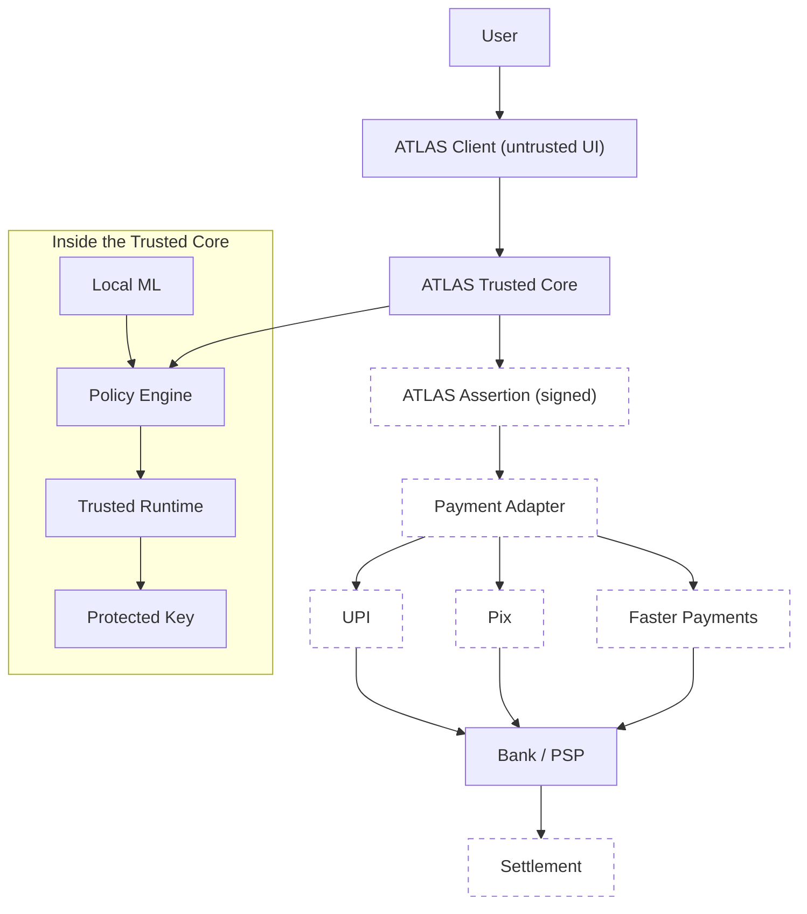
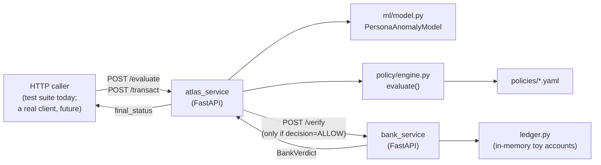
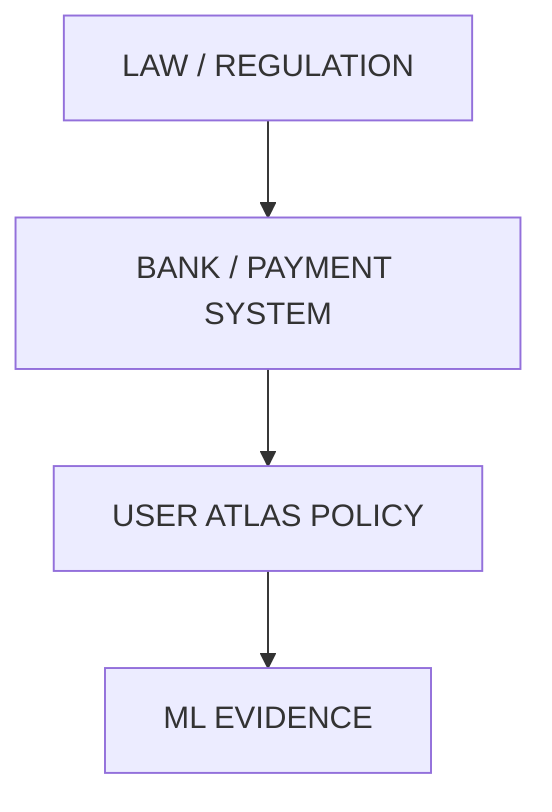
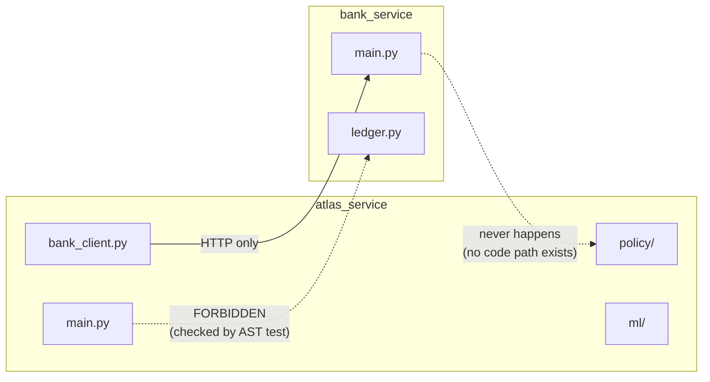
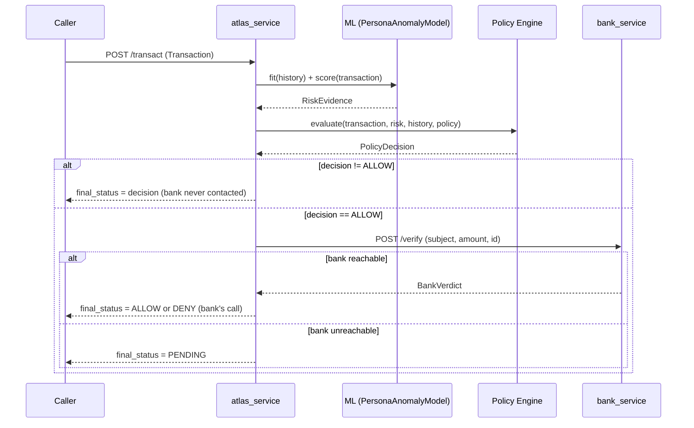
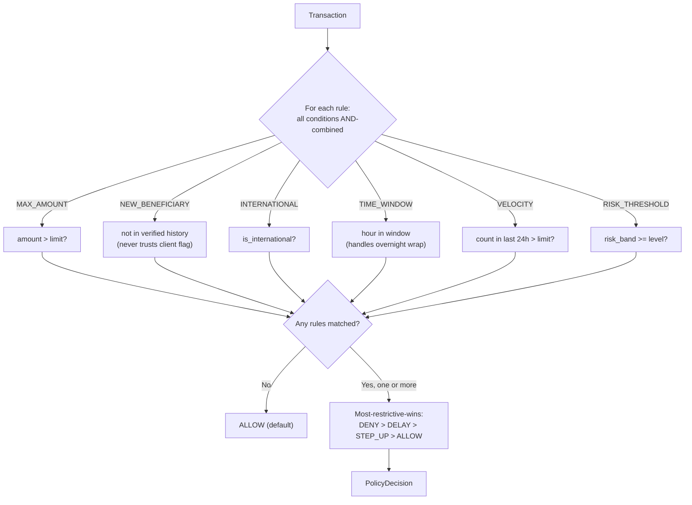
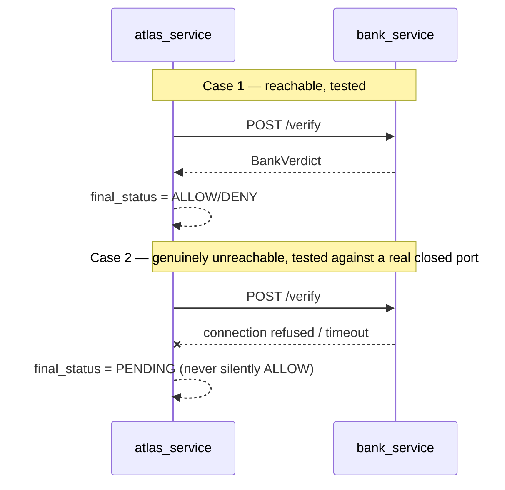
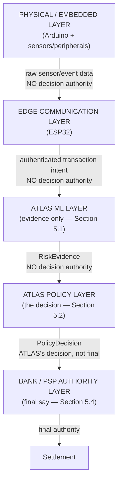
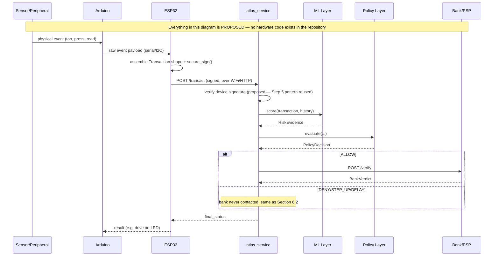

<!-- title: ATLAS Blueprint -->

# ATLAS Engineering Blueprint

**Document status:** living reference, generated 2026-08-26 against the frozen research architecture and Steps 0–3 of the implementation. **Not itself a frozen document** — it must be regenerated/updated as later build steps land, but it must never be used to silently redefine the frozen architecture or research conclusions it describes.

**Scope statement.** This document describes ATLAS as it actually exists today: a research prototype whose novelty is explicitly unproven, whose implementation covers four of ten planned build steps, and whose embedded/hardware dimension is entirely undesigned-in-code. Nothing below should be read as a claim that ATLAS is complete, secure in the production sense, or novel. Where this document proposes something the research never decided, that is labeled — not blended in as if the research already settled it.

---

## How to read this document — the provenance legend

Every non-trivial claim below carries one or more of these tags. This is not decoration; it is the actual instruction under which this document was written, and it is the same discipline `ledger/ARCHITECTURE.md` already established for the codebase.

| Tag | Meaning | Where it comes from |
|---|---|---|
| **[A]** | Research-established — something the Day 1–13 ChatGPT research conversation actually said, explored, or concluded | `ledger/CHATGPT-TRANSCRIPT.md` |
| **[B]** | Frozen architecture — locked by the final "architecture freeze" conversation; changing this requires the evidence-first protocol | `ledger/ARCHITECTURE.md` |
| **[C]** | Engineering judgment — a design or implementation decision made during the build, not dictated by the research | This document + `BUILD-PLAN.md` |
| **[D]** | Implemented — code exists in the repository right now | Verified by direct file inspection, 2026-08-26 |
| **[E]** | Tested — covered by a passing automated test, with the specific test named | Verified by a live `pytest` run, 2026-08-26: **45 passed in 13.00s** |
| **[F]** | Proposed / future work — described for planning purposes; no code exists | — |
| **[G]** | Unresolved research question — the research explicitly left this open; this document does not answer it | `ledger/ARCHITECTURE.md`'s RQ backlog |

A claim tagged **[D][E]** is both built and verified. A claim tagged **[C][F]** is my own proposed design that has not been built. A claim tagged only **[A]** or **[B]** is describing what the research said, not what the code does.

---

## 0. Source-of-Truth / Reconciliation

Required by the brief: before writing this blueprint, the historical conversation was checked against the actual repository state (fresh directory listing and fresh test run, both performed immediately before this document, not recalled from earlier in this session). Two categories of finding, neither silently resolved:

### 0.1 A genuine tension in the research record, already reconciled once (2026-08-22) — restated here, not re-litigated

Day 7's own Q5 research question **[A]** poses a scenario where the policy engine sees `Bank: Fraud risk=LOW` as one of its inputs. Day 12's architecture note and the final frozen architecture **[B]** both sequence the bank's check *after* ATLAS's own decision, with no bank input into that decision. This was resolved in `ledger/SYNTHESIS.md` §1 as research narrowing over time (Day 7 was exploratory; the freeze is authoritative) — not a contradiction requiring a fresh decision. The implemented policy engine **[D]** takes no bank data as input; this is confirmed by its function signature (`evaluate(transaction, risk, history, policy)` — no bank argument) and by the passing test suite.

### 0.2 Specificity the research never provided — flagged, not invented

The research **[A]** discusses embedded security in the abstract — "MCU," "Arduino/MCU," a defined Embedded Interface Emulator function surface, secure boot / TEE / Secure Element *concepts*. It does **not** name ESP32 specifically, does not specify Wokwi, does not specify WiFi/HTTP as the communication channel, and does not work through an embedded-specific threat model item-by-item (compromised device, forged identity, sensor manipulation, etc.). Section 24 of this document proposes concrete answers to close that gap — **all of Section 24's specifics are labeled [C][F]: engineering judgment extending frozen principles, not yet implemented.** Where this document says "ESP32," "Arduino," or "Wokwi," that is this document's proposal, not the research's conclusion.

### 0.3 What the fresh audit confirmed matches (no discrepancy found)

The claims in `BUILD-PLAN.md`'s Steps 0–3 status rows were checked against the actual file tree and a live test run performed immediately before writing this document. They match exactly: 29 source files exist (listed in Section 16), no `firmware/`, `dashboard/`, `adapters/`, `state_machine.py`, `crypto.py`, or `db.py` exist anywhere in the repository, and the test suite reports **45 passed, 0 failed, in 13.00 seconds** (8 in `test_ml_model.py`, 24 in `test_policy_engine.py`, 13 in `test_bank_boundary.py`). No fabricated or rounded numbers appear in this document — every count below is this same audit.

---

## 1. Executive Overview

ATLAS is a research prototype investigating one narrow, sharpened question **[B]**:

> Can a trusted, user-controlled financial policy layer evaluate transaction intent using deterministic policies and local behavioral evidence, protect the resulting decision through a trusted security boundary and cryptographic identity, and produce a verifiable policy assertion that can be consumed by existing payment infrastructure — without replacing the payment rail?

It is **not** a payment app, not a bank, not a new payment rail, and not a fraud-detection product **[B]**. It is a policy/security layer that sits alongside existing infrastructure and can only ever make a transaction *more* restrictive, never grant something a higher authority (the bank, the law) didn't already allow **[B]**.

**What exists today, precisely:** a machine-learning behavioral-anomaly layer **[D][E]**, a deterministic policy engine **[D][E]**, and two independent HTTP services demonstrating that a bank can override ATLAS's own decision **[D][E]**. Three build steps of an eleven-step plan. No cryptographic signing, no persistent transaction state machine, no payment-rail adapters, no dashboard, and no embedded/hardware code of any kind exist yet **[F]**.

**What has not been proven:** that any of this is novel. A real prior-art search **[A]** found a patent combining most of ATLAS's original architecture, and killed most of the individually-appealing novelty claims. What survives is a narrower, harder, explicitly unproven hypothesis **[B]** — see Section 21.

---

## 2. Problem Definition and Research Question

### 2.1 Origin **[A]**

ATLAS began as a request to combine an embedded-systems (ECE) background with a PGDM finance specialization, deliberately scoped to *global* finance rather than coursework, with eleven explicit constraints from the outset: no physical hardware; software tools replicating hardware behavior faithfully; genuine idea generation and selection; real-world usefulness; a rigorous experimental structure; a prior-art check; genuine novelty; a real, unprecedented problem, not a rehash; a working, usable piece of software, not a viewable-only demo; and Arduino-based embedded C with chip integration (wires, LEDs, sensors).

### 2.2 Methodology **[A]**

The research adopted an explicit "researcher, not student" discipline: never stop at *what*, always continue through *why → why not → what if → can it fail → can it be improved → can ATLAS do better*; never memorize, always model; always find the bottleneck; every claim needs external evidence, never "I think." This discipline is what later produced the Day 11–13 novelty findings (Section 3) rather than an unexamined novelty claim.

### 2.3 The research question's evolution **[A][B]**

| Framing | Status | When killed |
|---|---|---|
| "Can ML detect fraud?" | Rejected — not novel, thousands of existing studies | Day 7 |
| "Build an embedded fraud detector" | Rejected — too generic | Day 8 |
| "ATLAS decides ALLOW/DENY and tells the bank what to do" | Rejected — wrong authority model | Day 9 |
| "TEE + policy + ML + attestation for transaction authorization" | Rejected — an existing patent already claims this combination | Day 11 |
| *(final, frozen)* "Can a trusted, user-controlled financial policy layer… produce a verifiable policy assertion… without replacing the payment rail?" | **Current, frozen** | Freeze conversation |

---

## 3. Research Findings and Prior-Art Positioning

Days 11–13 **[A]** conducted a real prior-art search and found that most of ATLAS's individual pieces already exist in production or in filed patents:

- A patent (**US20210065194A1**) combines policy ruleset + ML-based authentication + TEE + attestation + a transaction-authorization message — most of ATLAS's original architecture, in one filed claim.
- A second patent describes policy-compliance checking inside a TEE with proof of execution attached to a transaction.
- **Visa's Commercial Payment Controls** already provide near-real-time spend/merchant/location/time/velocity controls tied into authorization.
- **Coinbase's Policy Engine** already applies rules to wallet operations with accept/reject outcomes.
- **Apple Pay** already demonstrates Secure Element + Secure Enclave + dynamic transaction cryptograms, in production, at scale.
- **EMV tokenization** already supports payment credentials constrained to device/merchant/scenario.
- **NIST and Android Key Attestation** already establish hardware-backed attestation as a working mechanism.

**[B] None of these, individually or combined, is ATLAS's novelty claim.** See Section 21 for what survives.

---

## 4. ATLAS Architecture

### 4.1 The frozen conceptual architecture **[B]** — not all of this exists in code yet


*Dashed nodes are not implemented — signing, adapters, and rail integration are Steps 5, 7, and (never, by design) real UPI/Pix/FPS connectivity **[F]**.*

### 4.2 The currently implemented architecture **[D][E]** — what actually runs today


*Every node in this diagram is real, running code, exercised by the 45-test suite. No signing occurs anywhere in this diagram — the HTTP calls are currently unauthenticated **[D]**, which Section 14 addresses directly.*

### 4.3 The three-domain split **[B]**

| Domain | Job | Provides |
|---|---|---|
| Embedded / Trusted Security | protects the *authority* | trusted execution, protected identity, key protection, attestation |
| Machine Learning | provides *evidence* | local behavioral anomaly detection only — never the final decision |
| FinTech / Finance | provides *meaning* | policy semantics, authorization logic, payment-rail integration |

---

## 5. Component and Service Responsibilities

For each component: what it does, why it exists, what it may/may not do, its inputs/outputs, who holds authority over it, its failure behavior, how it's tested, and its provenance tag.

### 5.1 `atlas_service/ml` — the anomaly-evidence layer

| | |
|---|---|
| **What it does** | Produces `RiskEvidence` (an anomaly score, a LOW/MEDIUM/HIGH band, and plain-language reasons) for one transaction, given a subject's history |
| **Why it exists** | Day 7 **[A]**: ATLAS needs to notice when a transaction is unusual for a *specific person*, not against a global population |
| **Allowed to** | Read transaction + history; produce evidence |
| **Not allowed to** | Decide ALLOW/DENY/STEP_UP/DELAY; that authority belongs to the policy engine, never ML **[B] principle 1** |
| **Receives** | `Transaction`, the subject's transaction history |
| **Produces** | `RiskEvidence` |
| **Authority** | None over the outcome — advisory only **[B]** |
| **On failure** | Frozen behavior **[B]**: "ML unavailable → fall back to deterministic policy." **Not yet implemented** — the current code has no unavailability handling; if `PersonaAnomalyModel.fit()`/`.score()` raises, the request currently fails rather than degrading gracefully **[F]** |
| **Tested** | `tests/test_ml_model.py`, 8/8 passing **[D][E]** — normal transactions score LOW; each of the original research's specific planted anomalies (₹70,000 at 3:12 AM, a 45-transaction velocity burst, an unknown cryptocurrency exchange, an unknown device in another country) scores MEDIUM/HIGH; a legitimate ₹85,000 purchase scores as anomalous *without* being asserted as fraud (anomaly ≠ fraud, Day 7 **[A]**); declared travel mode measurably reduces anomaly vs. an otherwise-identical undeclared case; explanations are plain language, never a bare number |
| **Provenance** | The *principle* (ML is advisor, per-subject baseline) is **[A][B]**; the *implementation* (Isolation Forest, specific features, the travel-mode neutralization fix) is **[C]** |

### 5.2 `atlas_service/policy` — the deciding authority

| | |
|---|---|
| **What it does** | Deterministically evaluates a transaction against a versioned policy, in the frozen Policy Semantic Layer vocabulary, and returns `PolicyDecision` |
| **Why it exists** | **[B]**: the policy engine, not ML, is the actual authority over the ALLOW/STEP_UP/DELAY/DENY outcome |
| **Allowed to** | Read `Transaction`, `RiskEvidence`, `history`, the policy file; independently re-verify beneficiary/device novelty against history rather than trust client-supplied flags |
| **Not allowed to** | See bank-side data (Section 0.1); silently ignore an unrecognized policy condition (fails loudly instead) |
| **Receives** | `Transaction`, `RiskEvidence`, `history`, `policy: dict` |
| **Produces** | `PolicyDecision` (decision, matched rule names, policy version + hash) |
| **Authority** | Final say on ATLAS's own decision; subordinate to the bank (Section 6) |
| **On failure** | Frozen: "policy corrupted → deny." **Implemented for one failure mode** — an unrecognized condition key raises `ValueError` rather than silently no-oping **[D][E]**, test `test_unknown_condition_key_fails_closed`. Malformed YAML / missing file is **not yet handled explicitly [F]** |
| **Tested** | `tests/test_policy_engine.py`, 24/24 passing **[D][E]** — including boundary conditions (amount exactly at a limit vs. one paisa over; time-window edges), multi-rule conflicts (most-restrictive-wins verified with a ₹150,000 transaction matching two rules of different severity), the reframed "trusted beneficiary vs. high ML risk" scenario, an adversarial test where the client lies about `is_new_beneficiary` and the engine catches it anyway, hash determinism and sensitivity, and rollback rejection |
| **Provenance** | Vocabulary and versioning/hashing principle: **[B]**. Conflict-resolution ordering (DENY>DELAY>STEP_UP>ALLOW) and using the categorical risk band instead of a raw score: **[C]**, explicitly flagged when built |

### 5.3 `atlas_service/bank_client.py` — the one-directional door to the bank

| | |
|---|---|
| **What it does** | Calls `bank_service`'s `/verify` over HTTP; converts connection/timeout/HTTP failures into a typed `BankUnreachableError` |
| **Why it exists** | **[B]**: ATLAS may ask the bank; the reverse must never be possible |
| **On failure** | **[B]** frozen rule: "bank unavailable → pending," never silent approval. **Implemented and tested against a real closed TCP port**, not a mock **[D][E]**, test `test_verify_with_bank_raises_on_genuinely_unreachable_port` |
| **Provenance** | **[C]** implementation; **[B]** the failure semantics it must respect |

### 5.4 `bank_service` — the independent authority

| | |
|---|---|
| **What it does** | Holds a toy in-memory ledger (three accounts: normal, frozen, insufficient-balance); decides `/verify` requests purely from `(subject, amount)` |
| **Why it exists** | **[B]**: "the bank still owns the account" — this has to be a genuinely separate authority, not a rubber stamp |
| **Not allowed to** | Import anything from `atlas_service.policy` or `atlas_service.ml` — enforced by an AST-level source test, not just convention **[D][E]**, `test_bank_service_never_imports_atlas_internals` |
| **Receives** | `subject`, `amount`, `transaction_id` — nothing about ATLAS's ML evidence or policy reasoning |
| **Produces** | `BankVerdict` (approved, reason — using Day 10 Q2's own reason vocabulary: "insufficient funds," "account restrictions") |
| **Authority** | Final — can override an ATLAS ALLOW; ATLAS cannot override a bank DENY **[B]** |
| **Tested** | Direct `/verify` tests (approve, frozen-account reject, insufficient-funds reject, unknown-account reject) plus full end-to-end tests through `/transact` proving the override actually happens in running code, not just at the unit level — `test_transact_bank_overrides_atlas_allow_frozen_account`, `test_transact_bank_overrides_atlas_allow_insufficient_funds` **[D][E]** |
| **Provenance** | This is a **toy simulator [C][F]** — not connected to any real bank, UPI, or PSP, and never will be within this prototype's scope **[B]** ("no real UPI transactions," "no live bank integration" are in the frozen exclusion list) |

### 5.5 Components that do not exist yet **[F]**

| Component | Planned step | Status |
|---|---|---|
| Transaction state machine + SQLite persistence | Step 4 | Not started |
| Ed25519 signing / verification, replay cache, revocation | Step 5 | Not started |
| UPI-shaped / Pix-shaped payment adapters | Step 7 | Not started |
| Wokwi/ESP32 firmware | Step 8 | Not started |
| Dashboard | Step 9 | Not started |

---

## 6. Trust and Authority Boundaries

### 6.1 The authority hierarchy **[B]**



A layer can only make a transaction **more restrictive**, never grant what the layer above didn't already allow **[B]**.

- `ATLAS=ALLOW`, `Bank=DENY` → **DENY, always**. Implemented and tested **[D][E]** (Section 5.4).
- `ATLAS=DENY`, `Bank=would-have-approved` → genuinely unresolved **[G]** (RQ-13/28/29 — a governance question, not a coding one). This implementation's resolution (Section 6.2) sidesteps the question rather than answering it.

### 6.2 A conservative engineering resolution of an open question **[C]**

Because RQ-13/28/29 are explicitly unresolved **[G]**, `atlas_service` is built so that **if its own policy decision is already DENY, it never contacts the bank at all** — there is nothing to ask, and no code path asserts an answer to the open question. This is verified by test, not just asserted **[D][E]**: `test_transact_atlas_deny_never_contacts_bank` points the bank client at a closed port and confirms the result is a clean `DENY` (ATLAS's own decision) rather than `PENDING` (which would prove an unreachable-bank code path had actually been triggered).

### 6.3 How the boundary is actually enforced today

Not by network topology alone — by **static source-code isolation**, which is a stronger guarantee **[C]**:



The forbidden edge is not merely undocumented — `tests/test_bank_boundary.py::test_bank_service_never_imports_atlas_internals` parses `bank_service`'s source with Python's `ast` module and asserts `atlas_service` never appears among its imports **[D][E]**.

---

## 7. Transaction/Data Flow

### 7.1 What is implemented and tested today **[D][E]**



### 7.2 The full frozen flow — not yet implemented **[B][F]**

The conceptual flow includes signing the decision into an `AssertionPayload`/`SignedAssertion` (Step 5), persisting transaction state through the frozen state machine (Step 4), and routing through a payment-rail adapter (Step 7) before ever reaching a bank. None of that exists in Section 7.1's diagram yet — today's `/transact` is the ML→policy→bank slice only, with no cryptographic proof attached to the decision at all.

---

## 8. ML / Anomaly-Detection Layer

Covered in detail in Section 5.1; this section adds the two real defects found and fixed during Step 1 **[D][E]**, since they materially shaped the final design and are part of the verified record, not just narrative:

1. **Data leakage + O(n²) performance bug.** The first implementation of the training-feature computation let a transaction "see" transactions that happened after it chronologically when deciding if a beneficiary was new — a real correctness bug, not just a style issue — and was incidentally ~10x slower because of it. Fixed with a proper walk-forward `extract_training_matrix()` that only ever looks backward in time.
2. **Travel Mode initially made anomaly scores worse, not better.** With travel injected at only ~2.5% of training data — sitting right at the configured contamination rate — the Isolation Forest learned to treat travel itself as the rare pattern to isolate, exactly backwards from intent. Fixed with a deterministic feature-neutralization adjustment (location/international signals are neutralized when `declared_travel_mode` is true) rather than relying on the model to learn the pattern from sparse density — a more robust design directly following Day 7 Q4's own instruction that Travel Mode should be a deterministic *reinterpretation* of evidence, not a hope that the model infers it.

**Known, documented limitation [C]:** the amount baseline is computed per-subject globally, not per-beneficiary — a legitimately recurring large payment (rent) can read as mildly elevated. Does not block any current test scenario; a "recognized recurring payment" concept is future work, not attempted here, to avoid gold-plating a research prototype's ML step.

---

## 9. Policy Semantic Layer and Rule Engine

### 9.1 The frozen vocabulary **[B]**

`MAX_AMOUNT`, `NEW_BENEFICIARY`, `INTERNATIONAL`, `TIME_WINDOW`, `VELOCITY`, `RISK_THRESHOLD` are conditions; `REQUIRE_STEP_UP` (and DENY/ALLOW/DELAY) are outcomes a rule maps to, not an additional condition — this reading follows the research's own worked examples ("IF amount > X THEN require confirmation") **[C, interpretation of A]**.

### 9.2 Evaluation flow **[D][E]**



### 9.3 A security decision worth restating **[C], extending A**

`NEW_BENEFICIARY` (and any future "new device" check) never trusts `Transaction.is_new_beneficiary` as sent — the engine independently recomputes it from the subject's own history. This directly extends Day 13's own red-team finding for the ML/app layer ("the trusted layer re-verifies transaction data itself") to the policy layer. Verified by an adversarial test that constructs a transaction lying about this exact flag and confirms the engine catches it anyway **[D][E]**, `test_client_lying_about_new_beneficiary_is_ignored`.

---

## 10. Bank/PSP Interaction Model

Already detailed in Sections 5.4, 6, and 7. The essential, easy-to-overclaim point, stated plainly: **`bank_service` is a toy simulator with three hardcoded in-memory accounts** **[C][F]**. It does not connect to UPI, any real bank core, or any PSP, and the frozen research explicitly excludes ever doing so within this prototype's scope **[B]**. Its value is entirely in *proving the authority-separation mechanism*, not in providing real banking functionality.

---

## 11. Security Architecture and Threat Model

### 11.1 The frozen Red Team scorecard **[A][B]** (Day 13)

| Attack | Status | Reasoning |
|---|---|---|
| Compromised OS / malicious app | 🟡 mitigable | trusted layer re-verifies data itself |
| Stolen phone | 🟡 layered | key protection helps; user-authentication is a separate problem |
| Stolen assertion (replay) | 🟢 strong | transaction ID + nonce + expiry + state + signature |
| Malicious policy update | 🟡 mitigable | needs auth + versioning + secure storage |
| Fake policy enrollment | 🔴 unsolved | trust-bootstrap, not a cryptography problem |
| Compromised/poisoned/evaded ML | 🟡 mitigable | ML is non-authoritative by design |
| Policy rollback | 🟡 mitigable | monotonic versioning |
| Compromised TEE | 🔴 serious | attestation is evidence, not proof |
| Compromised Secure Element | 🔴 serious | needs revocation + re-enrollment |
| Fake attestation | 🟡 mitigable | verifier must check the full chain |
| Network failure | 🟢 solved | state machine + reconciliation |
| Bank rejects ATLAS's ALLOW | 🟢 not an attack | the hierarchy working as designed |
| ATLAS/bank conflict on DENY | 🔴 unsolved | governance, not code |
| Emergency override abuse | 🟡 mitigable | needs a separate high-assurance flow |
| Privacy leakage via the assertion | 🟡 open | even a bare decision leaks *something* |
| Cross-rail incompatibility | 🔴 hardest | currency/timing/regulatory differences |

### 11.2 Which of these Steps 0–3 actually touch **[C], mapped against A/B**

| Red-team item | Current implementation status |
|---|---|
| Compromised OS/malicious app (data lying) | **Partially addressed [D][E]** for one specific case — `is_new_beneficiary` lying is caught (Section 9.3). Amount/other-field tampering is not independently re-verified against anything yet. |
| Bank rejects ATLAS's ALLOW | **Fully demonstrated [D][E]** (Section 5.4) |
| Network failure (bank unreachable) | **Fully demonstrated [D][E]** for the ATLAS→bank leg (Section 5.3) |
| Policy rollback | **Check logic implemented [D][E]**; persistent "last seen version" storage is Step 4, not built |
| Everything requiring signatures (replay, stolen assertion, fake attestation, forged identity) | **Not implemented — Step 5 [F]** |
| Compromised TEE / Secure Element | **Not applicable yet — no trusted-execution boundary exists in code, only process/import separation [F]** |

---

## 12. Failure Modes and Resilience

### 12.1 The frozen failure-mode table **[B]**

| Failure | ATLAS response |
|---|---|
| ML unavailable | fall back to deterministic policy |
| ML uncertain | step-up |
| Policy corrupted | deny |
| Key unavailable | step-up / deny |
| Attestation fails | step-up / deny |
| Device revoked | deny |
| Network unavailable | pending → reconciliation |
| Bank unavailable | pending |
| Bank rejects | bank's decision wins |
| Assertion expired | reject |
| Assertion replayed | reject |
| Policy rollback detected | reject |
| Model integrity failure | disable ML, use policy alone |
| Emergency request | separate high-assurance flow |
| Unknown payment status | reconcile — never blindly retry |

### 12.2 Implementation status against that table **[C]**

Only **"Bank unavailable → pending"** and **"Bank rejects → bank's decision wins"** are implemented and tested today **[D][E]**. Every row involving cryptography, persistence, or ML unavailability handling is **future work [F]** — most require Step 4 (state machine) or Step 5 (crypto) to even be expressible in code.



---

## 13. Policy Integrity, Versioning and Hashing

**[B]** frozen principle: policy integrity requires versioning + hashing + non-rollback; **a policy hash proves integrity, not legitimacy** — it proves "this exact text produced this decision," not "the real account holder authored it" (provenance remains open, RQ-7/12/24 **[G]**).

**[D][E] implemented and tested today:** SHA-256 over the canonical (sorted-key, fixed-separator) JSON serialization of the entire policy including its version; a pure `check_rollback()` function rejecting any attempted version older than one already seen. Tests confirm hash determinism, hash sensitivity to a single changed value, and rollback rejection/acceptance across older/equal/newer/first-ever version cases.

**[F] not implemented:** persistent storage of "the last version seen for this subject" — the check function exists and is correct, but nothing yet calls it with real, persisted state; that is Step 4's job.

---

## 14. Authentication, Authorization and Trust Model

**[A]** Day 10's distinction, still exactly accurate to how this document should be read: *Authentication* = who are you; *Authorization* = what may you do; *Policy* = under what rules.

**The single most important honesty point in this entire document:** **as of Steps 0–3, ATLAS has no cryptographic authentication or identity of any kind [F].** The HTTP calls between `atlas_service` and `bank_service` are plain, unsigned JSON over HTTP. The trust boundary that exists today is **process and source-code isolation only** (Section 6.3) — real, and independently verified by an AST-level test, but not cryptographic. Ed25519 signing, the `AssertionPayload`/`SignedAssertion` split already defined in `contracts.py`, and the `secure_sign()`/`attest()`/`revoke()` interface from the frozen Embedded Interface Emulator **[B]** are all designed but **not yet wired to any running code [F]** — that is Step 5.

---

## 15. Implementation Architecture

**[D]** Confirmed stack, from `requirements.txt` and the actual code: Python 3.12, FastAPI + Pydantic v2 for both services, scikit-learn (`IsolationForest`) + NumPy for ML, PyYAML for policy files, `httpx` for inter-service calls, pytest + `fastapi.testclient.TestClient` for testing. No database yet (SQLite is planned, Step 4, not present). No async — all endpoints are synchronous `def`, matching the synchronous `httpx.Client`/`PersonaAnomalyModel` design used throughout.

---

## 16. Repository / File Structure

**[D]** The actual tree, from a fresh listing immediately before this document (not the aspirational tree in `BUILD-PLAN.md`):

```
atlas/
├── BUILD-PLAN.md
├── PROJECT.md
├── requirements.txt
├── contracts.py
├── docs/
│   ├── POSITIONING.md
│   └── ATLAS-Blueprint.md          (this document)
├── ledger/
│   ├── ARCHITECTURE.md
│   ├── CHATGPT-TRANSCRIPT.md
│   ├── NOTEBOOK.md
│   └── SYNTHESIS.md
├── atlas_service/
│   ├── main.py                     (/evaluate, /transact)
│   ├── bank_client.py
│   ├── ml/
│   │   ├── synth.py
│   │   ├── features.py
│   │   └── model.py
│   └── policy/
│       ├── engine.py
│       └── policies/
│           ├── user-demo-1.yaml
│           ├── user-frozen-1.yaml
│           └── user-poor-1.yaml
├── bank_service/
│   ├── main.py                     (/verify)
│   └── ledger.py
└── tests/
    ├── conftest.py
    ├── test_ml_model.py
    ├── test_policy_engine.py
    └── test_bank_boundary.py
```

**Not present anywhere in the repository** — confirmed by the same fresh listing, not assumed: `firmware/`, `dashboard/`, `atlas_service/adapters/`, `atlas_service/state_machine.py`, `atlas_service/crypto.py`, `atlas_service/db.py`, `bank_service/verify.py` *(logic currently lives directly in `main.py`/`ledger.py` instead)*, `bank_service/replay_cache.py`, `bank_service/revocation.py`, `scripts/run_dev.py`, `.gitignore` entries for a database file *(none exists yet to ignore)*.

---

## 17. Test Architecture and Verification Evidence

**[D][E]** Live results, this session, immediately before this document:

```
============================= test session starts =============================
platform win32 -- Python 3.12.10, pytest-9.1.1
collected 45 items

tests/test_bank_boundary.py .............                             [ 13 passed]
tests/test_ml_model.py ........                                       [ 8 passed]
tests/test_policy_engine.py ........................                  [ 24 passed]

======================= 45 passed in 13.00s =======================
```

| Suite | Count | What it proves |
|---|---|---|
| `test_ml_model.py` | 8 | Per-subject anomaly detection against the original research's own specific examples; travel-mode correction works; explanations are plain language |
| `test_policy_engine.py` | 24 | Boundary correctness, multi-rule conflict resolution, an adversarial data-lying case, hash/version integrity |
| `test_bank_boundary.py` | 13 | Source-level import isolation (AST-checked), real authority override end-to-end, genuine network-failure handling against a real closed port |

No test in this suite exercises cryptography, persistence, adapters, or hardware — because none of that code exists yet **[F]**.

---

## 18. Red-Team Findings and Security Decisions

Consolidated from Sections 8, 9.3, and 11 — the concrete, implemented answers to specific Day 13 findings **[C], addressing A/B**:

1. **"Compromised OS/malicious app"** → the policy engine independently re-derives `is_new_beneficiary` from history rather than trusting the request. Tested adversarially.
2. **"Bank rejects ATLAS's ALLOW"** → not treated as an edge case but as the *headline* test of the whole system. Tested end-to-end.
3. **"Network failure"** (the ATLAS↔bank leg specifically) → typed exception, tested against a genuinely closed port, never silently treated as success.
4. **"Policy rollback"** → pure check function implemented and tested; persistence deferred to Step 4, not silently dropped.

Everything else in the Section 11.1 scorecard remains exactly as the research left it — unaddressed by code, because the code that would address it (crypto, TEE/Secure-Element modeling, enrollment) does not exist yet.

---

## 19. Known Limitations

Stated plainly, not buried:

- **No cryptographic trust of any kind exists yet.** Today's "trust boundary" is source isolation, not cryptography (Section 14).
- **The ML model is refit from scratch on every request** — no persistence or caching of trained models per subject. Fine for demonstrating the mechanism; not how a real service would behave.
- **The amount baseline is per-subject-global, not per-beneficiary** — recurring large payments can read as mildly elevated (Section 8).
- **`bank_service`'s ledger is in-memory and resets on restart** — three hardcoded accounts, no real persistence.
- **The bank URL is a single hardcoded constant** (`atlas_service/main.py`), not configuration.
- **No handling exists yet for ML raising an exception, malformed policy YAML, or a missing policy file** — these fail with an unhandled error today rather than the frozen "policy corrupted → deny" behavior, except for the one specific case tested (Section 5.2).
- **Zero hardware, firmware, or embedded code exists** (Section 24 is entirely proposed).

---

## 20. Open / Unresolved Research Questions

**[G]** Reproduced faithfully from `ledger/ARCHITECTURE.md` — not answered here, not softened:

- **RQ-7/12/24** — policy and device *provenance* (not just integrity): how does a bank know a policy or ATLAS instance genuinely traces to the real account holder? The red team's "fake enrollment" attack is exactly this gap, rated 🔴.
- **RQ-11/23** — who operates ATLAS's identity infrastructure? Four candidate models floated, none chosen.
- **RQ-13/28/29** — the DENY-side authority conflict; where user policy sits relative to mandatory regulatory controls; who is liable if ATLAS says ALLOW and the transaction is fraudulent. Governance questions, not coding ones.
- **RQ-14** — the full revocation lifecycle (ACTIVE→SUSPENDED→REVOKED) — designed, not built.
- **RQ-16/18/19/25/26** — cross-rail policy portability and currency-conversion semantics. Named by the red team as the single hardest open problem.
- **RQ-30** — what would make a bank/PSP economically willing to integrate ATLAS at all? No convincing answer found.
- **RQ-31** — which guarantees need real hardware vs. can stay simulated indefinitely (directly relevant to Section 24).

Also still genuinely open, not a blocker: whether Module 7 (dedicated Security day) or Module 8 (historical failures — Mondex/Avant/eNaira/Dinero) ever ran in the original research.

---

## 21. Novelty / Contribution Positioning

**[B]**, reproduced faithfully from `docs/POSITIONING.md` — this is the honest answer, and this document does not sharpen it into a stronger claim than the research supports:

> Individually, none of ATLAS's pieces are new: policy engines, spending controls, Secure Elements, TEEs, attestation, and even the specific combination of policy + ML + TEE + attestation for transaction authorization all have real prior art, including at least one directly overlapping patent. What hasn't been shown to already exist — and what this prototype sets out to *test*, not claim — is whether a policy can stay genuinely user-owned (rather than bank- or wallet-owned) and portable across different payment rails, while keeping the behavioral evidence that justifies a decision strictly local, disclosed to no one.

**Novelty status: OPEN / UNPROVEN.** Steps 0–3 do not change this status — they test the *mechanism*, not the *novelty claim*, and no claim in this document should be read as asserting otherwise.

---

## 22. Implementation Roadmap / Future Work

**[C][F]**, from `BUILD-PLAN.md`, unchanged in substance:

| Step | Content |
|---|---|
| 4 | Transaction state machine + SQLite, fail-closed vs. reconcile split |
| 5 | Ed25519 signing/verification, canonical serialization, replay cache, minimal revocation |
| 6 | Full HTTP integration, all core scenarios, still no hardware |
| 7 | UPI-shaped + Pix-shaped payment-rail adapters (toy shapes, not real formats) |
| 8 | Wokwi ESP32 firmware — see Section 24 |
| 9 | Dashboard |

---

## 23. Final Architecture Summary

ATLAS is, today, precisely this and nothing more: a per-subject ML anomaly model **[D][E]**, a deterministic policy engine reading a versioned, hashed YAML policy **[D][E]**, and two independent FastAPI services proving — in running, tested code — that a bank can override ATLAS and that an unreachable bank never silently becomes an approval **[D][E]**. Everything involving cryptography, persistence, payment rails, a dashboard, or physical/simulated hardware is designed at the level of principle **[B]** but not yet built **[F]**. The research's own novelty claim remains exactly where the research left it: open, unproven, and narrower than the original pitch **[B]**.

---

## 24. Embedded Hardware Architecture

**Read this section's label discipline carefully: almost everything below is [C][F] — my own engineering proposal, extending frozen principles into a domain the research described only abstractly, and none of it is implemented.** Section 0.2 already flagged this; this section is where that gap gets a full, honest treatment rather than an invented implementation history.

### 24.1 What the research actually said **[A][B]** — the boundary of what's grounded

- An embedded/trusted layer exists because it's a genuine security requirement — protecting keys and policy-evaluation integrity needs a stronger boundary than ordinary application code, **not** because the project needed an Arduino in the diagram **[B]**.
- The **Embedded Interface Emulator** function surface is frozen: `init_device()`, `generate_identity()`, `get_public_key()`, `secure_sign(data)`, `verify_policy(policy)`, `attest()`, `revoke()` **[B]**.
- The software-only prototype must never claim hardware-equivalent security **[B]** — this rule applies with full force to everything in this section.
- RQ-31 **[G]** already sorts *what kind* of guarantee needs real hardware: policy evaluation, ML, hashing, signatures, and the payment API are fine in software indefinitely; private-key protection, trusted execution, device identity, attestation, and secure boot are simulatable for a prototype but *should* eventually be hardware-backed for anything real.
- The research explicitly discusses a future **Python ↔ serial/USB ↔ Arduino/MCU firmware bridge [A]** as the eventual real-hardware path, generically — not ESP32 by name, not Wokwi, not WiFi.

**Everything past this point is this document's proposal for how to instantiate those principles, clearly marked [C][F].**

### 24.2 Layer separation — who owns each decision **[C][F]**



**No decision authority exists below the Policy Layer, ever [C], directly extending [B] principle 1** ("ML is an advisor, never the judge") **down one more layer**: the embedded device is a *witness and evidence source*, not a judge, for exactly the same reason ML isn't — a component closer to the physical world is *more* exposed to tampering (sensor manipulation, physical theft), not less, so it deserves *less* trust, not more.

### 24.3 ESP32's proposed role **[C][F]**

| Question | Proposed answer |
|---|---|
| What does it collect? | Raw transaction-intent data from Arduino/peripherals (Section 24.4) plus its own connectivity state |
| What processing happens locally? | Minimal — packaging data into the `Transaction` shape, running the local half of `init_device()`/`secure_sign()` if a hardware-backed key is available on the module; **no ML, no policy evaluation locally** — those stay server-side per Section 24.2 |
| How does it communicate with ATLAS? | HTTP over WiFi to `atlas_service`, mirroring the existing `/transact` contract exactly — no new protocol invented |
| Device identity | A key pair generated on-device (`generate_identity()`), analogous to how `atlas_service` will hold its own key from Step 5 — an `atlas_key_id`-equivalent identifies *this device*, distinct from the subject's ATLAS policy identity |
| Authentication | Every request signed with the device's private key (`secure_sign()`); `atlas_service` verifies against a previously-enrolled public key — the same enrollment problem already flagged unresolved at the human/institutional level (RQ-7/12/24 **[G]**) applies identically at the device level, not solved here either |
| Security responsibilities the device *does* hold | Protecting its own private key from casual extraction; refusing to operate with an unset/default identity; reporting its own integrity state honestly (or failing closed if it can't) |
| Responsibilities that must stay *off* the device | Any ALLOW/DENY/STEP_UP decision; ML scoring; policy evaluation; final transaction authorization — all Section 24.2 |
| Device compromise | Revoked via the same `revoke()` interface **[B]** already frozen for ATLAS's own key — a compromised ESP32's signatures become rejected the same way a compromised ATLAS instance's would |

**This project must never claim ESP32-based signing provides hardware-equivalent security** — a consumer ESP32 module without a certified secure element is a **[C]** convenience choice for a research prototype, explicitly *not* the hardware-backed guarantee Section 24.1's frozen principle requires for anything beyond a prototype.

### 24.4 Arduino's proposed role **[C][F]**

Arduino is a **sensor/peripheral interface feeding the ESP32** — never a security or financial decision-maker, for the same reason Section 24.2 gives ML no authority: it sits even closer to the physical, tamperable world.

- **Sensor acquisition / physical input:** a button press, an RFID/NFC tap, or a keypad entry as the *physical event* that originates a transaction intent.
- **Communication with ESP32:** serial or I²C, handing off a simple, well-defined payload (e.g., "tag ID X read at time T") — not a `Transaction` object itself; that assembly happens on the ESP32 or server side.
- **Why Arduino specifically must never be the financial authority:** a bare Arduino running ordinary firmware has none of the four embedded-layer responsibilities from Section 4.3's frozen framing (no trusted execution boundary, no protected identity, no key protection, no attestation) — it is a sensor interface, full stop, and treating its output as trustworthy without the ESP32/ATLAS layers re-verifying it would directly violate **[B]**'s own "not every embedded system automatically has these properties" warning.

### 24.5 Embedded-to-ATLAS sequence — proposed, not implemented **[C][F]**



### 24.6 Embedded threat model **[C][F]** — reasoned from frozen principles, not researched item-by-item in the original conversation

| Threat | Proposed handling | Grounded in |
|---|---|---|
| Compromised device (firmware-level) | Device signatures become untrustworthy; same detection problem as a compromised TEE (🔴 serious, Section 11.1) — attestation gives evidence, not proof | **[A][B]** extended |
| Stolen device | `revoke()` the device's key, identical mechanism to Section 5's revocation design | **[B]**, direct reuse |
| Replayed transaction | Same nonce/expiry/transaction-ID discipline the frozen assertion design already specifies for ATLAS's own signing (Section 13) — reused, not reinvented | **[B]**, direct reuse |
| Forged device identity | Exactly RQ-7/12/24's enrollment problem, one layer down — genuinely unresolved, not solved here | **[G]**, unresolved |
| Modified firmware | Secure boot is named in RQ-31 as something that *should* be hardware-backed eventually; a consumer ESP32 without verified boot cannot actually guarantee this | **[B]**/**[G]** |
| Network interception | Should use TLS at minimum; the research's "minimum necessary disclosure" principle (Section 12) applies to what the device transmits, same as ATLAS's own assertion | **[B]** extended |
| Sensor manipulation | This is *why* Section 24.4 gives Arduino zero decision authority — a manipulated sensor produces a manipulated `Transaction`, but the policy/bank layers still apply exactly as they would to any other transaction | **[C]**, direct consequence of 24.2 |
| Communication failure | Identical pattern to the already-implemented ATLAS↔bank handling (Section 12.1): never silently treat unreachable as success; the device should hold the event and retry, not assume anything | **[B]** extended, mechanism unbuilt |
| Device offline state | The device should fail closed locally (no local ALLOW capability exists — Section 24.2) rather than queue an unauthorized decision | **[C]**, direct consequence of 24.2 |
| ATLAS/backend unavailable | Same "pending, reconcile, never blind-retry" principle already frozen and already tested for the ATLAS↔bank leg (Section 12) | **[B]**, mechanism reused conceptually, not yet built for this leg |

### 24.7 What is implemented, prototype, simulated, or future — stated with zero ambiguity

| Item | Status |
|---|---|
| Physical Arduino/ESP32 hardware | **Not owned, not purchased** — explicit project constraint from the very first research message **[A]** |
| Any `.ino` file, firmware code, or `firmware/` directory | **Does not exist in the repository** — confirmed by the fresh listing in Section 0.3 |
| Wokwi as the simulation tool | **Proposed only [C][F]** — named in an earlier conversation turn, not the frozen research, not yet configured |
| Device identity / signing scheme described in 24.3 | **Proposed only [C][F]** — reuses the *pattern* Step 5 will build for ATLAS's own key, itself not yet built |
| The layer-separation diagram (24.2) | **Design proposal [C][F]**, directly derived from frozen principle **[B]**, not itself frozen |
| The threat model (24.6) | **Analysis performed for this document [C]**, reasoning from frozen principles — not a transcription of research that already did this analysis |

No hardware implementation evidence is claimed anywhere in this section, because none exists.

---

## Final Consistency Audit

Performed immediately after drafting, against the same fresh repository state audited in Section 0.

**Definitely implemented [D]:** `contracts.py` (all data models); `atlas_service/ml/{synth,features,model}.py`; `atlas_service/policy/engine.py` + three policy YAML files; `atlas_service/main.py` (`/evaluate`, `/transact`); `atlas_service/bank_client.py`; `bank_service/{main,ledger}.py`; `docs/POSITIONING.md`.

**Definitely tested [E]:** all of the above, via 45 passing tests (8 + 24 + 13), confirmed by a live run at 13.00 seconds immediately before this document was written — not a remembered or estimated figure.

**Definitely incomplete:** cryptographic signing, transaction persistence/state machine, payment-rail adapters, dashboard, and every item in Section 24 (embedded/hardware) — zero code for any of these exists.

**Definitely unresolved (research, not implementation):** every item in Section 20 — provenance/enrollment, root-of-trust ownership, the DENY-side authority conflict, cross-rail semantics, bank economic incentive. This document answers none of them and was not permitted to.

**Does this blueprint accurately match the frozen architecture?** Yes, with the two reconciliation points in Section 0 disclosed rather than smoothed over, and with Section 24 clearly and repeatedly marked as this document's own proposal rather than the research's conclusion. No claim in this document asserts novelty, security completeness, or hardware implementation beyond what Sections 0, 19, 20, and 24.7 already state plainly.
