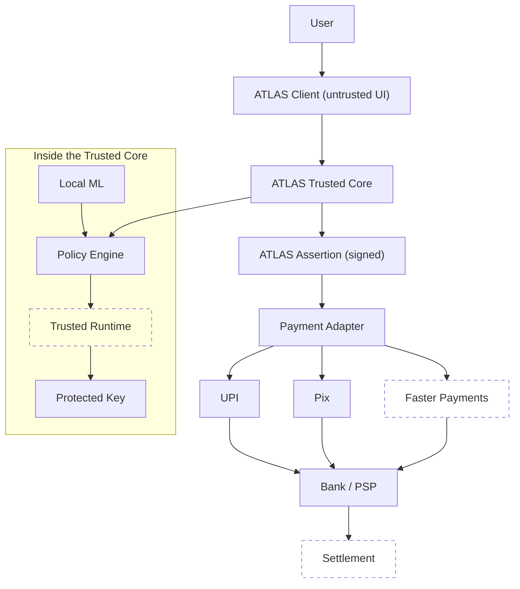
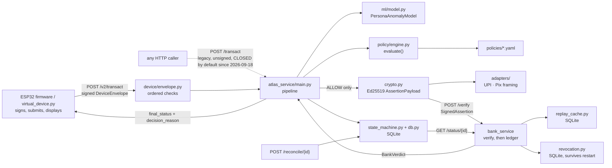
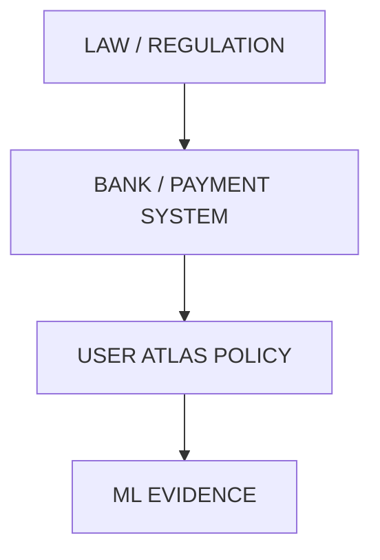
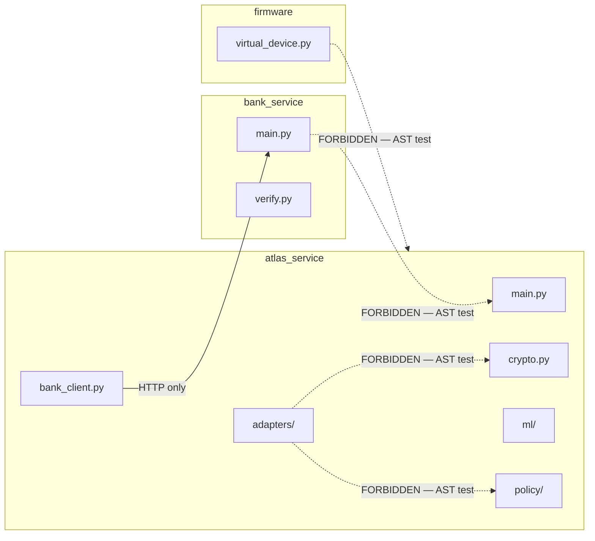
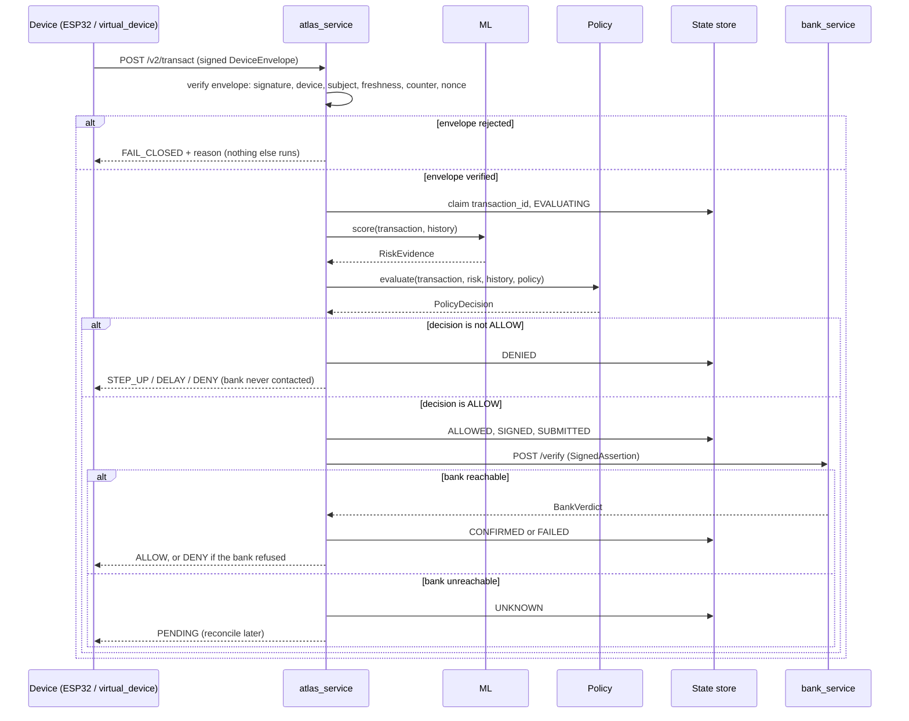
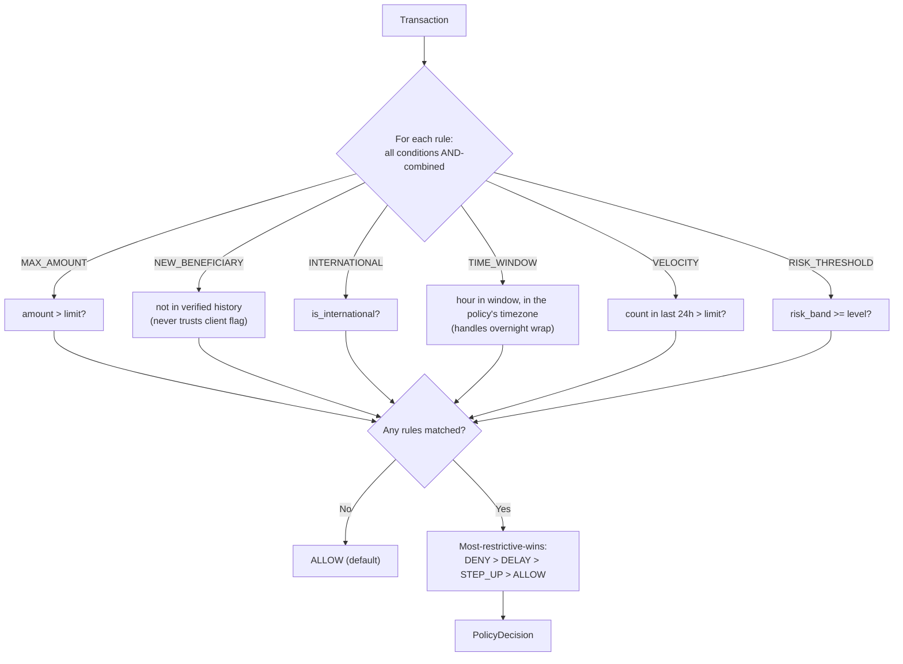
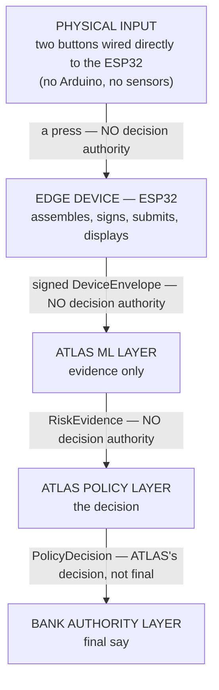
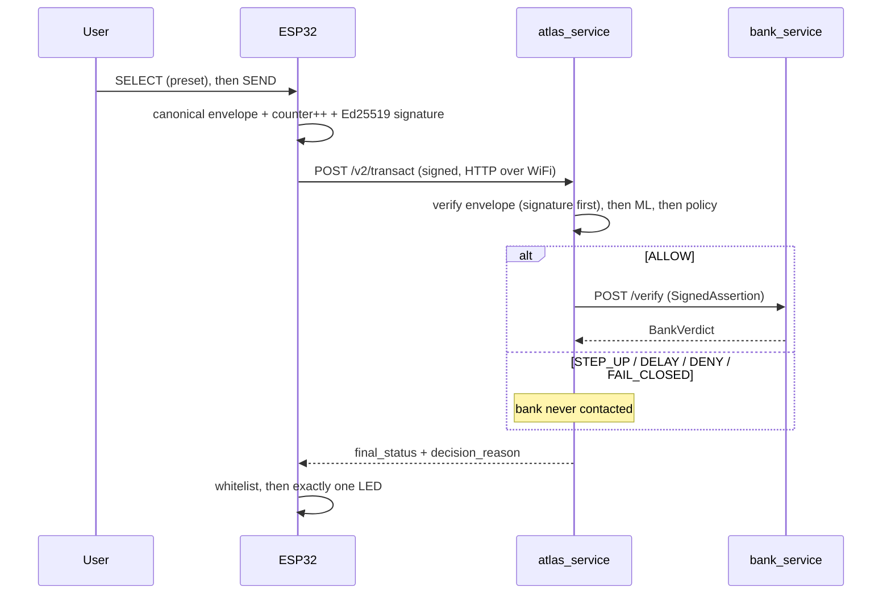

<!-- title: ATLAS Blueprint -->

# ATLAS Engineering Blueprint

**Document status:** living reference. First generated 2026-08-26 against Steps 0–3; refreshed 2026-09-16 for the first public release, updated for the 2026-09-17 and 2026-09-18 work, and **re-synced with this release on 2026-09-21** (every count, status and limitation re-checked against the repository and a live test run). It must be regenerated as later work lands, and it must never be used to silently redefine the frozen architecture or research conclusions it describes.

**Scope statement.** This document describes ATLAS exactly as it exists in this repository: a research prototype whose novelty is explicitly unproven; whose build covers Steps 0–8 of a nine-step plan and a Step 9 dashboard that is built but not hosted; plus a hardening track (Phase 1 audit, Phase 2, Phase 3.1–3.3, checkpoints F1–F3, Phase 3.8's legacy-path closure), an optional out-of-band step-up, and a transport policy; and whose embedded dimension is an ESP32 firmware verified by tests and by a simulator — never by physical hardware. Nothing below should be read as a claim that ATLAS is complete, secure in the production sense, hardware-backed, or novel. Where this document proposes something the research never decided, that is labelled — not blended in as if the research had settled it.

---

## How to read this document — the provenance legend

Every non-trivial claim below carries one or more of these tags. This is the same discipline `ledger/ARCHITECTURE.md` established for the codebase.

| Tag | Meaning | Where it comes from |
|---|---|---|
| **[A]** | Research-established — something the Day 1–13 research conversation actually said, explored, or concluded | Distilled in `ledger/ARCHITECTURE.md` and `ledger/SYNTHESIS.md` (the raw transcript is kept private) |
| **[B]** | Frozen architecture — locked by the final "architecture freeze"; changing it requires the evidence-first protocol | `ledger/ARCHITECTURE.md` |
| **[C]** | Engineering judgment — a design or implementation decision made during the build, not dictated by the research | This document, `BUILD-PLAN.md`, `HANDOFF.md` |
| **[D]** | Implemented — code exists in this release | Verified by direct inspection of this release, 2026-09-21 |
| **[E]** | Tested — covered by a passing automated test | Verified by a live `pytest` run on this release, 2026-09-25: **677 passed, 2 skipped** (the skips are the opt-in firmware build, last run and passed on 2026-09-18, and Playwright's Firefox, which will not start on the build machine) |
| **[F]** | Proposed / future work — no code exists | — |
| **[G]** | Unresolved research question — the research left this open; this document does not answer it | `ledger/ARCHITECTURE.md`'s RQ backlog |

A claim tagged **[D][E]** is both built and verified. A claim tagged **[C][F]** is a proposed design that has not been built. A claim tagged only **[A]** or **[B]** describes what the research said, not what the code does.

---

## 0. Source-of-Truth / Reconciliation

Before this refresh, the document was checked against the release itself — a fresh file listing and a fresh test run on 2026-09-21, and the three demo payments as re-run through both real services by the dashboard export of 2026-09-18 (no decision code has changed since) — not against memory.

### 0.1 A genuine tension in the research record, already reconciled (2026-08-22)

Day 7's Q5 **[A]** poses a scenario where the policy engine sees `Bank: Fraud risk=LOW` as an input. The frozen architecture **[B]** sequences the bank's check *after* ATLAS's own decision, with no bank input into it. `ledger/SYNTHESIS.md` §1 resolved this as research narrowing over time. The implemented engine **[D][E]** still takes no bank data: `evaluate(transaction, risk, history, policy)`.

### 0.2 Specificity the research never provided — flagged, not invented

The research **[A]** discusses embedded security abstractly — "MCU", "Arduino/MCU", the Embedded Interface Emulator surface, secure boot / TEE / Secure Element *concepts*. It never names ESP32, Wokwi, or WiFi/HTTP. Choosing an ESP32 in Wokwi, speaking HTTP, was a build decision **[C]** — and it is now implemented **[D][E]** (Step 8, Phase 3.3, F3). The Arduino sensor bridge Section 24 once proposed was **not** built **[F]**: the ESP32 reads its own two buttons.

### 0.3 What the fresh audit of this release confirmed

| Check | Result |
|---|---|
| Tracked files | 101 — see §16 |
| Test suite | **677 passed, 2 skipped** (679 collected) across 36 test files, plus 34 JavaScript checks for the dashboard page and a committed browser matrix |
| `atlas_service` routes | `POST /evaluate`, `POST /transact`, `POST /v2/transact`, `POST /v2/step-up`, `POST /reconcile/{transaction_id}` |
| `bank_service` routes | `POST /verify`, `GET /status/{transaction_id}` |
| Present | `firmware/`, `atlas_service/{adapters,device,ml,policy,step_up}/`, `state_machine.py`, `crypto.py`, `db.py`, `bank_service/{verify,replay_cache,revocation}.py`, `scripts/` |
| Absent | an FPS adapter, any Arduino code, `docs/THREAT-MODEL.md` and `docs/DEMO-SCRIPT.md` (named in `BUILD-PLAN.md`'s aspirational tree, never written) |

Demo payments, run against this code with real signing and real bank verification (the dashboard export, 2026-09-18):

| Payment | At 10:00 IST | At 23:30 IST |
|---|---|---|
| ₹1,500 → `ben-mother` | ALLOW (bank approved) | STEP_UP (`odd_hours`) |
| ₹60,000 → `ben-newshop` | STEP_UP (`large_amount`, `new_beneficiary_meaningful_amount`, `high_ml_risk`) | STEP_UP (the same plus `odd_hours`) |
| ₹1,50,000 → `ben-newshop` | DENY (`hard_cap` wins) | DENY |

### 0.4 Found by running the firmware, and fixed in this release

Running this firmware in the Wokwi simulator (2026-08-30 to 09-02) closed Limitation 1 — the compiled firmware does execute — and exposed a start-up clock race: the sketch called `configTime()` but never waited for NTP before signing. A SEND pressed in the first seconds after boot could carry a 1970 timestamp (rejected as `STALE_REQUEST`) or abort and reboot the ESP32 during SNTP start-up. **Both are fixed in this release** (2026-09-02): `setup()` blocks on `waitForClock(30000)`, and `loop()` re-checks `clockIsSet()` before every SEND, so nothing is issued while SNTP is still resolving. Verified by execution, including the failure path.

---

## 1. Executive Overview

ATLAS is a research prototype investigating one narrow, sharpened question **[B]**:

> Can a trusted, user-controlled financial policy layer evaluate transaction intent using deterministic policies and local behavioral evidence, protect the resulting decision through a trusted security boundary and cryptographic identity, and produce a verifiable policy assertion that can be consumed by existing payment infrastructure — without replacing the payment rail?

It is **not** a payment app, a bank, a new payment rail, or a fraud-detection product **[B]**. It is a policy and security layer that can only ever make a transaction *more* restrictive, never grant what a higher authority didn't already allow **[B]**.

**What exists in this release, precisely:**

- A per-subject ML anomaly layer producing evidence, never decisions **[D][E]**
- A deterministic, versioned, hashed policy engine **[D][E]**
- Two independent HTTP services proving a bank can override ATLAS **[D][E]**
- A persistent transaction state machine with restart reconciliation **[D][E]**
- Ed25519-signed assertions verified by the bank for signature, revocation, expiry and replay **[D][E]**
- UPI- and Pix-shaped rail adapters that frame one signed decision **[D][E]**
- Device trust: a registry, per-device Ed25519 keys, signed envelopes, and counter + nonce replay layers on `/v2/transact` **[D][E]**
- ESP32 firmware that signs with libsodium and fails closed — pinned byte-for-byte against the backend **[D][E]**, executed in the Wokwi simulator (§0.4)
- An optional out-of-band step-up, off by default, whose re-resolution recomputes nothing (§5.10) **[D][E]**
- A transport policy that allows plain HTTP only on loopback (§14) **[D][E]**
- A Step 9 dashboard: a dated snapshot page with its exporter (§22) **[D][E]**

**Not built:** Phase 3.4–3.6 and Phase 3.7's GNSS stub (Phase 3.8's red-team suite was built on 2026-09-22); any hardware-backed key, attestation or trusted execution; production TLS; any real bank or rail connectivity **[F]**. The Step 9 dashboard is built (2026-09-17/18) but not hosted anywhere.

**Not proven:** that any of this is novel. A real prior-art search **[A]** found a patent combining most of ATLAS's original architecture. What survives is a narrower, explicitly unproven hypothesis **[B]** — see Section 21.

---

## 2. Problem Definition and Research Question

### 2.1 Origin **[A]**

ATLAS began as a request to combine an embedded-systems (ECE) background with a PGDM finance specialization, deliberately scoped to *global* finance, with eleven explicit constraints: no physical hardware; software tools replicating hardware behaviour faithfully; genuine idea generation and selection; real-world usefulness; a rigorous experimental structure; a prior-art check; genuine novelty; a real, unprecedented problem; a working, usable piece of software rather than a viewable-only demo; and Arduino-based embedded C with chip integration (wires, LEDs, sensors).

### 2.2 Methodology **[A]**

An explicit "researcher, not student" discipline: never stop at *what* — continue through *why → why not → what if → can it fail → can it be improved → can ATLAS do better*; model, don't memorize; find the bottleneck; every claim needs external evidence. That discipline produced the Day 11–13 novelty findings (Section 3) instead of an unexamined novelty claim.

### 2.3 The research question's evolution **[A][B]**

| Framing | Status | When killed |
|---|---|---|
| "Can ML detect fraud?" | Rejected — not novel | Day 7 |
| "Build an embedded fraud detector" | Rejected — too generic | Day 8 |
| "ATLAS decides ALLOW/DENY and tells the bank what to do" | Rejected — wrong authority model | Day 9 |
| "TEE + policy + ML + attestation for transaction authorization" | Rejected — an existing patent claims this combination | Day 11 |
| *(final, frozen)* "Can a trusted, user-controlled financial policy layer… produce a verifiable policy assertion… without replacing the payment rail?" | **Current, frozen** | Freeze conversation |

---

## 3. Research Findings and Prior-Art Positioning

Days 11–13 **[A]** found that most of ATLAS's individual pieces already exist in production or in filed patents:

- A patent (**US20210065194A1**) combines policy ruleset + ML-based authentication + TEE + attestation + a transaction-authorization message — most of ATLAS's original architecture in one claim.
- A second patent describes policy-compliance checking inside a TEE with proof of execution attached to a transaction.
- **Visa's Commercial Payment Controls** provide near-real-time spend/merchant/location/time/velocity controls tied into authorization.
- **Coinbase's Policy Engine** applies rules to wallet operations with accept/reject outcomes.
- **Apple Pay** demonstrates Secure Element + Secure Enclave + dynamic transaction cryptograms at scale.
- **EMV tokenization** constrains payment credentials to device, merchant or scenario.
- **NIST and Android Key Attestation** establish hardware-backed attestation as a working mechanism.

**[B] None of these, individually or combined, is ATLAS's novelty claim.** See Section 21 for what survives.

---

## 4. ATLAS Architecture

### 4.1 The frozen conceptual architecture **[B]**



*Solid nodes exist in this release in software form; dashed nodes do not.* The assertion, the policy engine, local ML and the UPI/Pix adapters are implemented **[D][E]**. The "Protected Key" is a file **encrypted at rest** by `keystore.py` (Windows DPAPI, or AES-256-GCM under a passphrase-derived key) and decrypted in process memory when used, and the "Trusted Runtime" is ordinary process and import isolation — there is no TEE or secure element, and any process running as the same user can decrypt the key **[D]**, **[F]**. The FPS adapter was deliberately not built, and real settlement is excluded from scope **[B]**.

### 4.2 The implemented architecture **[D][E]** — what actually runs in this release



The animated walkthrough in `assets/atlas-flow.svg` (shown in the README) traces the same path for the three demo payments and a replay attack, using the firmware's real serial output.

### 4.3 The three-domain split **[B]**

| Domain | Job | Provides |
|---|---|---|
| Embedded / Trusted Security | protects the *authority* | trusted execution, protected identity, key protection, attestation |
| Machine Learning | provides *evidence* | local behavioural anomaly detection only — never the final decision |
| FinTech / Finance | provides *meaning* | policy semantics, authorization logic, payment-rail integration |

---

## 5. Component and Service Responsibilities

For each component: what it does, what it may and may not do, how it fails, how it is tested, and where the idea came from.

### 5.1 `atlas_service/ml` — the anomaly-evidence layer

| | |
|---|---|
| **What it does** | Produces `RiskEvidence` — an anomaly score, a `LOW`/`MEDIUM`/`HIGH` band, and plain-language reasons — for one transaction against one subject's own history |
| **Model** | scikit-learn `IsolationForest`, `contamination=0.02`, `n_estimators=200`, `random_state=0`, scaler fitted on training data only **[C][D]** |
| **Features** | Ten: `amount_zscore`, `hour_of_day`, `is_new_beneficiary`, `is_new_device`, `is_new_location`, `is_new_merchant_category`, `transactions_last_24h`, `is_international`, `declared_travel_mode`, `is_emergency_request` **[D]** |
| **Allowed to** | Read the transaction and history; produce evidence |
| **Not allowed to** | Decide ALLOW/DENY/STEP_UP/DELAY — that authority is the policy engine's **[B] principle 1** |
| **On failure** | Frozen behaviour **[B]** is "ML unavailable → fall back to deterministic policy". **Not implemented [F]** — if the model raises, the request fails closed as `INTERNAL_ERROR` rather than degrading to policy alone |
| **Tested** | `tests/test_ml_model.py`, 22 tests **[D][E]** — normal activity scores LOW; the research's planted anomalies (₹70,000 at 3:12 AM, a 45-transaction burst, an unknown crypto exchange, an unknown device abroad) score MEDIUM/HIGH against the test persona's own fitted model — the burst case does not generalise: held-out burst recall is 0.0 (Known gaps, below); a legitimate ₹85,000 purchase reads as anomalous *without* being called fraud; declared travel measurably lowers anomaly; explanations are never a bare number and are worded for the direction the value actually went; and, since 2026-09-18, one instant scores identically in six UTC offsets, a naive timestamp is read as UTC, and the generated history is pinned as spread across the whole clock |
| **Time basis** | UTC is the canonical basis for the hour feature (D2, 2026-09-18): every timestamp is normalised before the hour is read, and training history is generated in UTC. The `odd_hours` **policy** rule is separate and still evaluated in the user's own timezone (§9.4) **[D][E]** |
| **Lifecycle** | Since 2026-09-22 training and inference are separate: `scripts/train_models.py` fits and persists a model per policy subject (joblib + a manifest carrying an HMAC-SHA256 over the artifact bytes, keyed by a keystore-protected `model-integrity` key, with the scikit-learn version pinned); `atlas_service/ml/registry.py` verifies and loads it once per process and the request path only scores. A missing, altered or version-mismatched artifact fails closed before any state is created — it never silently refits **[D][E]** |
| **History at inference** | Since 2026-09-23 the features are computed from the subject's **own persisted payments** (`TransactionStore.history_for`): the most recent 200 rows, oldest first, excluding the payment being decided. A subject ATLAS has not seen enough of is not judged — below `MIN_HISTORY_FOR_BANDS` (200, unchanged: the repository holds no validated evidence for a different number) the ML layer returns `INSUFFICIENT_HISTORY` with no anomaly score and a reason saying how much history exists. It is not LOW and no `RISK_THRESHOLD` rule matches it, so every payment decision is exactly what it was when this case was reported as LOW (tests compare both answers rule by rule); the frozen step-up context round-trips it through SQLite unchanged (approved 2026-09-25; `tests/test_insufficient_history.py`). *Unknown* is not *anomalous*, and grading ignorance would step up every first payment. The model itself is still trained offline on generated reference data **[D][E]** |
| **Burst evidence** | The Isolation Forest does not see bursts and is not changed to. Instead a separate `beyond_observed_range` evidence signal (`atlas_service/ml/range_signal.py`) compares the customer's payments in the 24 hours up to this one with the busiest 24 hours in that customer's own earlier history, using only rows dated no later than the payment; it fires above 6x. The multiplier was chosen on the validation split alone, by a rule fixed before it ran (the largest in a fixed grid with validation false-positive rate <= 1% among those with the best validation burst recall); every value from 1.5x to 6x separated the synthetic validation bursts perfectly, so 6x is the most conservative. On the test split it flagged 40 of 40 held-out bursts and 0 of 320 ordinary and hard-negative cases, and never fired on the other anomaly families. That is separation of synthetic bursts, not evidence about real payments. It is evidence only: it does not change risk_band, no policy rule reads it, and no payment decision changed. It runs only where the ML layer operates (200+ known payments), so in the current demo -- where no customer has 200 payments -- it never fires on a live request; `velocity_burst` is still what refuses a live burst. The Isolation Forest itself is untouched and still misses bursts (recall 0.0; its score does not rise from 13 to 103 payments). The current window is (t - 24h, t]: payments stamped at the same instant as this one count (they have already been received; excluding them would let many payments sharing one timestamp read as one), and nothing dated after it ever counts. Visible to an auditor every time: `risk.range_signal` in the `/v2/transact` reply (fired or not, with both counts), one reason line when it fires, a `beyond_observed_range=FIRED|not_fired|not_evaluated` field on every `[RISK]` log line, and the dashboard's scenario detail (approved 2026-09-25/26; `tests/test_range_signal.py`, 24) **[D][E]** |
| **Known gaps** | The amount baseline is per-subject-global, not per-beneficiary; `is_emergency_request` is a feature, but no synthetic training row sets it and the firmware always sends `false`. The Isolation Forest itself does not catch bursts: its held-out burst recall is **0.0**, because a forest never splits beyond its training range (the highest of 625 splits on the 24-hour count sits at the training maximum). The separate `beyond_observed_range` signal (row above) covers that as evidence; bursts are *refused* by the `velocity_burst` policy rule **[D][E]**. Evaluation look-ahead removed 2026-09-25 (every case scored only against earlier history); the figures did not change, because only the 24-hour count moved and the score does not respond to it **[D][E]** |
| **Provenance** | Principle (ML advises, per-subject baseline) **[A][B]**; Isolation Forest, the feature set and the travel-mode neutralization **[C]** |

### 5.2 `atlas_service/policy` — the deciding authority

| | |
|---|---|
| **What it does** | Deterministically evaluates a transaction against a versioned YAML policy in the frozen vocabulary and returns `PolicyDecision` (decision, matched rules, policy version, policy hash) |
| **Vocabulary** | `MAX_AMOUNT`, `NEW_BENEFICIARY`, `INTERNATIONAL`, `TIME_WINDOW`, `VELOCITY`, `RISK_THRESHOLD` **[B]** |
| **Conflicts** | Most-restrictive-wins: `DENY > DELAY > STEP_UP > ALLOW` **[C]** |
| **Allowed to** | Read the transaction, risk evidence, history and policy; independently recompute beneficiary novelty from history instead of trusting the client's flag |
| **Not allowed to** | See bank-side data (§0.1); silently ignore an unrecognised condition — it raises instead |
| **On failure** | Frozen: "policy corrupted → deny". **One case implemented [D][E]**: an unknown condition key raises `ValueError` (`test_unknown_condition_key_fails_closed`). Malformed YAML and a missing policy file are **not handled explicitly [F]** |
| **Tested** | `tests/test_policy_engine.py`, 27 tests **[D][E]** — amount boundaries to the paisa, time-window edges and midnight wrap, multi-rule conflicts, a client lying about `is_new_beneficiary`, hash determinism and sensitivity, rollback accept/reject cases, and which rule supplied the winning action (`deciding_rule`) |
| **Rollback — stated precisely** | **Live since 2026-09-25 [D][E].** `policy/version_store.py` persists each subject's highest policy version and its hash (`atlas_policy_state.db`, a new file); every deciding request and `/evaluate` checks the policy before any state exists and refuses an older version (`policy_rollback`), the same version with different content (`policy_tampered`) or an unreadable store (`policy_state_unavailable`) — FAIL_CLOSED, nothing persisted, the bank never contacted (`tests/test_policy_rollback.py`, 14). **Not covered [F]:** the first version seen is trusted, and a higher-numbered looser file is accepted — that needs signed policy updates |
| **Provenance** | Vocabulary, versioning and hashing **[B]**; conflict ordering and comparing against the categorical risk band rather than a raw score **[C]** |

### 5.3 `atlas_service/bank_client.py` — the one-directional door to the bank

| | |
|---|---|
| **What it does** | Calls `bank_service`'s `POST /verify` with a `SignedAssertion`; converts connection, timeout and HTTP failures into a typed `BankUnreachableError` |
| **Why it exists** | **[B]**: ATLAS may ask the bank; the reverse must never be possible |
| **On failure** | "Bank unavailable → pending", never silent approval — tested against a genuinely closed TCP port, not a mock **[D][E]** |
| **Known gap** | `BANK_SERVICE_URL` is a hardcoded constant (`http://127.0.0.1:8100`), not configuration **[D]** |

### 5.4 `bank_service` — the independent authority

| | |
|---|---|
| **What it does** | `POST /verify` checks the assertion (`verify.py`: signature → revocation → expiry → replay), then lets its own ledger decide. `GET /status/{transaction_id}` reports what actually happened, for reconciliation |
| **Why it exists** | **[B]**: "the bank still owns the account" — a genuinely separate authority, not a rubber stamp |
| **State** | Replay cache: SQLite, keyed on `(transaction_id, nonce)`, survives restart. Revocation and recorded outcomes: SQLite too since 2026-09-22 (`bank_ledger.db`, or `$ATLAS_STATE_DIR`) — a revoked key stays revoked across a restart, and an outcome recorded before a restart is still the answer after it, which is what reconciliation reads. Outcomes are recorded idempotently by `transaction_id`: the first outcome stored is the one returned. Balances: **three hardcoded in-memory accounts** (normal, frozen, insufficient balance) **[D][E]** |
| **Key distribution** | Learns ATLAS's public key from a shared, gitignored file that `atlas_service` writes on start — a toy stand-in, explicitly not a solution to RQ-24 **[D][G]** |
| **Not allowed to** | Import `atlas_service` internals — enforced by an AST-level source test **[D][E]** |
| **Authority** | Final. It can override an ATLAS ALLOW; ATLAS can never override a bank DENY **[B]** |
| **Tested** | `test_bank_boundary.py` (17), `test_crypto.py` (9), `test_replay.py` (5), `test_revocation.py` (5), `test_expiry.py` (5) **[D][E]** |

### 5.5 `state_machine.py` + `db.py` — persistence and reconciliation

| | |
|---|---|
| **Lifecycle** | `CREATED → EVALUATING → [DENIED / ALLOWED → SIGNED → SUBMITTED → [CONFIRMED / FAILED / UNKNOWN → RECONCILING → CONFIRMED or FAILED]]` **[B] states, [C] transition graph** |
| **Guarantees** | Terminal states (`DENIED`, `CONFIRMED`, `FAILED`) can never be left; a restarted process finds transactions stuck in `SUBMITTED`/`UNKNOWN` and asks the bank, by the same `transaction_id`, what happened — never guessing, never resubmitting **[D][E]** |
| **Concurrency** | SQLite with `check_same_thread=False`, a busy timeout and an `RLock`, plus an atomic `claim_new()` so two requests with the same id cannot both proceed (F2) **[D][E]** |
| **Step-up** | With `ATLAS_ENABLE_STEP_UP=1` (off by default) a `STEP_UP` on `/v2/transact` pauses in `AWAITING_STEP_UP`, which exits only to `ALLOWED` or `DENIED` (§5.10). With the flag off — and for `DELAY` always — both still land in `DENIED` like a `DENY`, and only `final_status` and `decision_reason` distinguish them **[D][E]** |
| **Tested** | `test_state_machine.py` (15), `test_end_to_end.py` (13), part of `test_f2_concurrency.py` **[D][E]** |

### 5.6 `crypto.py` — ATLAS's own identity and assertions

| | |
|---|---|
| **Implements** | Five of the seven frozen Embedded Interface Emulator functions: `init_device`, `generate_identity`, `get_public_key`, `secure_sign`, `revoke` **[B] surface, [D][E]**. `verify_policy` is covered by policy hashing; `attest()` is **not implemented [F]** |
| **Signs** | An Ed25519 `AssertionPayload` — `issuer`, `subject`, `transaction_id`, `amount`, `currency`, `beneficiary`, `policy_version`, `policy_hash`, `decision`, `nonce`, `issued_at`, `expires_at` (90 s), `audience`, `atlas_key_id` — over sorted-key canonical bytes both services reproduce from `contracts.py` **[D][E]** |
| **Only for** | ALLOW. STEP_UP, DELAY and DENY produce no assertion and never reach the bank **[C][D][E]** |
| **Deliberately excluded** | The ML score, features, history and full policy text **[B] principle 5** |
| **Key storage** | `atlas_service/keys/atlas_ed25519.key` (gitignored), **protected at rest** by `keystore.py` since 2026-09-22: Windows DPAPI under the signed-in user by default, or AES-256-GCM under a scrypt-derived passphrase key (`ATLAS_KEYSTORE_PASSPHRASE`) elsewhere. The file's purpose is bound into the ciphertext, so one protected key cannot be substituted for another, and an unprotected legacy key file is refused rather than used. Still software only: a process running as the same user can decrypt it, and there is no HSM or secure element **[D]** |

### 5.7 `adapters/` — payment-rail framing

| | |
|---|---|
| **What it does** | Frames one signed decision as a UPI-shaped or Pix-shaped payload via a registry that raises `UnknownRailError` rather than defaulting **[C][D][E]** |
| **Load-bearing rule** | An adapter frames the `SignedAssertion` and never edits through it. Proven by extracting the assertion back out of each rail shape and re-running the bank's real verifier; confirmed by mutation (making the Pix adapter rewrite the amount fails the test) **[D][E]** |
| **FX** | One hardcoded, illustrative INR→BRL rate. Converting back deliberately does not round-trip — RQ-16/25/26 made visible, not solved **[D][E][G]** |
| **Trust side** | Untrusted. An AST test fails the build if an adapter imports `crypto`, `policy` or `ml` **[D][E]** |
| **Not built** | FPS **[F]** |
| **Tested** | `test_adapters.py`, 21 tests **[D][E]** |

### 5.8 `device/` + `firmware/device_identity.py` — device trust (Phase 3.1–3.3)

| | |
|---|---|
| **Registry** | SQLite `devices`, `device_counters`, `device_nonces`, `device_events`. Status `ACTIVE` / `SUSPENDED` / `REVOKED`; `REVOKED` is terminal; re-enrolling an existing device id is refused, because silently replacing an enrolled key is an account-takeover primitive **[D][E]** |
| **Identity** | Each device holds its own Ed25519 key, separate from ATLAS's key **[D][E]** |
| **Envelope** | `DeviceEnvelope`: `device_id`, `device_key_id`, `boot_id`, `counter`, `nonce`, `issued_at`, `transaction`, `location`, `health`, `signature` — the signature covers every field but itself **[D][E]** |
| **Verification order** | 1 look up key (a hint only) · 2 well-formed · **3 signature — the trust boundary** · 4 `device_id` matches · 5 status `ACTIVE` · 6 subject binding · 7 freshness (±5 min) · 8 counter strictly rises · 9 nonce unused · 10 `transaction_id` unused **[C][D][E]** |
| **Replay** | Three independent layers: counter, nonce, `transaction_id`. `ATLAS_SIMULATION_ALLOW_COUNTER_RESET` (default **off**, audited) relaxes only the counter, for simulators that cannot persist NVS **[D][E]** |
| **Legacy path** | `POST /transact` performs **no device authentication**. Closed by default from 2026-09-18, and since 2026-09-22 there is **no way to open it in a running service**: the `ATLAS_REQUIRE_DEVICE_AUTH=0` escape hatch is gone, so it answers `FAIL_CLOSED` / `DEVICE_AUTH_REQUIRED` whatever the environment says. It stays only for the pre-Phase-3 tests, which open it through an in-process dependency override **[D][E]** |
| **Provisioning** | `scripts/provision_device.py`: `enroll`, `firmware-config`, `list`, `show`, `revoke`, `suspend`. Demo-grade — it proves key possession, not ownership. The `/admin/devices` endpoints `PHASE3-SPEC.md` proposed were not built **[D][F]** |
| **Carried but not graded** | `location` and `health` are inside the signed bytes, but nothing grades them yet — that is Phase 3.4/3.5 **[D][F]** |
| **Tested** | `test_phase3_device_trust.py`, 59 tests **[D][E]** |

### 5.9 `firmware/` — the edge device (Step 8, F3)

The ESP32 sketch, `virtual_device.py` and the Wokwi circuit are described in full in Section 24. `virtual_device.py` carries the executable correctness claims (30 tests); `test_f3_firmware_parity.py` (20 tests) pins the sketch's signing template byte-for-byte against the backend, and pins that the sketch may display the ML risk band but never branch on it **[D][E]**.

### 5.10 `atlas_service/step_up` — out-of-band step-up, off by default

| | |
|---|---|
| **Flag** | `ATLAS_ENABLE_STEP_UP`, default **off**. With it off, a `STEP_UP` behaves exactly as it did before this feature: terminal `DENIED` **[D][E]** |
| **Where** | `/v2/transact` only. The legacy unsigned path carries no envelope hash, so a challenge there would be bound to nothing **[D][E]** |
| **What the customer proves** | An Ed25519 signature from an enrolled authenticator over `ATLAS-STEPUP-PROOF-v1\|challenge_id\|transaction_id\|envelope_hash`. ATLAS holds a **public key** and never receives a PIN, OTP or biometric **[D][E]** |
| **Bounded re-resolution** | `resolver.resolve_step_up(ctx, auth, current_policy_hash)` is pure and total: no ML, no policy engine, no clock, no I/O. Order: bad auth → DENY · original not `STEP_UP` → DENY · **any matched rule with action DENY → DENY** · any DELAY → DENY · policy hash changed → DENY · otherwise ALLOW **[D][E]** |
| **STEP-UP-INVARIANT-1** | A successful step-up can never convert a DENY into an ALLOW. Enforced by an exhaustive sweep of the resolver's entire input space, a structural guard, and a mutation test that deletes the DENY guard **[D][E]** |
| **Limits** | 120 s expiry, one challenge per transaction, single-use. A failed proof is refused and audited but ends nothing (2026-09-18); the clock alone closes a challenge without a valid proof **[D][E]** |
| **Left waiting** | A payment nobody confirms is settled to `DENIED` at the next service start, before any request is served. A live challenge is left alone, and the cleanup never approves anything **[D][E]** |
| **Proven on the device** | The approve path was observed end to end in Wokwi on 2026-09-23: challenge `032221ef4d525fc1e4f72731e8e2e1bb` issued to transaction `esp32-atlas-fw-10-90135b7a-0001` on the real firmware, redeemed with the enrolled authenticator, resolved SUCCESS -> ALLOW, assertion signed, bank approved over mutual TLS, transaction CONFIRMED. With the 7 checks of 2026-09-11 (boot, preset, `AWAITING_STEP_UP`, the device's step-up block, the challenge id matching the database, the audited counter reset, device/backend agreement), that is **10 of 10** **[D][E]**. The run used a disposable state directory; the live databases were untouched |
| **Open** | Nothing, on the cancellation question. A request without a valid proof — wrong `transaction_id` (fixed 2026-09-17), invalid or malformed signature, or no enrolled authenticator (fixed 2026-09-18) — is refused and audited and changes nothing, so neither id is a secret. Expiry alone still closes a challenge. Nothing remains open here either: the device-side approve path was observed in the Wokwi simulator on 2026-09-23 (§5.10). Physical hardware remains untested **[D][E]** |
| **Tested** | `test_step_up.py`, 57 tests **[D][E]** |

### 5.11 Components that do not exist in this release **[F]**

| Component | Planned in |
|---|---|
| A hosted copy of the dashboard (the page itself exists, §22) | Step 9 |
| Location evidence + geofence grading | Phase 3.4 |
| Integrity grading + firmware rollback check | Phase 3.5 |
| Optional policy keys + ML features for device evidence | Phase 3.6 — the only step that can change financial decisions |
| GNSS stub in firmware | Phase 3.7 |
| FPS adapter, attestation, Arduino sensor bridge | Not scheduled |

---

## 6. Trust and Authority Boundaries

### 6.1 The authority hierarchy **[B]**



A layer can only make a transaction **more restrictive**, never grant what the layer above didn't already allow **[B]**.

- `ATLAS=ALLOW`, `Bank=DENY` → **DENY, always**. Proven end to end for a frozen account and an insufficient balance **[D][E]**.
- `ATLAS=DENY`, `Bank=would-have-approved` → genuinely unresolved **[G]** (RQ-13/28/29 — governance, not code).

### 6.2 A conservative engineering resolution of an open question **[C]**

Because RQ-13/28/29 are unresolved **[G]**, `atlas_service` never contacts the bank at all when its own decision is not ALLOW — there is nothing to assert. Verified by pointing the bank client at a closed port and confirming the result is ATLAS's own `DENY`, not `PENDING` **[D][E]**.

### 6.3 How the boundaries are actually enforced

Not by network topology alone — by **static source isolation**, checked in the test suite **[C][D][E]**:



| Rule | Test |
|---|---|
| `bank_service` never imports `atlas_service` | `test_bank_boundary.py` |
| Adapters never import `crypto`, `policy` or `ml` | `test_adapters.py` |
| The device imports no `atlas_service`, `bank_service` or `contracts` internals | `test_virtual_device.py` |

---

## 7. Transaction / Data Flow

### 7.1 What is implemented and tested **[D][E]** — the authenticated path



The legacy `POST /transact` answers `FAIL_CLOSED` / `DEVICE_AUTH_REQUIRED` and cannot be reopened in a running service (§5.8). Only an in-process test override reaches the pipeline behind it, which it then runs without the envelope step.

### 7.2 What the full frozen flow still lacks **[B][F]**

Attestation of the device or of ATLAS itself, a trusted execution boundary, hardware-protected keys, and real UPI/Pix/FPS connectivity (excluded by design). Step-up confirmation now exists, off by default (§5.10), but strictly out of band: the device never collects the second factor, and its approve path has not yet been observed on the real firmware.

---

## 8. ML / Anomaly-Detection Layer

Section 5.1 covers the layer. Two real defects found and fixed during Step 1 shaped the final design **[D][E]**:

1. **Data leakage + O(n²) performance.** The first training-feature computation let a transaction "see" later transactions when deciding whether a beneficiary was new, and was ~10x slower because of it. Fixed with a walk-forward `extract_training_matrix()` that only looks backward in time.
2. **Travel Mode made scores worse.** At ~2.5% of training data — right at the contamination rate — the forest learned to isolate travel itself. Fixed with a deterministic feature-neutralization for declared travel, following Day 7 Q4's instruction that travel mode is a *reinterpretation* of evidence, not something to hope the model infers **[A][C]**.

---

## 9. Policy Semantic Layer and Rule Engine

### 9.1 The frozen vocabulary **[B]**

`MAX_AMOUNT`, `NEW_BENEFICIARY`, `INTERNATIONAL`, `TIME_WINDOW`, `VELOCITY`, `RISK_THRESHOLD` are conditions; `ALLOW`, `STEP_UP`, `DELAY` and `DENY` are the outcomes a rule maps to **[C, interpretation of A]**. The demo policy `user-demo-1.yaml` (version 4) contains seven rules: `hard_cap` (DENY above ₹1,00,000), `large_amount` (STEP_UP above ₹50,000), `new_beneficiary_meaningful_amount`, `international_txn`, `high_ml_risk`, `velocity_burst` (DENY) and `odd_hours` (STEP_UP 22:00–06:00) **[D]**.

### 9.2 Evaluation flow **[D][E]**



### 9.3 The client's claims are recomputed, not trusted **[C], extending A**

`NEW_BENEFICIARY` never trusts `Transaction.is_new_beneficiary` as sent — the engine recomputes it from the subject's own history, extending Day 13's red-team finding ("the trusted layer re-verifies transaction data itself") to the policy layer. Verified adversarially by `test_client_lying_about_new_beneficiary_is_ignored` **[D][E]**.

### 9.4 `TIME_WINDOW` is evaluated in the user's timezone **[C][D][E]**

Found in the Phase 1 audit: `TIME_WINDOW` used the raw hour of whatever offset the client sent, and the ESP32 sends UTC — so `odd_hours: [22, 6]` fired at 09:24 IST and stayed silent at 21:00 IST. Fixed in Phase 2: a policy declares `timezone: Asia/Kolkata`, and the rule reads the transaction's own timestamp in that zone. Re-verified on this release: the same ₹1,500 payment is ALLOW at 10:00 IST and STEP_UP at 23:30 IST (§0.3).

---

## 10. Bank / PSP Interaction Model

**`bank_service` is a toy simulator with three hardcoded in-memory accounts [C]**. It connects to no real bank core, UPI switch or PSP, and the frozen research excludes that from this prototype's scope **[B]**. Its value is proving the authority-separation mechanism — signed assertions, independent verification, an independent ledger decision and reconciliation — not providing banking.

---

## 11. Security Architecture and Threat Model

### 11.1 The frozen Red Team scorecard **[A][B]** (Day 13)

| Attack | Status | Reasoning |
|---|---|---|
| Compromised OS / malicious app | 🟡 mitigable | trusted layer re-verifies data itself |
| Stolen phone | 🟡 layered | key protection helps; user authentication is a separate problem |
| Stolen assertion (replay) | 🟢 strong | transaction ID + nonce + expiry + state + signature |
| Malicious policy update | 🟡 mitigable | needs auth + versioning + secure storage |
| Fake policy enrollment | 🔴 unsolved | trust bootstrap, not a cryptography problem |
| Compromised / poisoned / evaded ML | 🟡 mitigable | ML is non-authoritative by design |
| Policy rollback | 🟡 mitigable | monotonic versioning |
| Compromised TEE | 🔴 serious | attestation is evidence, not proof |
| Compromised Secure Element | 🔴 serious | needs revocation + re-enrollment |
| Fake attestation | 🟡 mitigable | verifier must check the full chain |
| Network failure | 🟢 solved | state machine + reconciliation |
| Bank rejects ATLAS's ALLOW | 🟢 not an attack | the hierarchy working as designed |
| ATLAS/bank conflict on DENY | 🔴 unsolved | governance, not code |
| Emergency override abuse | 🟡 mitigable | needs a separate high-assurance flow |
| Privacy leakage via the assertion | 🟡 open | even a bare decision leaks *something* |
| Cross-rail incompatibility | 🔴 hardest | currency, timing and regulatory differences |

### 11.2 What this release actually does about each **[C], mapped against A/B**

| Red-team item | Status in this release |
|---|---|
| Stolen assertion / replay | **Implemented on both hops [D][E]** — bank replay cache on `(transaction_id, nonce)`; device→ATLAS counter + nonce + `transaction_id` on `/v2` |
| Compromised app lying about data | **Partly [D][E]** — beneficiary novelty recomputed; every field of a `/v2` envelope is signature-protected. The legacy `/transact` is closed by default; if it is reopened it accepts whatever it is sent **[D]** |
| Stolen device | **Revocation implemented [D][E]** — but the key is in plaintext flash, so a signature proves possession of a key, not the genuineness of a device |
| Fake enrollment | **Unsolved [G]** — enrollment is a demo CLI with no identity proofing |
| Policy rollback | **Live since 2026-09-25 [D][E]** — an older or same-numbered-but-different policy is refused on every deciding request; a higher-numbered one is trusted, because policy updates are not signed **[F]** |
| Compromised TEE / Secure Element, fake attestation | **Not applicable** — no TEE, secure element or `attest()` exists **[F]** |
| Network failure | **Implemented [D][E]** — `PENDING`, then `/reconcile` against the bank's record |
| Bank rejects ATLAS's ALLOW | **Implemented [D][E]** |
| ATLAS/bank conflict on DENY | **Sidestepped, not solved** (§6.2) **[G]** |
| Emergency override | **No flow exists [F]**; the firmware always sends `is_emergency_request: false` |
| Privacy leakage | **Partly [D]** — the assertion excludes the ML score, features and history; the decision itself still leaks **[G]** |
| Cross-rail incompatibility | **Demonstrated, not solved [D][E][G]** — one signed decision framed for two rails, with FX divergence made measurable |

**Phase 1 audit gaps (`docs/SECURITY-GAP-REPORT.md`), status in this release:** G1–G3 (no device authentication, signing or registry) and G8 (no device→ATLAS replay protection) are **closed on `/v2/transact`**, and the legacy `/transact` that lacks them is **closed** since 2026-09-18 and, since 2026-09-22, cannot be reopened in a running service at all. G4 (duplicate-id HTTP 500), G6 (timezone), G7 (DENY vs FAIL_CLOSED) and G13 (structured logging) are **fixed**. G12 (tested model ≠ shipped firmware) is **converged** by F3's parity tests. G9 (in-memory revocation) is **fixed** on 2026-09-22 — revocations and outcomes are SQLite now — and G10 is **narrowed**: ATLAS's own keys on disk are encrypted at rest (§5.6), leaving the *device* key in plaintext flash, which only hardware can change. **Still open:** G5 (location is unverified), G10 for the device seed, G11 (no secure boot or firmware integrity), G14 (`authentication_method` is never validated; an out-of-band second factor for STEP_UP now exists, §5.10, but ships off by default).

---

## 12. Failure Modes and Resilience

### 12.1 The frozen failure-mode table **[B]**

| Failure | ATLAS response |
|---|---|
| ML unavailable | fall back to deterministic policy |
| ML uncertain | step-up |
| Policy corrupted | deny |
| Key unavailable | step-up / deny |
| Attestation fails | step-up / deny |
| Device revoked | deny |
| Network unavailable | pending → reconciliation |
| Bank unavailable | pending |
| Bank rejects | bank's decision wins |
| Assertion expired | reject |
| Assertion replayed | reject |
| Policy rollback detected | reject |
| Model integrity failure | disable ML, use policy alone |
| Emergency request | separate high-assurance flow |
| Unknown payment status | reconcile — never blindly retry |

### 12.2 Implementation status against that table **[C]**

| Failure | This release |
|---|---|
| Bank unavailable | ✅ `PENDING` **[D][E]** |
| Network unavailable / unknown payment status | ✅ `UNKNOWN` → `/reconcile` against `GET /status` **[D][E]** |
| Bank rejects | ✅ bank wins **[D][E]** |
| Assertion expired / replayed | ✅ rejected at the bank **[D][E]** |
| Device revoked | ✅ `DEVICE_REVOKED` **[D][E]** |
| Key unavailable | ✅ on the device: no identity → the firmware halts and never sends an unsigned request **[D][E]**. ATLAS generates its own key on first start |
| Policy corrupted | 🟡 one case (unknown condition key) **[D][E]**; malformed or missing YAML not handled **[F]** |
| ML uncertain | 🟡 a `HIGH` band triggers `high_ml_risk` → STEP_UP **[D][E]**; there is no separate notion of uncertainty |
| Policy rollback detected | ✅ rejected on live requests since 2026-09-25 (FAIL_CLOSED, `policy_rollback`) **[D][E]** |
| ML unavailable, model integrity failure, attestation fails, emergency request | ❌ not implemented **[F]** |

---

## 13. Policy Integrity, Versioning and Hashing

**[B]**: policy integrity requires versioning + hashing + non-rollback — and **a policy hash proves integrity, not legitimacy**. It proves "this exact text produced this decision", not "the real account holder wrote it" (RQ-7/12/24 **[G]**).

**Implemented [D][E]:** SHA-256 over the canonical, sorted-key JSON of the whole policy including its version. Every `PolicyDecision` carries `policy_version` and `policy_hash`, and both travel inside the signed `AssertionPayload`, so the bank receives cryptographic proof of which policy produced an ALLOW.

**Implemented 2026-09-25 [D][E]:** a persisted "highest version seen" per subject, and every deciding request checked against it. **Not implemented [F]:** signed policy updates, so a higher-numbered file is trusted, and the first version ATLAS sees is trusted too.

---

## 14. Authentication, Authorization and Trust Model

**[A]** Day 10's distinction: *authentication* = who are you; *authorization* = what may you do; *policy* = under what rules.

| Link | What protects it in this release |
|---|---|
| Device → ATLAS, `/v2/transact` | Ed25519 signature over every envelope field, checked against a registered, ACTIVE device key **[D][E]** |
| Device → ATLAS, legacy `/transact` | **Closed since 2026-09-18, and unopenable in a running service since 2026-09-22** — no environment variable, flag or configuration file reaches it **[D][E]** |
| ATLAS → bank | Ed25519-signed assertion, verified by the bank before its ledger runs **[D][E]** |
| Transport | **ATLAS → bank: mutual TLS since 2026-09-22.** `scripts/make_dev_ca.py` issues the material from a local test CA; the bank's certificate is verified with its hostname checked, the bank requires ATLAS's client certificate, and missing TLS material fails the request instead of falling back to plaintext. `atlas_service/transport.py` still refuses to serve a non-loopback address, or call a non-loopback bank URL, without TLS (`ATLAS_ALLOW_INSECURE_HTTP=1` is the named development override and logs itself). Since 2026-09-25 an opt-in production profile (`ATLAS_TRANSPORT_PROFILE=production`) adds TLS 1.3 only, CRL revocation checks in both directions, a pinned bank key checked before any request byte is sent, no plain HTTP anywhere and refusal to start without that material (`tests/test_tls_production.py`, 16, real servers). This is still **not** a production deployment: the CA, its CRL and the pin are local, and there is no HSM — a public or enterprise PKI is an external requirement. **Device → ATLAS stays plain HTTP on loopback** — the ESP32 firmware has no TLS client — reaching the host through a local gateway **[D][E]** |
| Keys | Software-only. ATLAS's server-side keys are **encrypted at rest** (`keystore.py`: DPAPI or scrypt+AES-GCM) and decrypted in memory when used; the device seed is still plaintext in ESP32 flash, which only hardware can change **[D]** |
| The human | The button press is not authentication: `authentication_method: "device_button"` is never validated. A STEP_UP can now be confirmed out of band by an enrolled Ed25519 authenticator (§5.10), off by default — ATLAS verifies a signature and never sees a PIN, OTP or biometric **[D][E]** |
| Enrollment | A demo CLI proving key possession, not ownership **[D][G]** |

The honest summary: ATLAS now has real cryptographic *message* authentication on its authenticated path, and no hardware-rooted *identity* anywhere.

---

## 15. Implementation Architecture

**[D]** Python 3.12. FastAPI + Pydantic v2 for both services, all endpoints synchronous. scikit-learn (`IsolationForest`) + NumPy + pandas for ML. PyYAML for policies. `httpx` for inter-service calls. `cryptography` for Ed25519. SQLite for transaction state, the device registry and the bank's replay cache. pytest with `fastapi.testclient.TestClient`, which runs both real apps in-process.

**Firmware [D][E]:** Arduino core for ESP32 3.3.11 (board `esp32doit-devkit-v1`), libsodium bundled in that core (mbedTLS there has no Ed25519), ArduinoJson 7.2.0, NVS `Preferences` for the counter, simulated in Wokwi.

**Reproducibility note:** `requirements.txt` is unpinned.

---

## 16. Repository / File Structure

**[D]** The actual published tree of this release — 120 tracked files (122 in the working repository, minus the two private notes below):

```
atlas/
├── README.md · LICENSE · HANDOFF.md · RUNBOOK.md · BUILD-PLAN.md · PROJECT.md
├── requirements.txt · pytest.ini · .gitignore · contracts.py · keystore.py
├── assets/
│   ├── hero-atlas.svg
│   └── atlas-flow.svg              (animated walkthrough)
├── docs/
│   ├── ATLAS-Blueprint.md          (this document)
│   ├── IMPROVEMENT-DIRECTIVE.md
│   ├── PHASE3-SPEC.md
│   ├── SECURITY-GAP-REPORT.md
│   ├── STEP-UP-PROPOSAL.md         (step-up design record)
│   ├── STEP-UP-EXPIRY-FIX.md       (the restart-cleanup fix and finding D, with evidence)
│   ├── index.html · dashboard-data.json · .nojekyll   (the Step 9 dashboard)
│   ├── ml-public-benchmark.json         (the public-dataset benchmark, aggregates only)
├── ledger/
│   ├── ARCHITECTURE.md · NOTEBOOK.md · SYNTHESIS.md
├── atlas_service/
│   ├── __init__.py · main.py · bank_client.py · crypto.py · db.py · state_machine.py · transport.py · tls.py
│   ├── adapters/   __init__ · base · fx · upi_adapter · pix_adapter
│   ├── device/     __init__ · db · envelope · registry
│   ├── ml/         __init__ · features · model · synth · registry · evaluation
│   ├── step_up/    __init__ · resolver · service · db
│   └── policy/     __init__ · engine
│       └── policies/  user-demo-1 · user-frozen-1 · user-poor-1 (.yaml)
├── bank_service/   __init__ · db · ledger · main · replay_cache · revocation · verify
├── firmware/
│   ├── README.md · __init__.py · device_identity.py · virtual_device.py
│   └── atlas_device/  atlas_device.ino · diagram.json · libraries.txt · secrets.example.h · wokwi.toml
├── scripts/        run_dev.py · run_sim.py · serve.py · provision_device.py · enroll_authenticator.py
│                   verify_device_run.py · export_dashboard_data.py · evaluate_ml.py · audit_file_access.py
│                   make_dev_ca.py · train_models.py · protect_keys.py · benchmark_public_dataset.py
└── tests/          __init__ · conftest · 36 test files · js/dashboard_page_tests.mjs
                    browser/dashboard_matrix.mjs   (the Playwright browser matrix)
```

Two private research notes — the raw research transcript and an interview positioning note — are kept in the working repository and never published; some documents still refer to them by name. Gitignored and never published: signing keys (`keys/`, `device_keys*/`, `shared_keys/`), the device secret (`firmware/atlas_device/secrets.h`), SQLite databases, logs, development certificates and firmware build output.

---

## 17. Test Architecture and Verification Evidence

**[D][E]** Live result on this release, 2026-09-24:

```
677 passed, 2 skipped
```

679 tests are collected from 36 files, in about 5 to 11 minutes. Both skips name their reason.
`test_the_sketch_compiles` is opt-in because it takes minutes and needs `arduino-cli`; it
was **run separately on 2026-09-23 and passed**, building from a copy of the sketch with
`secrets.example.h` (never the real secret, and never into the repository's own build
directory) at 1,176,472 bytes, 89% of program storage -- the same size as the
2026-09-18 build, from an unchanged sketch. The other skip is Playwright's Firefox, which
will not start on that machine (`spawn UNKNOWN`), so that engine is recorded as
untested.

| Test file | Tests | What it proves |
|---|---|---|
| `test_phase3_device_trust.py` | 61 | Registry lifecycle, envelope verification order, tampering, replay layers, subject binding, freshness |
| `test_step_up.py` | 58 | The pure resolver across its entire input space; a DENY never becomes an ALLOW; no recomputation; the full HTTP round trip; and the restart cleanup, which only ever settles a waiting payment to DENIED |
| `test_red_team.py` | 27 | Phase 3.8's 25 attacks, each driven through the real signed endpoint with a real `bank_service` behind it, each pinned to an explicit outcome, plus a catalogue test that fails if an attack is dropped. One outcome is recorded as found rather than as wished: location and health are tamper-evident but ungraded (3.4/3.5 unbuilt). Attack 20 changed on 2026-09-23 from "a live burst does not trip the rule" to a live burst being refused, once decisions started reading real payment history |
| `test_live_history.py` | 17 | That decisions read the subject's own persisted payments: a burst of 21 real payments is refused and the same rule on generated history is not (so the test fails if the live path ever falls back), the verdict survives closing and reopening the store, a payee becomes known because the subject really paid it, a payment is never in its own history, pre-migration rows are skipped not invented, an unseen subject is not graded, a first ordinary payment is still allowed, and the band grades again once 200 real payments exist |
| `test_keystore.py` | 20 | That a key file is encrypted at rest under either backend, that its purpose is bound into the ciphertext so one key cannot stand in for another, that a relabelled header does not help, that an unprotected legacy key is refused rather than used, and that no error ever carries key material |
| `test_bank_adapter.py` | 16 | That a late, broken, lying or missing bank reply settles PENDING and never approval; that reconciliation survives a malformed status reply; and that the sandbox bank's outcomes and revocations survive its own restart, so the first outcome recorded stays the answer |
| `test_tls.py` | 12 | Against real TLS servers: the bank's certificate is verified and its hostname checked, an impostor CA fails the handshake, the bank refuses a client with no certificate, and missing TLS material fails the request instead of falling back to plaintext |
| `test_model_registry.py` | 11 | Train → persist → verify → load → infer: an edited artifact or manifest is refused, a scikit-learn version change is refused, the request path loads once and never fits, and a missing model fails closed |
| `test_ml_evaluation.py` | 6 | That the held-out evaluation keeps its train, validation and test seeds disjoint, generates its anomalies independently of the training generator, and reports per-family recall including the families it misses |
| `test_dashboard_browsers.py` | 7 | The committed browser matrix: the page loaded from the file, over local HTTP and in its failure state, at three widths in light and dark themes, every scenario clicked. Chromium, WebKit, the installed Chrome 153 and Edge 153 pass, and two labelled EMULATIONS (WebKit with the iPhone 13 profile, Chromium with the Pixel 7 profile, tapping) pass; Firefox will not start on this machine and is skipped with the error it reports |
| `test_transport_security.py` | 36 | That insecure transport is refused rather than assumed: loopback plain HTTP is allowed, anything else needs TLS, the escape hatch is explicit and named, no source file points at a plaintext remote host, and the service refuses to start pointed at one |
| `test_export_dashboard_data.py` | 31 | That the dashboard export reads the live databases read-only, drives the signed path on temporary stores, never runs the startup hook, reports every failure and missing database, and exits non-zero when something genuinely failed |
| `test_firmware_behaviour.py` | 12 | That the sketch's pins match `diagram.json`, only the exact word ALLOW lights green, an unrecognised reply fails closed, the buttons are debounced and pulled up, the device takes no part in step-up authentication — plus an opt-in `arduino-cli` build |
| `test_dashboard_page_js.py` | 1 | Runs the page's own 34 JavaScript checks through node: scenario rendering and selection, the signing, step-up and replay panels, warnings and failed runs, missing or empty sections, escaping of hostile text, that the page makes no network request at all, that recorded figures are labelled as recorded, the ML caveat, that the limits section describes this release, and that the shipped export renders |
| `test_virtual_device.py` | 30 | Raw event → contract-valid transaction; ALLOW/STEP_UP/DENY through both real services; fail-closed on 13 malformed bodies, HTTP 500, non-JSON and an unreachable host; exactly one status lights green |
| `test_f1_canonicalization.py` | 30 | Signed numerics are `Decimal`, never `float`; canonical bytes are deterministic |
| `test_phase2_fixes.py` | 29 | Duplicate `transaction_id` fails closed instead of HTTP 500; timezone-correct `TIME_WINDOW`; DENY vs FAIL_CLOSED; firmware and Python id formats agree |
| `test_policy_engine.py` | 27 | Boundaries, conflicts, a lying client, hashing, rollback check, and which rule supplied the winning action |
| `test_policy_rollback.py` | 14 | Rollback rejected on LIVE signed requests (2026-09-25): an older policy refused on the next real payment with nothing persisted and the bank never contacted, the same version with different rules refused as tampering, a newer version recorded, `/evaluate` read-only, an unopenable or corrupt version store refusing, and persistence across a reopen |
| `test_tls_production.py` | 16 | The production transport profile against real TLS servers, each with a development-profile control: TLS 1.3 negotiated for a completed payment, a revoked bank or client certificate refused, a certificate the CA mis-issued refused by the pin before anything is sent, an expired certificate, TLS-1.2-only peers, plain HTTP refused on loopback with the override ignored, and refusal to start without the CRL or pin |
| `test_ml_evaluation_no_lookahead.py` | 4 | Every held-out case, and every case of the older evaluation, is scored only against history dated before it; placement keeps the hour and every gap inside a burst |
| `test_device_diagrams.py` | 18 | The device pictures agree with the simulation: all 30 pins in Wokwi's own order in the pinout, board and schematic; exactly the 9 wired pins shown as used and the 21 others marked no-connect; each board track starts on the pad of the pin that drives it and ends at an LED of the right colour or the right button, keeps clear of every other pad and track, and never crosses another; LEDs return to GND.2 and buttons to GND.1; the parts card matches the firmware's GPIOs and its ALLOW/amber/red rules |
| `test_isolation_guard.py` | 2 | The isolation guard watches the REAL key directories, captured before any redirect, not its own sandbox |
| `test_insufficient_history.py` | 16 | Cold start (approved 2026-09-25): INSUFFICIENT_HISTORY with no score, through the signed endpoint too; no RISK_THRESHOLD matches it at any level; every decision identical to the old LOW answer, rule by rule; the forest's own band and score kept once history suffices; and neither a store reopen nor the step-up context's SQLite round trip turns it into LOW |
| `test_range_signal.py` | 24 | The separate burst signal (approved 2026-09-25): normal activity and a busy normal day do not fire; bursts of 13, 23, 48 and 103 do, while the forest's band stays LOW and its score does not rise; the shipped multiplier equals the validation-only calibration; test cases are refused by the calibration and poisoning the test split cannot move it; rows dated after the payment cannot change it; nothing below the minimum history; velocity_burst and every decision unchanged; through the signed endpoint the 7th and 8th of eight quick payments fire and the 6th (the boundary) does not, the signal shows in the reply, the reasons and the audit log, and the returned decision equals the decision with the signal removed; a restart and a model reload give the same signal; same-instant payments count and later ones never do |
| `test_f2_concurrency.py` | 21 | Shared stores across threads; atomic counter, nonce, transaction and replay claims |
| `test_adapters.py` | 21 | Rail framing never edits the signed assertion; FX divergence; adapters stay on the untrusted side |
| `test_f3_firmware_parity.py` | 20 | The sketch's signing template is byte-identical to the backend's; the sketch contains no decision logic and may display the ML risk band but never branch on it |
| `test_bank_boundary.py` | 18 | `bank_service` never imports ATLAS; the bank overrides an ATLAS ALLOW; a genuinely closed port yields PENDING |
| `test_state_machine.py` | 15 | Terminal states are final; restart reconciliation with no duplicate submission |
| `test_end_to_end.py` | 13 | Both real apps together: ALLOW, STEP_UP, bank override, `/reconcile`, tamper/expiry/revocation |
| `test_crypto.py` | 9 | Ed25519 signing, tamper detection, device self-revocation |
| `test_ml_model.py` | 22 | Per-subject anomaly detection against the research's own planted examples; reasons worded for the direction a value actually went; one instant scores identically in every UTC offset (D2) |
| `test_replay.py`, `test_revocation.py`, `test_expiry.py` | 5 each | The bank's replay cache survives restart; revocation is key-specific; the exact expiry instant is tested on both sides |

**Growth, every checkpoint preserving all prior tests:** 45 (Steps 0–3) → 58 (Step 4) → 85 (Step 5) → 96 (Step 6) → 122 (Step 7) → 152 (Step 8) → 181 (Phase 2) → 234 (Phase 3.1–3.3) → 264 (F1) → 285 (F2) → 304 (F3) → 308 (deciding rule, risk-band boundary) → 338 (step-up) → 351 (the step-up restart cleanup) → 386 (the dashboard review, 2026-09-17) → 464 (the security and correctness pass, 2026-09-18) → 564 (the hardening, verification and release pass, 2026-09-22/23) → 581 (decisions read live payment history, 2026-09-23/24) → 621 (limitation closure, 2026-09-25) → 657 (the two approved ML specification changes, 2026-09-25) → 661 (the burst signal's end-to-end, restart and visibility tests, 2026-09-26) → 679 (the device pictures checked against diagram.json, the firmware and Wokwi, 2026-09-26). One step-up test was replaced on 2026-09-18 because it encoded the retired three-attempt design, and on 2026-09-22 the legacy-path test was replaced because the environment switch it described no longer exists; none was weakened.

**Guards proven to have teeth** — each was deliberately broken to confirm a test fails, then restored **[E]**:

- Weakening the expiry comparison to `>` → the boundary test failed
- Reverting the `REJECTED`-during-reconciliation fix → the test caught a transaction stuck in `RECONCILING` forever
- Making the Pix adapter rewrite the signed amount → verification failed, naming PIX
- Matching statuses by substring → `"ALLOWED"` lit green and two tests failed
- Reverting F1's coordinates to `float` → 12 tests failed
- Removing one default field from the firmware template → 4 tests failed
- Making `claim_counter` non-atomic → **not caught** until a 2 ms interleaving window was added; the atomicity guarantee rests on the single locked compare-and-swap, not on the tests
- Ten deliberate breaks of the step-up restart cleanup — approving instead of denying, skipping the transition, ignoring a crashed resolution, treating live challenges as expired, never calling it at startup, running it only with the flag on — **all ten caught**, and every mutated file restored byte-for-byte
- Twenty-four deliberate breaks of the 2026-09-17 changes — **all caught**; among them, four of the transaction-id mismatch fix (removing the refusal, letting it consume the challenge, letting it use an attempt, letting its reply carry the risk band)
- Seventeen deliberate breaks of the 2026-09-18 security pass — **sixteen caught**. The survivor is documented: removing the test sandbox's redirect alone changes nothing today, because every test already overrides its own stores; removing a redirect *and* an override together is caught
- A deliberate check of the 2026-09-21 JavaScript guard: run against the previous page, it fails on the retired limits text
- Fifteen deliberate breaks of the 2026-09-22 controls — **all fifteen caught**, but only after two of them exposed real holes. Broken and caught at once: the keystore's purpose binding (both the header check and the cipher's own binding), its refusal of an unprotected legacy key, the model registry's HMAC, its refusal to fit on the request path, the bank certificate's verification, its hostname check, the bank's demand for a client certificate, the rejection of a verdict naming another transaction, `BankResponseError`'s membership of the PENDING-safe family, the durable outcome lookup, the legacy path's lockdown, the 64 KiB request cap, and an error response that echoes each rejected field value. The two survivors were fixed before they were caught: the bank ledger's `INSERT OR IGNORE` could be swapped for `INSERT OR REPLACE` with nothing failing, because `verify()` answers from the stored outcome first and no deterministic test could force the race the INSERT actually decides — a test now pins `record_outcome` directly; and a 422 handler that echoed the unparsed body slipped past the check for it, because the check looked for a literal `"counter": ` that JSON escaping had already hidden — the check now uses a needle that survives escaping, and a second test covers the wrong-shape body, whose rejected values arrive through a different field. A third break, written the same day to echo that field for malformed JSON, is recorded as a **no-op rather than a survivor**: Pydantic reports `{}` as the input of a JSON decode error, so it echoed nothing to catch

**What the suite does not prove:** that the compiled firmware produces these bytes at runtime (template parity only — see §0.4 for the later Wokwi run); any hardware security property; multi-process safety; ML quality — the suite does not measure it, and `scripts/evaluate_ml.py` measures only separation on synthetic data (§19.3); the absence of every race.

---

## 18. Red-Team Findings and Security Decisions

The concrete, implemented answers to specific findings **[C], addressing A/B**:

1. **Compromised app lying about data** → beneficiary novelty recomputed from history; every field of a `/v2` envelope is covered by the device signature.
2. **Bank rejects ATLAS's ALLOW** → the headline test of the whole system, proven end to end.
3. **Network failure** → a typed exception, `PENDING`, then reconciliation by the same `transaction_id`; a bank `REJECTED` discovered during reconciliation resolves to `FAILED` instead of hanging.
4. **Replay** → blocked on both hops. The bank marks `(transaction_id, nonce)` only after full success, so a rejected assertion never burns its slot. Device requests face three independent layers.
5. **Tampering in flight** → signatures cover every field; adapters frame the assertion and never edit through it.
6. **Revocation** → enforced by the verifier, because a compromised device cannot be trusted to revoke itself. `REVOKED` is terminal, and re-enrolling a device id is refused.
7. **Probing and enumeration** → the signature is checked before device status, so an unsigned probe cannot map which devices are revoked; lookup is keyed on the high-entropy `device_key_id`, not the readable `device_id`.
8. **Outages hidden as risk decisions** → `DENY` (a decision was reached) and `FAIL_CLOSED` (no trustworthy decision could be reached) are separate statuses with a machine-readable `decision_reason`.
9. **Duplicate `transaction_id`** → an atomic claim; the duplicate fails closed instead of re-running policy, which could return a different answer for an id the bank already settled.
10. **Firmware trusting a reply** → a whitelist: only an exact `ALLOW` lights green, anything unknown lights red, and the device never retries.
11. **Non-deterministic signed bytes** → `Decimal`, never `float`, inside anything signed (F1).
12. **Check-then-act races** → atomic claims and per-store locks (F2).

---

## 19. Known Limitations

### 19.1 The six limitations recorded at release, with what happened next

| # | Limitation | Class | Standing decision |
|---|---|---|---|
| 1 | Wokwi round-trip not proven — the sketch compiles but had never executed | E — verification gap | **Closed after release** (§0.4): the firmware ran in Wokwi, and the run exposed limitations 7 and 8 |
| 2 | Device key seed in plaintext flash, readable with `esptool` | G — hardware | Document it. A secure element is an architecture change requiring approval |
| 3 | `firmware-config` exports the private key seed | I — intentional | Inherent to software-key provisioning; not removed in isolation |
| 4 | Wokwi may not persist NVS, so a restarted simulation can resume its counter from 0 | H — environment | Correctly rejected as `COUNTER_REGRESSION`. `ATLAS_SIMULATION_ALLOW_COUNTER_RESET` exists, defaults off, is audited, and cannot bypass the nonce or `transaction_id` layers |
| 5 | 89% flash use (libsodium ~120 KB) | D — resource | A constraint, not a defect; never reclaim space by removing security components |
| 6 | ~~Legacy `POST /transact` open by default~~ **closed by default 2026-09-18** | J — **resolved** | Phase 3.8's enforcement is complete, and its dedicated red-team suite was built on 2026-09-22 (`tests/test_red_team.py`). Clients verified first: the firmware signs to `/v2/transact`, the dashboard export drives the signed path, and the legacy tests opt in explicitly |

### 19.2 Found by running the firmware, and fixed

| # | Limitation | Effect |
|---|---|---|
| 7 | No wait for NTP before signing | **Fixed 2026-09-02.** `setup()` now blocks on `waitForClock(30000)`; before that, a SEND in the first seconds after boot could carry a 1970 `issued_at`, rejected as `STALE_REQUEST` |
| 8 | Signing during SNTP start-up | **Fixed by the same change.** `loop()` re-checks `clockIsSet()` before any DNS or HTTP call, so nothing is issued while SNTP is resolving |

Both fixes are in this release's firmware, verified by execution including the failure path.

### 19.3 Other known limitations

- **No production TLS — narrowed 2026-09-25.** Since 2026-09-22 the ATLAS → bank hop is **mutual TLS**: `scripts/make_dev_ca.py` creates a local test CA, the bank's certificate is verified against it with its hostname checked, the bank accepts only clients presenting a certificate from that CA, and missing TLS material makes the request fail (PENDING) rather than fall back to plaintext. That CA is a local test authority — no public or enterprise PKI and no HSM for the CA key. Since 2026-09-25 the opt-in production profile adds TLS 1.3 only, CRL revocation checks both ways, a pinned bank key and no plain HTTP, all tested against real servers — but a local CRL is not OCSP from an institution, and a public PKI and an HSM are **external requirements**, so this is still **not** production transport security. The device → ATLAS hop is still plain HTTP on loopback, because the ESP32 firmware has no TLS client: its requests are Ed25519-signed end to end but travel unencrypted through the local Wokwi gateway, and the key-holding service is never exposed to the internet.
- ~~**Policy rollback rejection is not live.**~~ **Fixed 2026-09-25** (§13): refused on every deciding request before any state exists; a traced run refused a Rs 1,50,000 payment after the policy file was swapped for an older, looser one. Signed policy updates remain unbuilt, so a higher-numbered file is trusted.
- ~~**The ML model is refit on every request.**~~ **Fixed 2026-09-22**: models are trained offline by `scripts/train_models.py`, verified against an HMAC and loaded once per process, and the request path only scores (§5.1). The **amount baseline is still per-subject-global** rather than per-beneficiary.
- ~~**Decisions are scored against modelled history, not live payments.**~~ **Fixed 2026-09-23.** `TransactionStore` now persists the whole transaction, and the velocity check, the new-beneficiary check and every ML history feature read the subject's own payments back out of it (§5.1). A burst of 21 real payments trips `velocity_burst` and is refused — the red-team suite's attack 20 now asserts that instead of recording it as unreachable — a payee becomes known because the subject really paid it, and both survive the store being closed and reopened. Unchanged: the model is still trained offline on generated reference data, and a subject with fewer than 200 payments on record is not graded into a band, so ATLAS still knows nothing about a new customer — it just no longer mistakes that for anomaly.
- ~~**The ML layer does not see bursts.**~~ **Burst detection: CLOSED as an implementation limitation** (built 2026-09-25 under an approved specification change, approved as implemented 2026-09-26; §5.1, "Burst evidence"): the Isolation Forest is untouched and still misses bursts (recall 0.0), and a separate `beyond_observed_range` evidence signal, calibrated on validation only, flagged 40 of 40 held-out synthetic bursts and 0 of 320 ordinary cases on the test split. Evidence only — it never changes the risk band, triggers `high_ml_risk` or any rule, or alters a decision (tested end to end through the signed endpoint) — and it runs only for customers with 200+ payments, so it never fires in the demo; `velocity_burst` refuses live bursts. Visible to an auditor every time: `risk.range_signal` in the `/v2/transact` reply (fired or not, with both counts), one reason line when it fires, a `beyond_observed_range=FIRED|not_fired|not_evaluated` field on every `[RISK]` log line, and the dashboard's scenario detail. **Evidence boundary, not a defect:** the 40/40 and 0/320 are separation of synthetic bursts (15-30 payments in two hours) from synthetic normal days (1-3 payments); they say nothing about real-world burst-detection performance. The accurate claim is that ATLAS has a separately validated, customer-relative range signal demonstrated on synthetic data.
- ~~**Cold start reported LOW.**~~ **Resolved 2026-09-25 by an approved specification change**: `INSUFFICIENT_HISTORY`, no score, never matched by `RISK_THRESHOLD`, decisions identical. The 200-payment threshold is unchanged; that the ML layer judges nobody below it is a design fact, not a defect.
- **Model quality is measured, and modest.** On a held-out evaluation with disjoint train/validation/test seeds, four unseen personas and an independently generated anomaly set (`atlas_service/ml/evaluation.py`, 560 test cases): ROC-AUC 0.90, average precision 0.93; at MEDIUM-and-above precision 0.985, recall 0.833, false-positive rate 0.009; at HIGH, recall 0.079. Both classes still come from synthetic generators, so this measures separation on generated data and is **not** evidence of fraud detection. For an outside reference point, `scripts/benchmark_public_dataset.py` runs the same IsolationForest configuration on a public card-fraud dataset (OpenML #1597, 284,807 real transactions, 492 frauds): ROC-AUC 0.934, average precision 0.113; at MEDIUM-and-above recall 0.84 with precision 0.014 and a 10.2% false-positive rate. That benchmarks the *configuration* on public data — it is not a measurement of ATLAS, whose features, history and thresholds are its own.
- **The dashboard is not hosted anywhere**, and it does not measure policy-evaluation, signing or verification latency separately, reconciliation success rate, or what leaves the trust boundary (§22). Since 2026-09-22 a committed browser matrix (`tests/browser/dashboard_matrix.mjs`, driven by `tests/test_dashboard_browsers.py`) loads the page from the file, over a local HTTP server and in its failure state, at three widths in both light and dark themes, clicking every scenario: **Chromium, WebKit, the installed Chrome 153 and Edge 153 pass**, and two labelled emulations (iPhone 13 on WebKit, Pixel 7 on Chromium) pass — emulation, not phones. **Firefox could not be tested on the build machine** — Playwright's Firefox build refuses to start there (it reports `spawn UNKNOWN`; diagnosed earlier as a missing Microsoft C++ runtime, which is a system install), so that engine is skipped with its error recorded, never claimed as passing. Safari proper, real phones, a stock Firefox and GitHub Pages remain untested; each needs an action outside this machine's approved scope (a download, a push for macOS CI, a phone, or publishing). The 2026-09-23/24 "webkit teardown error" was not WebKit: the dashboard export wrote the live `bank_ledger.db` while a test ran, and the isolation guard caught it — reproduced (2/2), fixed and re-run (10/10) on 2026-09-25.
- **Scope boundary (frozen, by design): the firmware has run only in the Wokwi simulator**, never on physical hardware. ARCHITECTURE.md lists ATLAS as "Not something that requires physical hardware to exist"; this is the project's scope, not an unfinished task.
- **No handling for the ML model raising, or for malformed/missing policy YAML**, except the one tested unknown-condition case.
- ~~**The bank's ledger and revocation table are in-memory.**~~ **Fixed 2026-09-22**: recorded outcomes and revocations are SQLite (`bank_ledger.db`), so a revoked key stays revoked across a restart and reconciliation after a restart returns the original outcome instead of turning an approved payment into a failed one. The bank's **balances** are still three hardcoded in-memory accounts — it is a simulator, not a bank core.
- **`BANK_SERVICE_URL` is hardcoded**; the bank learns ATLAS's public key from a shared file (RQ-24).
- **`DELAY` persists as `DENIED`**, with no resumption path. So does `STEP_UP` while `ATLAS_ENABLE_STEP_UP` is off, which is the default.
- ~~**Step-up is not proven on the device.**~~ **Closed 2026-09-23**: the approve path was observed end to end in Wokwi on 2026-09-23: challenge `032221ef4d525fc1e4f72731e8e2e1bb` issued to transaction `esp32-atlas-fw-10-90135b7a-0001` on the real firmware, redeemed with the enrolled authenticator, resolved SUCCESS -> ALLOW, assertion signed, bank approved over mutual TLS, transaction CONFIRMED, completing 10 of 10 Wokwi checks. Step-up still ships **off** by default (`ATLAS_ENABLE_STEP_UP`), and this was the simulator, never physical hardware.
- ~~**Three invalid step-up proofs deny a waiting payment, by design.**~~ **Fixed 2026-09-18.** A request carrying no valid proof is refused and audited and changes nothing, so an observer holding both ids can neither approve nor deny. A wrong `transaction_id` stopped cancelling payments on 2026-09-17; the 3-attempt budget was retired the next day (`docs/STEP-UP-EXPIRY-FIX.md` §18).
- **An unanswered step-up shows `AWAITING_STEP_UP` until the next service start**, which settles it to `DENIED`. There is deliberately no background timer.
- **Out-of-order concurrent requests from one device trip `COUNTER_REGRESSION`** — the monotonic counter working as designed; 8 sequential transactions give 8/8 ALLOW.
- **F2's locks are per store instance**; multi-process deployment is untested and unclaimed.
- **FX uses one hardcoded rate** and deliberately does not round-trip.
- **`requirements.txt` is unpinned.**

---

## 20. Open / Unresolved Research Questions

**[G]** Reproduced from `ledger/ARCHITECTURE.md` — not answered here, not softened. No implementation work in this release answers any of them: implementation tests the *mechanism*, never the *novelty claim* or the governance questions.

- **RQ-7/12/24** — policy and device *provenance*: how does a bank know a policy or device key genuinely belongs to the real account holder? The red team's "fake enrollment" attack, rated 🔴.
- **RQ-11/23** — who operates ATLAS's identity infrastructure? Four candidate models, none chosen.
- **RQ-13/28/29** — the DENY-side authority conflict; where user policy sits relative to mandatory regulatory controls; liability when ATLAS says ALLOW and the payment is fraudulent.
- **RQ-14** — the full revocation lifecycle across parties.
- **RQ-16/18/19/25/26** — cross-rail policy portability and currency-conversion semantics — the hardest open problem.
- **RQ-30** — what would make a bank or PSP economically willing to integrate ATLAS at all?
- **RQ-31** — which guarantees need real hardware and which can stay simulated (see Section 24).

Also open, not blocking: whether the dedicated Security (Module 7) and historical-failures (Module 8) research days ever ran.

---

## 21. Novelty / Contribution Positioning

**[B]**, following `ledger/ARCHITECTURE.md`'s novelty section — this document does not sharpen it into a stronger claim than the research supports.

Individually, none of ATLAS's pieces are new: policy engines, spending controls, Secure Elements, TEEs, attestation, and even the specific combination of policy + ML + TEE + attestation for transaction authorization all have prior art, including a directly overlapping patent. What survives is a hypothesis, not a claim — whether the specific combination of:

- **(a)** a policy that is **user-owned** rather than institution-owned,
- **(b)** **portable across payment rails** rather than tied to one provider, and
- **(c)** **strictly local behavioural evidence**, disclosing only a minimal decision to the bank

can be made to work. Pieces of (a), (b) and (c) also have partial precedent, so the honest status is a narrower, harder question than originally posed — not yet shown to be unsolved either.

**Novelty status: OPEN / UNPROVEN.** Nothing in this release changes that.

---

## 22. Implementation Roadmap / Future Work

**[C][F]**

| Item | Content | Note |
|---|---|---|
| Step 9 | Dashboard: transactions, ML evidence, policy decision, crypto/replay status, active rail, and the measurement dimensions in `ledger/ARCHITECTURE.md` | **Built 2026-09-17/18, not hosted** — `docs/index.html` + `scripts/export_dashboard_data.py` show transactions, ML evidence, the policy decision and deciding rule, signing and per-transaction replay status, the active rail and a second rail, and measured ML precision, recall, false-positive rate and score latency. **Not measured:** policy-evaluation, signing and verification latency separately (only each scenario's round trip), reconciliation success rate, and what leaves the trust boundary; rollback rejection is live since 2026-09-25 but the page does not measure it. GitHub Pages untried |
| Phase 3.4 | Location evidence, confidence, geofence — graded, not gating | Low risk |
| Phase 3.5 | Integrity grading + firmware rollback check | Low risk |
| Phase 3.6 | Optional policy keys and ML features for device evidence | **Highest risk** — the only step that can change financial decisions; deliberately last |
| Phase 3.7 | Firmware GNSS stub | Medium — unverifiable in simulation |
| Phase 3.8 | Close the legacy `/transact` by default; full red-team suite | **Done.** Closure 2026-09-18, hardened 2026-09-22 so no environment setting reopens it. The dedicated red-team suite was **built 2026-09-22** — `tests/test_red_team.py` runs the spec's 25 attacks against the real signed endpoint and a real `bank_service`, and a catalogue test fails if an attack is dropped. Two attacks drove new code: a 64 KiB request cap and a fail-closed handler for malformed JSON that does not echo the input back. The two attacks that target Phase 3.4/3.5 grading (location, health) are pinned as "signed and tamper-evident, not graded", because the grading itself is unbuilt |
| — | ~~Wait for NTP before the first signed request~~ | **Done** — limitations 7 and 8, fixed 2026-09-02 |
| — | Signed policy updates | Tells a legitimate higher version from a malicious one; rollback rejection itself is live since 2026-09-25 |
| — | Let a policy rule act on `beyond_observed_range`; an evidence-derived history threshold | The signal and the INSUFFICIENT_HISTORY state are built (2026-09-25). Acting on the signal would change decisions and the frozen vocabulary; a lower threshold needs measured false-positive rates at smaller history sizes |
| — | ~~Prove the step-up approve path on the real firmware~~ | **Done 2026-09-23** — 10 of 10 Wokwi checks (§5.10). Step-up remains off by default |
| — | ~~Stop refitting the ML model on every request~~ | **Done 2026-09-22** — train offline, verify an HMAC, load once, infer per request (§5.1) |
| — | ~~Score decisions against live payment history~~ | **Done 2026-09-23** — decisions read the subject's own persisted payments (§5.1, §19) |
| — | Make the detector itself see bursts | Held-out recall is still 0.0 and the anomaly score is flat in the 24-hour count. The feature exists and now carries real data, so the remaining work is in the detector — a rate-aware model, or a rate feature the forest can actually split on — not in the plumbing |
| — | Re-calibrate the risk bands on live history | Bands are percentiles of scores over 200-transaction generated histories, which is why a subject with less history than that is not graded at all. Per-subject calibration would remove that cliff |
| — | Hardware-backed keys, production TLS (a public or enterprise CA and an HSM; revocation and pinning exist locally since 2026-09-25), a real enrollment story | RQ-7/12/24, RQ-31. Server-side keys are encrypted at rest and the service hop is mutual TLS from a local test CA since 2026-09-22 — neither is hardware protection or production PKI |

---

## 23. Final Architecture Summary

ATLAS in this release is: a per-subject ML anomaly model that only advises **[D][E]**; a deterministic, versioned, hashed policy engine that decides **[D][E]**; a persistent state machine that never guesses an outcome **[D][E]**; Ed25519-signed assertions that a separate bank service verifies for signature, revocation, expiry and replay before its own ledger decides **[D][E]**; rail adapters that frame one signed decision for UPI and Pix **[D][E]**; and a device-trust layer — registry, per-device keys, signed envelopes, three independent replay defences — used by an ESP32 firmware that signs, submits and only displays **[D][E]**; and an optional out-of-band step-up, off by default, whose re-resolution recomputes nothing and can never rescue a DENY **[D][E]**; a transport policy that keeps plain HTTP on loopback, with an opt-in production profile (TLS 1.3, CRL, pinning) **[D][E]**; live policy-rollback rejection **[D][E]**; and a dashboard that shows a dated snapshot of all of this **[D][E]**. It proves the *mechanism* of a user-owned policy layer handing the bank something verifiable, in running and tested code. It does not provide hardware-rooted identity, attestation, production transport security, real rail connectivity or a hosted dashboard **[F]**, and its novelty remains exactly where the research left it: open, unproven, and narrower than the original pitch **[B]**.

---

## 24. Embedded Hardware Architecture

**Read this section's labels carefully.** Much of what the original blueprint proposed here as **[C][F]** is now implemented for the ESP32 — and the parts that are *not* implemented are marked just as clearly. Nothing here is hardware-backed.

### 24.1 What the research actually said **[A][B]**

- The embedded/trusted layer exists because protecting keys and evaluation integrity needs a stronger boundary than ordinary application code — **not** because the project needed an Arduino in the diagram **[B]**.
- The **Embedded Interface Emulator** surface is frozen: `init_device()`, `generate_identity()`, `get_public_key()`, `secure_sign(data)`, `verify_policy(policy)`, `attest()`, `revoke()` **[B]**.
- The software-only prototype must never claim hardware-equivalent security **[B]**.
- RQ-31 **[G]**: policy evaluation, ML, hashing, signatures and the payment API are fine in software; private-key protection, trusted execution, device identity, attestation and secure boot should eventually be hardware-backed.
- The research discussed a future Python ↔ serial/USB ↔ Arduino/MCU bridge generically — not ESP32, not Wokwi, not WiFi **[A]**.

### 24.2 Layer separation — who owns each decision **[C], implemented [D][E]**



**No decision authority exists below the policy layer [C], extending [B] principle 1 down one more layer.** A component closer to the physical world is *more* exposed to tampering, so it deserves less trust, not more. This is enforced by test: `test_firmware_never_contains_decision_logic` fails if the sketch contains `anomaly`, `policy_hash`, `IsolationForest` or `evaluate(`, and `test_firmware_may_display_risk_band_but_never_branches_on_it` lets the sketch show the backend's `risk_band` while failing if that value ever appears in a comparison or a branch **[D][E]**. The second test replaced an outright ban on the word `risk_band` on 2026-09-09; it enforces the real rule rather than a vocabulary proxy, and it was mutation-tested.

### 24.3 The ESP32's role — as implemented **[D][E]**

<p align="center"></p>
<p align="center"></p>

| Question | This release |
|---|---|
| Input · Display | As pictured above, drawn from [`diagram.json`](../firmware/atlas_device/diagram.json); the LEDs are driven through a whitelist, so only the exact word `ALLOW` lights green |
| Local processing | Builds the canonical envelope from a hand-written template — sorted keys, all 15 transaction fields, defaults spelled out, no whitespace — and signs it with Ed25519 via libsodium. **No ML, no policy evaluation** |
| Replay state | A random `boot_id` per power-on (`esp_random()`) and an NVS-persisted counter that rises with every SEND |
| Communication | `POST /v2/transact` over WiFi, 8-second timeout, **no retry**, **no TLS**. In Wokwi it reaches the host through the private local gateway (`host.wokwi.internal`), not a public tunnel |
| Identity | A per-device Ed25519 key derived from `DEVICE_KEY_SEED_HEX`, supplied by a gitignored `secrets.h` (template: `secrets.example.h`) and compiled into flash in plaintext; identified by `device_key_id` |
| Refusals | If identity setup fails, the device halts and never sends an unsigned request. Unreachable ATLAS, non-200 replies and malformed bodies all become `FAIL_CLOSED` |
| Serial output | `[DEVICE] preset N selected` · `[DEVICE] txn=… counter=N submitting signed envelope` · `[POLICY] txn=… final_status=… decision_reason=… state=…`, plus a plain-language decision trace showing the transaction context, each risk check, the priority rule and the final result — and, when step-up is on, the challenge reference and its expiry. All display; the device still derives nothing |
| Build | Compiles to 1,176,472 B (89% of flash) from `secrets.example.h`, with the clock fix, the decision-trace display and the step-up display (2026-09-18); a provisioned `secrets.h` changes a few bytes of string length (1,176,488 B). 1,168,316 B at F3 |
| Parity | The template renders byte-identical to the backend's `canonical_envelope_bytes()` — 605 bytes — pinned by 20 tests |
| Must never | Decide, score, evaluate policy, sign ATLAS assertions, hold ATLAS's key, or hold a copy of the policy |

**This project must never claim ESP32 signing provides hardware-equivalent security.** A consumer ESP32 without a certified secure element is a prototype convenience **[C]**, not the hardware-backed guarantee Section 24.1 requires for anything real.

### 24.4 Arduino's role — **not built [F]**

The original proposal of an Arduino as a sensor/peripheral interface feeding the ESP32 (button, RFID/NFC or keypad input over serial or I²C) was not built; the ESP32 reads its own buttons. The principle stands for any future bridge: a bare Arduino has no trusted execution, protected identity, key protection or attestation, so it can only ever be a sensor interface, never an authority.

### 24.5 Device-to-ATLAS sequence — implemented **[D][E]**



### 24.6 Embedded threat model — status in this release

| Threat | Handling | Status |
|---|---|---|
| Compromised firmware | Undetectable — no attestation or secure boot; its signatures still verify | **[F]** |
| Stolen device | Revoke or suspend in the registry; the key is still extractable with `esptool` | **[D][E]** revocation |
| Replayed transaction | Counter + nonce + `transaction_id`, independently | **[D][E]** |
| Forged device identity | Unknown keys are refused (`DEVICE_UNKNOWN`); proving a registered key belongs to the real owner is unsolved | **[D][E]** / **[G]** |
| Modified firmware | No secure boot or anti-rollback | **[F]** |
| Network interception | No TLS: payloads are readable. Tampering is detected by the signature; confidentiality is not provided | **[D]** |
| Sensor manipulation | No sensors exist; the principle holds — the device has no authority to abuse | n/a |
| Communication failure | Fail closed, no retry | **[D][E]** |
| Device offline | No local ALLOW path exists at all | **[D]** |
| ATLAS unavailable | Red, `FAIL_CLOSED` with `ATLAS_UNREACHABLE`; no queueing | **[D][E]** |
| Clock not yet synchronised | Found by running the firmware, then fixed: `setup()` waits for NTP and `loop()` re-checks before every SEND (§0.4, limitations 7 and 8) | **[D][E]** |

### 24.7 What is implemented, simulated, or future — stated with zero ambiguity

| Item | Status |
|---|---|
| Physical Arduino / ESP32 hardware | **None** — a project constraint from the first research message **[A]** |
| ESP32 firmware (`atlas_device.ino`) | **Exists [D]**, compiles and is template-parity tested **[E]**; executed in Wokwi, where all three decision branches were observed and the clock race was found and fixed (§0.4) |
| Wokwi circuit (`diagram.json`) | [Main circuit diagram](hardware/atlas-schematic.svg); pins checked against the sketch by test **[D][E]** |
| `virtual_device.py` | The tested device model, run against both real services — 30 tests **[D][E]** |
| Device signing and identity | Implemented with a **software** key **[D][E]** — not hardware-backed |
| Arduino sensor bridge | **Not built [F]** |
| Secure element, secure boot, flash encryption, attestation | **Not built [F]** |

---

## Final Consistency Audit

Performed against this release on 2026-09-21.

**Definitely implemented [D]:** everything in Sections 5.1–5.9 — `contracts.py`; `atlas_service/{main,bank_client,crypto,db,state_machine,transport}.py`; `atlas_service/{adapters,device,ml,policy}/`; `bank_service/{main,ledger,verify,replay_cache,revocation}.py`; `firmware/{atlas_device/,device_identity.py,virtual_device.py}`; `scripts/{run_dev,run_sim,serve,provision_device,enroll_authenticator,verify_device_run,export_dashboard_data,evaluate_ml,audit_file_access,make_dev_ca,train_models,protect_keys,benchmark_public_dataset}.py`; `keystore.py`, `atlas_service/tls.py`, `atlas_service/ml/{registry,evaluation}.py`, `bank_service/db.py`; Section 5.10's `atlas_service/step_up/`; and the Step 9 page, `docs/index.html`.

**Definitely tested [E]:** all of the above, through **677 passing tests** (plus the opt-in firmware build, last run 2026-09-23) and **34 JavaScript checks** for the page, confirmed by a live run on this release — not a remembered figure.

**Definitely incomplete [F]:** a hosted copy of the Step 9 dashboard, and the measurements it does not take (§22); Phase 3.4–3.6 and Phase 3.7's GNSS stub; signed policy updates; the ML-unavailable fallback; a policy rule that acts on the burst signal; production PKI (an external requirement); every hardware security property in Section 24.7 (a frozen scope boundary).

**Found by running, then fixed:** the firmware's start-up clock race (§0.4, limitations 7 and 8); a step-up cleanup that left unanswered payments waiting forever, and finding D — a request without a valid proof could deny a waiting payment (`docs/STEP-UP-EXPIRY-FIX.md`).

**Definitely unresolved (research, not implementation):** every item in Section 20. This document answers none of them.

**Does this blueprint match the frozen architecture?** Yes — with the reconciliations in Section 0 disclosed rather than smoothed over, with every post-release finding labelled as such, and with Section 24 separating what the ESP32 firmware actually does from the hardware guarantees it does not provide. No claim here asserts novelty, security completeness, or hardware backing.
