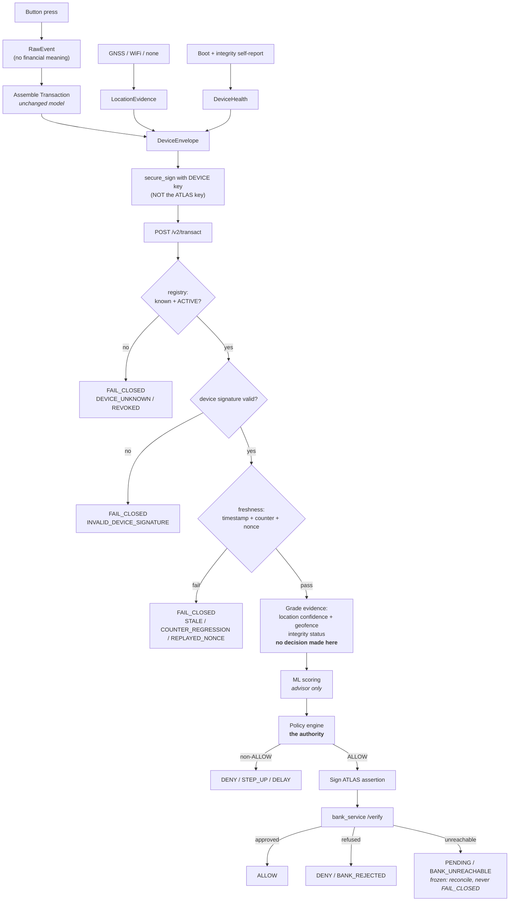

# PHASE3-SPEC.md — Trusted Device Security Layer

**Status (2026-09-23):** Phases **3.1–3.3 are implemented**, Phase 3.7 is implemented
except its GNSS stub, and **Phase 3.8 is complete**: the legacy `/transact` is closed and,
since 2026-09-22, cannot be reopened in a running service, and the dedicated red-team
suite of this document's 25 attacks was built the same day (`tests/test_red_team.py`,
driven through the real signed endpoint and a real `bank_service`). The two attacks that
target location and health grading are pinned as "signed and tamper-evident, **not
graded**", because 3.4/3.5 are unbuilt. Phases 3.4–3.6 remain proposals. Current status lives in `HANDOFF.md`; where the build differs from
this text (for example, the ESP32 signs with libsodium, because mbedTLS in that core has
no Ed25519, and devices are administered with `scripts/provision_device.py` rather than
`/admin/devices` endpoints), `HANDOFF.md` and `docs/ATLAS-Blueprint.md` describe what
was built.

**Original status: PROPOSAL. Nothing in this document is implemented.** Written
2026-08-27 from a fresh repository inspection. No file was modified to produce it. The
text below is the proposal as written.

**Phase 3 does not invent an architecture.** `docs/ATLAS-Blueprint.md` §24.3 already
specifies device authentication — *"Device identity: a key pair generated on-device
(`generate_identity()`) … an `atlas_key_id`-equivalent identifies this device, distinct
from the subject's ATLAS policy identity"* and *"Authentication: every request signed
with the device's private key (`secure_sign()`); `atlas_service` verifies against a
previously-enrolled public key."* That is labelled `[C][F]` — proposed, not implemented.
Phase 3 builds exactly that. Where this document goes beyond §24, it says so.

Baseline: **181 passing tests**, Phase 2 complete (boot-safe transaction ids,
timezone-correct TIME_WINDOW, DENY vs FAIL_CLOSED separation).

---

## A. Current architecture

```
ESP32 (Wokwi)  ──unauthenticated plaintext HTTP──▶  atlas_service :8000  ──▶  bank_service :8100
   3 LEDs                POST /transact                 ML → policy → sign        verify → ledger
   2 buttons             {Transaction}                  → state machine          Ed25519 + replay
```

**What is cryptographically real today:** the `atlas_service → bank_service` hop. Ed25519
signing (`atlas_service/crypto.py`), canonical serialization (`contracts.py`),
signature-then-revocation-then-expiry-then-replay verification
(`bank_service/verify.py`), SQLite replay cache.

**What is not protected at all:** the `device → atlas_service` hop. `/transact` accepts
any JSON from anyone. `device_id`, `location`, `authentication_method`, `subject`, and
`timestamp` are consumed as truth with zero verification.

**What the codebase already gets right and Phase 3 must extend, not replace:**
`is_new_beneficiary` / `is_new_device` are recomputed from history and the client's claim
is *ignored* (`policy/engine.py:_verified_new_beneficiary`, `ml/features.py`). That is the
correct pattern. Phase 3 applies the same discipline to device identity and location.

**Authority hierarchy — unchanged, non-negotiable:** `LAW → BANK → USER POLICY → ML`.
Blueprint §24.2 extends it one layer further: *"No decision authority exists below the
Policy Layer, ever"* — a component closer to the physical world is **more** exposed to
tampering, so it earns **less** trust. Nothing in Phase 3 gives the device authority.

---

## B. Phase 3 threat model

Extends Blueprint §24.6 (which already enumerates the embedded threats) with what is now
concretely exploitable against running code.

| # | Attack | Today | After Phase 3 | Residual |
|---|---|---|---|---|
| T1 | Attacker `curl`s a transaction claiming any `device_id`/`subject` | ✅ works | ❌ no valid signature | Enrollment trust (RQ‑24) |
| T2 | Tamper with `amount`/`beneficiary` in flight | ✅ works | ❌ signature covers them | — |
| T3 | Replay a captured request verbatim | ⚠️ blocked only by `transaction_id` | ❌ counter + nonce + txn id | — |
| T4 | Replay after device reboot (counter reset) | ✅ works | ❌ counter persisted in NVS | Wokwi cannot persist NVS — see §I |
| T5 | Stolen/cloned device | ✅ undetectable | ⚠️ `revoke()` once *noticed* | Detection latency |
| T6 | Extract device private key from flash | ✅ trivial | ⚠️ unchanged without secure element | **Real** — needs ATECC608 |
| T7 | Spoof location string | ✅ trivial | ⚠️ becomes low-confidence evidence | **Real** — GNSS is spoofable |
| T8 | Modified firmware | ✅ undetectable | ⚠️ self-reported attestation only | **Real** — needs verified boot |
| T9 | Unknown/unregistered device | ✅ silently trusted | ❌ `DEVICE_UNKNOWN` fail-closed | — |
| T10 | Roll back to older vulnerable firmware | ✅ works | ⚠️ version check, no eFuse anti-rollback | **Real** |
| T11 | Backend outage read as approval | ❌ already fails closed (Phase 2) | ❌ unchanged | — |

**Honest framing.** Phase 3 closes T1–T4 and T9 properly — those are software problems
with software answers. T5–T8 and T10 are **hardware trust problems**. Software can only
*represent* them; it cannot solve them. A compromised device reporting its own integrity
is worthless, and this spec never pretends otherwise.

---

## C. Proposed architecture

Three new concerns, each additive:

1. **Device Registry** — who is this device, is it still trusted, what is it bound to.
2. **Signed Device Envelope** — a wrapper proving a registered device authored this exact
   request. The existing `Transaction` model is carried **unmodified inside** it.
3. **Evidence channels** — location and integrity, surfaced as *graded evidence*, never
   as authorization.

### The identity separation (requirement 2)

| Identity | Lifetime | Proves | Field |
|---|---|---|---|
| **Device identity** | Enrollment → revocation | *this hardware* authored the request | `device_key_id` |
| **Transaction identity** | One payment | *this payment* is distinct | `transaction_id` |
| **Subject identity** | Account lifetime | *whose money* | `subject` |
| **ATLAS identity** | Instance lifetime | ATLAS authored the assertion to the bank | `atlas_key_id` |

These are four different things. Today only the fourth exists. Phase 3 adds the first and
binds it to the third in the registry.

### Verification order — deliberate

```
1. envelope well-formed?          → FAIL_CLOSED / MALFORMED_ENVELOPE
2. device known?                  → FAIL_CLOSED / DEVICE_UNKNOWN
3. device ACTIVE?                 → FAIL_CLOSED / DEVICE_REVOKED | DEVICE_SUSPENDED
4. signature valid?               → FAIL_CLOSED / INVALID_DEVICE_SIGNATURE
5. timestamp within window?       → FAIL_CLOSED / STALE_REQUEST | FUTURE_TIMESTAMP
6. counter strictly increasing?   → FAIL_CLOSED / COUNTER_REGRESSION
7. nonce unused?                  → FAIL_CLOSED / REPLAYED_NONCE
8. transaction_id unused?         → FAIL_CLOSED / DUPLICATE_TRANSACTION_ID  (Phase 2, kept)
─────────── only now is any field trusted ───────────
9. location evidence graded       → LocationAssessment (evidence, not a gate)
10. integrity evidence graded     → IntegrityAssessment (evidence, not a gate)
11. ML scoring                    → RiskEvidence (advisor)
12. policy evaluation             → PolicyDecision (the authority)
13. bank verification             → BankVerdict (final)
```

**Signature before anything else that reads envelope fields** — every field including
`device_id` is unauthenticated data until step 4 proves who wrote it. This mirrors
`bank_service/verify.py`, which already orders its checks this way for the same reason.

**Steps 9–10 never decide.** They produce graded evidence for steps 11–12. Blueprint
§24.2 forbids any decision authority below the policy layer.

---

## D. Data flow



---

## E. Module / component plan

### New modules

| Module | Responsibility |
|---|---|
| `atlas_service/device/registry.py` | Registry CRUD, status lifecycle, public-key lookup |
| `atlas_service/device/envelope.py` | Envelope verification: signature, freshness, counter, nonce |
| `atlas_service/device/location.py` | Confidence grading, haversine distance, geofence classification |
| `atlas_service/device/integrity.py` | Grade self-reported health into an integrity status |
| `atlas_service/device/db.py` | SQLite tables for devices / nonces / counters / events |
| `firmware/device_identity.py` | Device-side keypair + envelope signing (Python model) |

### Modified (all additive, all backward compatible)

| File | Change |
|---|---|
| `contracts.py` | `DeviceEnvelope`, `LocationEvidence`, `DeviceHealth`, new `DecisionReason` members, `canonical_envelope_bytes()` |
| `atlas_service/main.py` | New `POST /v2/transact`; `/transact` untouched unless `REQUIRE_DEVICE_AUTH` |
| `atlas_service/policy/engine.py` | New **optional** condition keys; existing keys untouched |
| `firmware/virtual_device.py` | Envelope assembly, counter persistence, evidence capture |
| `firmware/atlas_device/atlas_device.ino` | Device key, envelope signing, NVS counter |

### Explicitly out of scope for Phase 3

Real secure element, real GNSS, real secure boot, remote attestation, PKI/CA, key
rotation, the `attest()` frozen interface (designed here, implemented later).

---

## F. Database / schema changes

Existing `transactions` and `consumed_assertions` tables are **untouched**.

```sql
CREATE TABLE devices (
    device_id              TEXT PRIMARY KEY,
    device_key_id          TEXT NOT NULL UNIQUE,
    public_key             TEXT NOT NULL,          -- hex Ed25519, PUBLIC only
    bound_subject          TEXT NOT NULL,          -- device→account binding
    status                 TEXT NOT NULL,          -- ACTIVE|SUSPENDED|REVOKED
    firmware_version       TEXT,
    firmware_hash          TEXT,
    min_firmware_version   TEXT,                   -- anti-rollback floor
    registered_lat         REAL,                   -- geofence centre
    registered_lon         REAL,
    geofence_radius_m      INTEGER,
    secure_element_present INTEGER NOT NULL DEFAULT 0,
    created_at             TEXT NOT NULL,
    last_seen_at           TEXT,
    revoked_at             TEXT,
    revocation_reason      TEXT
);

CREATE TABLE device_counters (
    device_id     TEXT PRIMARY KEY REFERENCES devices(device_id),
    last_counter  INTEGER NOT NULL,
    updated_at    TEXT NOT NULL
);

CREATE TABLE device_nonces (
    device_id   TEXT NOT NULL,
    nonce       TEXT NOT NULL,
    consumed_at TEXT NOT NULL,
    PRIMARY KEY (device_id, nonce)
);

CREATE TABLE device_events (          -- append-only audit
    id          INTEGER PRIMARY KEY AUTOINCREMENT,
    device_id   TEXT NOT NULL,
    event       TEXT NOT NULL,        -- REGISTERED|REVOKED|AUTH_FAILURE|...
    detail      TEXT,
    occurred_at TEXT NOT NULL
);
```

**No private key is ever stored server-side.** `devices.public_key` is public material by
definition. Device private keys live only on the device.

`UNKNOWN` is deliberately *not* a stored status — it is the **absence** of a row. A device
cannot become UNKNOWN; it is either registered or it is not, and absence fails closed.

---

## G. API / contract changes

### New: `DeviceEnvelope`

```python
class LocationEvidence(BaseModel):
    source: str            # GNSS | WIFI | CELL | IP | DECLARED | NONE
    latitude: float | None = None
    longitude: float | None = None
    accuracy_m: float | None = None
    captured_at: str | None = None
    satellites: int | None = None

class DeviceHealth(BaseModel):
    firmware_version: str
    firmware_hash: str | None = None
    secure_boot_enabled: bool = False
    flash_encryption_enabled: bool = False
    secure_element_present: bool = False
    tamper_detected: bool = False
    boot_count: int | None = None
    reset_reason: str | None = None

class DeviceEnvelope(BaseModel):
    device_id: str
    device_key_id: str
    counter: int
    nonce: str
    issued_at: str
    transaction: Transaction          # EXISTING model, unmodified
    location: LocationEvidence | None = None
    health: DeviceHealth | None = None
    signature: str                    # over canonical_envelope_bytes(...)
```

`canonical_envelope_bytes()` covers **every field except `signature`**, using the same
`sort_keys=True, separators=(",",":")` discipline as `canonical_assertion_bytes()`. It
lives in `contracts.py` for the same reason: both sides must derive byte-identical input,
and it must stay crypto-free so the boundary tests keep passing.

### Endpoints

| Endpoint | Change |
|---|---|
| `POST /transact` | **Unchanged** while `REQUIRE_DEVICE_AUTH=false`. When true → `FAIL_CLOSED` / `DEVICE_AUTH_REQUIRED` |
| `POST /v2/transact` | **New.** Accepts `DeviceEnvelope` |
| `POST /admin/devices` | **New.** Enrollment (prototype only — see §L) |
| `POST /admin/devices/{id}/revoke` | **New.** Sets REVOKED |
| `GET /admin/devices/{id}` | **New.** Status inspection |

### New `DecisionReason` members

`DEVICE_UNKNOWN`, `DEVICE_REVOKED`, `DEVICE_SUSPENDED`, `INVALID_DEVICE_SIGNATURE`,
`MISSING_DEVICE_SIGNATURE`, `MALFORMED_ENVELOPE`, `STALE_REQUEST`, `FUTURE_TIMESTAMP`,
`COUNTER_REGRESSION`, `REPLAYED_NONCE`, `FIRMWARE_INTEGRITY_FAILURE`,
`FIRMWARE_ROLLBACK_DETECTED`, `DEVICE_AUTH_REQUIRED` — **all FAIL_CLOSED-class.**

**`BANK_UNREACHABLE` remains `PENDING`.** The frozen failure-mode table requires
pending → reconciliation because the payment may have succeeded. Unchanged.

### Location grading (evidence, not authorization)

| Confidence | Requires |
|---|---|
| `HIGH` | Secure-element-signed GNSS fix, ≤50 m, <60 s old — **not achievable in Phase 3** |
| `MEDIUM` | GNSS fix, ≤500 m, <5 min old, from a device with integrity OK |
| `LOW` | WiFi/cell/IP-derived, or GNSS from a device without integrity evidence |
| `UNKNOWN` | No evidence, or unparseable |

Geofence: `WITHIN_GEOFENCE` / `OUTSIDE_GEOFENCE` / `LOCATION_UNKNOWN` / `LOCATION_STALE`.

**A GNSS fix is the device asserting what it believes it saw. Civilian GNSS is
unauthenticated and spoofable with commodity SDR.** `HIGH` is defined but unreachable
without hardware, and is documented as such rather than quietly awarded.

### Policy vocabulary — additive only

New **optional** condition keys: `DEVICE_TRUST`, `LOCATION_CONFIDENCE`, `GEOFENCE`,
`FIRMWARE_INTEGRITY`, `AUTH_STRENGTH`.

Existing keys, thresholds, most-restrictive-wins, and the three shipped policy files are
**untouched**. No existing decision changes, because no existing policy uses these keys.
`_rule_matches` already raises on unknown keys (fail-closed), so adding keys is safe.

---

## H. Test strategy

Target: **181 preserved + ~75 new**. Every existing test must pass unmodified; if one
must change, the reason gets written down, as in Phase 2.

| Group | Coverage |
|---|---|
| Registry | register / duplicate / lookup / ACTIVE→SUSPENDED→REVOKED / unknown fails closed / revoked never silently re-trusted |
| Signature | valid accepted; tampered `amount`, `beneficiary`, `currency`, `device_id`, `timestamp`, `location` each rejected; wrong key; missing signature; malformed envelope |
| Replay | identical replay; reused nonce; counter regression; counter equal; reboot-with-persisted-counter accepted; reboot-with-reset-counter rejected; `transaction_id` duplicate still FAIL_CLOSED (Phase 2 preserved) |
| Location | each confidence tier; within/outside geofence; stale; missing; spoofed-coordinate case documented as *undetectable*; **location alone never authorizes** |
| Integrity | version accepted; rollback rejected; tamper flag graded; missing health graded UNKNOWN; self-report explicitly not proof |
| Risk/policy | new signals reach ML; ML stays advisory; policy remains the authority; ₹1,500/₹60,000/₹1,50,000 unchanged |
| Failure model | all five statuses; every new reason FAIL_CLOSED-class; `BANK_UNREACHABLE` still PENDING; **no security failure ever yields ALLOW** |
| Red team | the 25 attacks from your Phase 11 list, each with an explicit expected outcome |
| Backward compat | legacy `/transact` unchanged with flag off; rejects with flag on |

Mutation checks (as in Phases 2 and 5–8): weaken the signature check, the counter check,
and the registry lookup in turn, and confirm specific tests catch each.

---

## I. Wokwi simulation strategy

| Capability | Wokwi | Approach |
|---|---|---|
| Ed25519 signing on ESP32 | ✅ (mbedTLS in core) | Real signing, real verification |
| Key in flash | ✅ | Real, and **honestly labelled as extractable** |
| NVS counter across restart | ❌ **not reliably persisted** | See below |
| GNSS module | ⚠️ no native part | Simulated NMEA over UART |
| Secure element (ATECC608) | ❌ | Interface only, no implementation |
| Secure boot / eFuse / flash encryption | ❌ | Report `false`; never claim otherwise |
| Tamper switch | ✅ (pushbutton) | Real GPIO input |

**The counter-across-reboot problem is the significant one.** The correct design persists
the counter in NVS; Wokwi does not reliably retain flash between sessions, so a restarted
simulation would send `counter=1` and be correctly rejected — the demo would break.

Proposed handling, explicitly labelled: a `SIMULATION_ALLOW_COUNTER_RESET` server flag,
**default off**, which accepts a counter reset only when accompanied by a signed fresh
`boot_id`, and logs `[SECURITY] counter_reset_accepted simulation_mode=true` every time.
It is a simulation affordance, is documented as one, and must never be enabled outside
Wokwi. Requirement 4 says *do not weaken the existing replay fix* — the Phase 2
`transaction_id` duplicate check stays enforced even with this flag on, so replay
protection degrades from three layers to two rather than to zero.

Deterministic location simulation modes: `CORRECT`, `OUTSIDE_GEOFENCE`, `STALE`,
`MISSING`, `SPOOFED` — the last existing to demonstrate that a spoofed-but-plausible fix
is **accepted by the parser and indistinguishable from a real one**, which is the honest
lesson.

---

## J. Physical prototype plan

| Module | Solves | Mitigates | Evidence | Wokwi | Real HW | Verdict |
|---|---|---|---|---|---|---|
| **ESP32** | Compute/network | — | Signed envelope | ✅ | Have | **Essential** |
| **ATECC608 secure element** | Key extraction (T6) | Cloning, flash dump | Key provably never left the chip | ❌ | Required | **Essential for any real claim** |
| **GNSS (NEO-6M)** | Location evidence (T7) | Casual location lying | Coordinates + accuracy + satellite count | ⚠️ simulated UART | Required | **Optional** — evidence only, spoofable |
| **Tamper switch** | Enclosure opening | Physical access | Boolean + timestamp | ✅ | Cheap | **Optional, high value/cost ratio** |
| **IMU (MPU6050)** | Movement context | Device removal/relocation | Acceleration, orientation | ⚠️ partial | Cheap | **Optional** — weak signal alone |
| **OLED display** | Shows *what* is being approved | Confused-deputy / blind approval | User-visible amount + payee | ✅ | Cheap | **Recommended** — real security value: the user sees what they confirm |
| **Buzzer** | Alerting | Silent misuse | Audible event | ✅ | Trivial | **Optional** |

**Not proposed:** temperature/power monitoring (no threat in this model — it would be a
sensor for appearance, which the brief explicitly rules out).

**The honest ranking:** only the **secure element** changes what ATLAS can legitimately
*claim*. GNSS, IMU, and tamper switches add evidence quality. The **display** is the
sleeper — a confirmation factor where the user cannot see the amount is a confused-deputy
vulnerability, and it costs almost nothing to fix.

---

## K. Implementation order

Each step ends with a full green suite. Nothing enforces until 3.8.

| Step | Content | Enforcement | Risk |
|---|---|---|---|
| **3.1** | Schema + registry module + admin endpoints | none — passive | Low |
| **3.2** | `DeviceEnvelope`, `canonical_envelope_bytes`, device crypto, `/v2/transact` verifying signature + registry | new endpoint only | Low |
| **3.3** | Counter + nonce replay layers | on `/v2` only | Medium — reboot semantics |
| **3.4** | Location evidence + confidence + geofence (graded, not gating) | none | Low |
| **3.5** | Integrity grading + rollback check | none | Low |
| **3.6** | Optional policy keys + ML features | opt-in per policy | **Highest** — touches decisions |
| **3.7** | Firmware: device key, envelope, NVS counter, GNSS stub | — | Medium — unverifiable here |
| **3.8** | `REQUIRE_DEVICE_AUTH` + full red-team suite | **legacy path closed** | Medium |

Recommended checkpoint after **3.3** — that is where the T1–T4/T9 attacks actually close,
and it is a natural place to re-demo before touching anything decision-related.

---

## L. Risks and limitations

**Honest, and none of these are solved by Phase 3.**

1. **Enrollment is the unsolved problem (RQ‑7/12/24).** The registry answers *"is this key
   registered?"* — never *"does this device genuinely belong to this account holder?"*
   The proposed `/admin/devices` endpoint has **no authentication** and is a prototype
   affordance; in production it is a full identity-proofing flow. Blueprint §24.6 already
   rates forged device identity 🔴 unresolved, and Phase 3 does not change that.
2. **The device key sits in ordinary flash.** Anyone with physical access and `esptool`
   can read it. Without a secure element, "device identity" means *"someone who once had
   this key"*, not *"this device"*. Phase 3 must never be described as hardware-backed.
3. **Self-reported integrity is worthless against a compromised device.** Malicious
   firmware reports `secure_boot_enabled: true`. Only verified boot plus remote
   attestation against a hardware root of trust would change this.
4. **GNSS is spoofable.** Civilian GNSS is unauthenticated. `HIGH` confidence is defined
   but deliberately unreachable in Phase 3.
5. **Wokwi cannot prove hardware security.** It proves firmware behaviour and integration
   — nothing about secure boot, eFuses, flash encryption, or tamper resistance.
6. **The counter-reset simulation flag is a deliberate, documented weakening** confined to
   simulation, with the Phase 2 duplicate check still enforced beneath it.
7. **Step 3.6 is the only step that can change financial decisions.** It is deliberately
   last, opt-in per policy, and ships with the three demo amounts pinned as regression
   tests.
8. **Clock trust.** Timestamp freshness assumes a roughly correct device clock; NTP is
   unauthenticated. A device with a manipulated clock can shift its apparent freshness
   window — mitigated, not eliminated, by the monotonic counter.
9. **Scope honesty.** Phase 3 makes ATLAS meaningfully stronger against *remote* attackers
   (T1–T4, T9). It does **not** defend against an attacker with sustained physical
   possession of the device. That requires hardware this project does not have.
